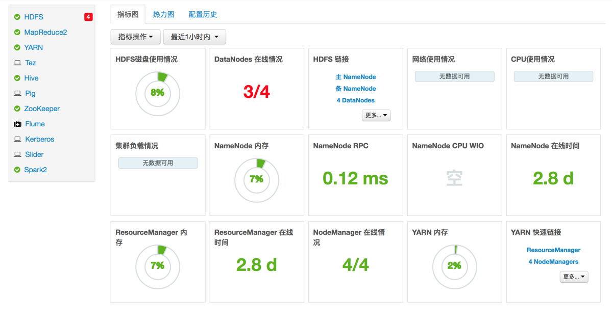
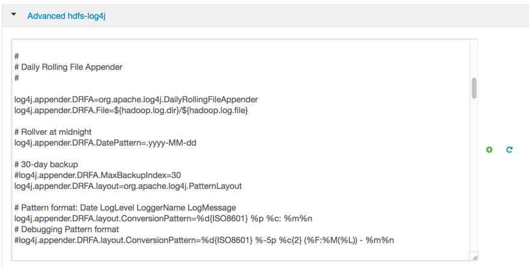

= 大数据平台管理系统使用手册
湖南天云魔方数据科技有限公司
2016
:corpname: 湖南天云魔方数据科技有限公司
:corpshortname: 天云魔方
:prodverbname:  Ambari
:prodver: 2.4.2
:imagedir: ./images
:stylesdir: ./styles
:doctype: book
:numbered:
:icons: font
:toc: left
:toclevels: 2
//active header and footer
:pagenums:
:docinfo:
:docinfo1:
:source-highlighter: pygments
:keywords: TDP, Hadoop, Azkaban
//i18n
:appendix-caption: 附录
:chapter-label:
:figure-caption: 图
:table-caption: 表
:lang: zh_cn
:preface-title: 前言
:toc-title: 目录
:appendix-caption: 附录
:orgname: 湖南天云魔方数据科技有限公司
:last-update-label: 最后更新时间

== 概述
Hadoop 属于大规模，分布式数据存储和计算体系，监控和管理如此多的机器成为一个非常琐碎和耗时的任务，
因此需要有一个管理系统来管理和监控如此庞大的机器。大数据平台管理系统就是这样的一个目的，它通过 Web 方式
来管理和监控集群内人的所有机器。

=== 系统架构

平台管理系统通过安装在集群中每个节点上的 agent 来收集节点的信息，以及执行 server 端发出的各类命令。
其体系架构如下图所示：


=== 访问平台管理系统

平台管理系统以 Web 方式和客户进行交互，为了访问系统，打开浏览器，输入下面的地址：

`http://<your hostname>:8080`

这里 <your hostname> 是安装了系统管理软件的机器。在出现的登陆页面后，输入账号密码登陆。

== 查看系统仪表板
该章节描述如何使用仪表板来监控集群。在系统主窗口上方导航栏里点击 “仪表板”，即可进入到系统仪表板界面。

image::images/ambari_users_guide-8b8a4.png[]

=== 查看集群仪表板
管理系统在主页显示整个集群的系统状态，每一个图表描述一个服务的或者一个组件的状态，包括 HDFS，YARN，HBase，
Storm 等。该页面只是显示简单的柱状图和拼图，对于有复杂显示的要求，会在该图表中直接给出数据源链接，点击链接进入后
可以看到更复杂的图表展示页面。



==== 扫描服务状态
注意上一节中的仪表板左侧的组件列表，在这些列表的左侧有一个可能用不同颜色表示的原点，这些不同颜色表示了状态的不同情况，下面给出描述

|====
| 颜色  | 状态
| 静止绿色 | 所有的master服务都在运行
| 闪动绿色 | 表示服务正在启动
| 静止红色 | 表示至少有一个 master 服务已经停止运行
| 闪动红色 | 表示服务正在停止
|====

==== 小部件描述

仪表板包括了当前大部分服务状态指标的小部件，下面描述每一个部件的简单说明

|====
|指标   | 描述
| **HDFS ** |
| HDFS 磁盘使用情况 | DFS 使用的空间百分比，它是统计了 DFS 和非 DFS 的合计使用
| **指标** |
| DataNodes 在线情况 | 有多少 Datanode 目前是在线的
| NameNode 内存 | NameNode 服务的 JVM 堆栈所使用的内存占比
| NameNode RPC | RPC 队列的平均延迟
| NameNode CPU WIO | CPU 等待 I/O 的百分比
| NameNode 在线时间 |  NameNode 在线的时长统计
| **YARN** |
| ResourceManager 内存 | ResourceManager JVM 堆栈使用占比
| ResourceManager 在线时间 | ResourceManager 在线时长统计
| NodeManager 在线情况 | 当前 NodeManager 在线数量以及总数量
| YARN 内存 | YARN 有效内存占比 (已使用 / 总计)
| **HBase** |
| HBase Master 内存| HBase Master JVM 堆栈使用占比
| HBase 平均负载 | HBase 服务的平均负载
| HBase Master 在线情况 | HBase Master 服务在线时长统计
| Region in Transaction | HBase region 事务个数
| **Storm** |
| Supervisors 在线 | Supervisors 在线节点个数
|====

==== 小部件详情
将鼠标移动某一个特定小部件上，可以看到该部件更详细的信息，类似如下：

image::images/ambari_users_guide-6bc40.png[]

* 点击左上角白色的 X 可以从当前仪表板删除该部件
* 点击 icon:Edit[] 图标，可以编辑当前小部件的显示信息，后面具体描述

==== 链接到服务界面
HDFS Links 和 HBase Links 部件表示当前可以通过点击该部件的连接列表获得更详细的状态显示。
比如线程堆栈，日志等。比如，你可以在 HDFS Links 部件中通过点击链接的方式来查看 NameNode，Secondary Namenode，
DataNode 组件的详细状态。类似如下：


通过点击 "更多" 下来列表，可以获得更多的状态连接，以下描述当前状态连接的指标描述

|====
| 服务 | 指标 | 描述
| HDFS | |
| | NameNode UI |  链接到 NameNode 的管理界面
| | NameNode Logs |  链接到 NameNode 的日志查看界面
| | NameNode JMX |  链接到 NameNode 的 JMX servlet 界面
| | Thread Stacks |  链接到 NameNode 线程堆栈跟踪页面
| HBase | |
| | HBase Master UI | 链接到 HBase Master 管理界面
| | HBase Logs | 链接到 HBase 日志查看界面
| | zookeeper Info | 链接到 Zookeeper 信息页面
| | HBase Master JMX | 链接到 HBase Master JMX servlet 页面
| | Debug Dump | 连接到 Debug 页面
| | Thread Stacks | 链接到 HBase Master 线程堆栈跟踪页面
|====

=== 修改集群仪表板

有以下几种方法来定制仪表板

==== 增加小部件到仪表板

通过以下方式可以把之前挪走的小部件重新加入到仪表板中

. 选择指标下拉框，如下所示
+

+
. 选择添加
. 选择需要的指标
. 点击应用

==== 重置仪表板

可以通过下面的方式来恢复仪表板到默认布局状态

. 选择指标下拉框，如下所示
+

+
. 选择编辑
. 选择重置所有的小部件到默认状态

==== 定制小部件显示

通过以下方式可以自定义小部件的显示指标

. 移动鼠标到需要定制的小部件上
. 选择出现在右上角的 icon:Edit[] 图标
定制小部件弹出窗口显示出你可以编辑的属性，如下图所示：
+
image::images/ambari_users_guide-3504e.png[]
+
. 根据定制指标方法来进行定制
比如，本文例子中，你可以掉成 HDFS 容量饼图占比颜色变化的阈值
. 点击应用按钮用来保存并关闭编辑窗口
. 如果不想修改，则点击取消按钮来关闭窗口

NOTE: 不是所有的小部件都支持小部件

=== 查看集群热力图
热力图提供了用颜色来展示整个集群里使用率的方法

image::images/ambari_users_guide-2bc03.png[]

一个颜色块代表一个节点。把鼠标移动到颜色块上可以看到更详细的信息。不同颜色代表该服务所使用资源的占比。
如果不能侦测到任何表示状态的数据，则用灰色表示无效数据。
可以通过修改默认的最大值来改变热图的颜色分布。

== 管理主机
平台管理系统使用主机管理服务来安装每个节点上的集群组件，比如 DataNodes，NamenNodes，NodeManager 等。
比如，你可以通过主机管理方式一次重启该节点上的所有与组件，或者该节点上某类型的组件或服务。

=== 主机相关工作
在主界面点击 “主机” 标签，进去主机管理主界面，该界面可以看到当前集群的所有主机以及主机的基本状态，类似如下：


每个主机前面有一个颜色表示的图标，不同颜色表示主机的不同状态，如下：

* 红色 - 表示在主机上至少有一个 master 组件停止运行
* 橙色 - 表示在主机上至少有一个 slave 组件停止运行
* 黄色 - 平台管理服务不能获得该主机的心跳信息至少超过3分钟
* 绿色 - 所有组件和服务状态都正常

红色状态标识优先于橙色状态标识，橙色则优先于黄色状态标识。换句话说，如果一个主机的一个 master 组件停止运行以及还有一些其他问题，
则用红色表示。

上图中的第一台主机用橙色标志，表示至少有一个 slave 组件停止运行了，点击主机名进入后，可以看到是 NodeManager 组件停止运行了。

=== 主机列表过滤

在主机页面，可以通过组件属性或者在输入框中输入关键字进行过滤，有效的搜索类型有：

- **主机属性搜索** 通过主机名，IP 地址，主机状态和其他属性进行搜索
- **通过服务搜索** 通过安装的组件来找到对应的主机
- **通过组件搜索** 通过安装的组件状态（比如启动，停止，维护状态等）来找到特定的主机
- **通过关键字搜索** 在输入框中输入你想搜索的关键字来找到主机

=== 执行主机级别的动作
使用动作下来菜单可以针对一个或者多个主机进行操作。

动作有下列三种菜单组成：

- 主机： 列表选择、过滤或者所有组件选项
- 对象：列出匹配选择的主机相对应的组件对象
- 操作：列素哦所有你选择的对象的可能操作

比如，如果想在一个主机上重启 DataNode，可以这样操作：

. 在主机页面，选择至少一个运行 DataNode 的主机
. 在动作下来框，选择 menu:选中的主机[ DataNodes->重启] ,如下图所示：


. 选择 btn:[确定] 按钮确定启动所选操作

=== 查看主机上的组件

在主机页面，点击主机名连接，进入到该主机的组件管理界面，比如我们选择 `tdp3.tcloudata.com` 主机，进入到如下图所示的页面

image::images/ambari_users_guide-f69cc.png[]

上图右上角的 "Host Actions" 下来框可以用来启动、停止、重启、进入维护模式和离开模式、删除主机等操作。

另外，每一个组件右侧的下来框也可以用来对该组件单独进行操作，包括启动、停止、重启、删除、打开维护模式、解除委托等操作。

image::images/ambari_users_guide-53d85.png[]

=== 如何删除一个组件

要删除一个组件，在主机页面，点击该组件所在主机的主机名连接

1. 首先停止该组件
2. 在下来菜单中解除组件委托
3. 对于已经解除委托的组件，在下来菜单中，选择删除组件

=== 从集群中删除一台主机
要从集群中删除一台主机，需要先完成以下前提操作：

- 停止运行在主机上的所有组件
- 解除 DataNodes 组件的委托
- 如果主机上运行有 Master 组件，比如 NameNode，HBase Master，则需要迁移这些组件到别的主机
- 如有必要，针对该主机，关闭维护模式

然后执行下面的步骤：

. 在主机页面，点击主机名
. 在主机详情页面，选择 Host Actions 下来菜单中
. 选择删除

如果你没有完成之前的步骤，执行该步骤可能出现类似以下警告：


=== 增加主机到集群
要增加主机到集群，进入到主机页面，然后选择 menu:Actions[+Add New Hosts]  菜单，增加主机向导将会出现，它提供了类似平台管理
首次安装向导界面。依据提示，提供必要的信息，即可完成主机增加操作。

image::images/ambari_users_guide-2cca1.png[]

=== 机架感知

平台管理系统可以管理主机所在的机架信息，通过设置机架 ID，系统能够通过 ID 来显示主机热力图，同时也可以通过机架 ID 来过滤主机

如果集群部署了 HDFS，管理系统能够通过拓扑脚本传递机架 ID 信息给 HDFS。管理系统生成 _/etc/hadoop/conf/topology.py_ 脚本，然后
自动在 `core-site.xml` 文件中设置 `net.topology.script.file.name` 属性。
该脚本读取系统自动创建的 _/etc/hadoop/conf/topology_mappings.data_ 映射文件，当修改机架 ID 是，该映射文件也会自动更新，从而
推送给 HDFS 配置文件。HDFS 使用该脚本来获得 DataNodes 的机架信息。

.设置机架ID
有两种方式设置机架 ID。一是在主机页面通过 Actions 菜单批量设置机架 ID；另外是更多进入到单个主机详情页面后，通过 Host Actions 菜单来
设置机架 ID

如果要批量设置机架 ID，进入到主机页面，然后选择 menu:Actions[Hosts->Set Rack]


如果要单独设置机架 ID，进入到主机详情页面，然后选择 menu:Host Actions[Set Rack] 菜单


== 服务管理
服务页面可以用来监控和管理选中的服务，该页面的最左侧列表便是当前集群所安装的服务。


=== 启动和停止所有服务

要启动和停止所有服务，选择最左侧服务列表下方的 menu:Actions[Start All]  或者 menu:Actions[Stop All] 下来菜单即可

image::images/ambari_users_guide-a9ebd.png[]

=== 修改服务配置

选择一个服务，然后选择配置标签，可以查看和修改当前配置。比如选择 MapReduce2 ，然后选择配置，可以看到给服务的几个核心配置，点击下方的
高级标签，既可以看到所有的配置选项。


=== 查看服务摘要及告警

当选择一个服务后，右侧出现的摘要信息标签会显示该服务的基本信息

image::images/ambari_users_guide-9294d.png[]

每个组件的连接只连接到安装有该组件的主机详情页面。

image::images/ambari_users_guide-2b0cc.png[]

==== 告警和健康检查

在每一个服务页面，摘要显示区域，点击右上角的image:images/ambari_users_guide-d26cc.png[]信息，及可以看到目前的具体告警


==== 修改服务仪表板

依据服务的不同，摘要标签页会显示当前服务的一些重要指标


该区域的指标可以自定义，你可以增加，删除或者修改每一个小部件的显示。同时也可以通过拖动的方式修改布局。

=== 执行服务操作
通过服务操作下来菜单，可以对选定的服务进行管理。不同的服务，可能有效的操作不一定完全相同，比如对于 HDFS 服务而言，有效的操作如下：


=== 监控后台操作
当有批量操作时，我们可以把这些批量操作转为后台操作，当之后想要查看时，点击导航栏左侧蓝色闪烁图标image:images/ambari_users_guide-62605.png[]
即可获得当前后台运行的操作


点击正在运行的操作名称，可以看到当前操作在每一台机器上完成的情况


再点击每个主机名称，可以看到具体在该主机上每个服务的执行情况


再点击具体的操作，则可以看到这个操作的详细日志，类似下图所示：


=== 操作审计
当你通过管理系统进行操作，比如登陆/注销，启动/停止/重启，增加/删除服务等，管理系统都会创建一条审计日志。通过审计日志，我们可以
知道谁在什么时间执行了什么样的操作。审计日志位于管理系统主机的 _/var/log/ambari-server/ambari-audit.log_

NOTE: 修改服务配置也会创建一条审计日志，不过日志文件为 _/var/log/ambari-server/ambari-config-changes.log_ 类似如下:
+
```
2016-05-25 18:31:26,242 INFO - Cluster 'MyCluster' changed by: 'admin';
service_name='HDFS' config_group='default' config_group_id='-1' version='2'
```
+

== 配置管理
管理系统把所有组件的配置当成代码方式进行版本管理

=== 配置服务
选择一个服务，然后选择配置标签来查看和更新配置。比如选择 MapReduce2，然后选择配置，查看配置参数。

==== 更新服务属性

. 打开配置属性
. 修改要改变的属性值
. 选择保存

==== 重启组件
编辑并保存修改后，橙色的重启按钮将会显示，用来提醒你某些组件需要重来才能使得修改的值生效。点击重启按钮，然后在出现的下拉框里
选择重启所有受影响的组件。


=== 定制日志设置
管理系统默认显示 menu:服务[配置->Advanced log4j] 的配置，依据需要，可以直接在 Web 页面修改该配置文件，比如控制日志的输出级别，
日志的存储路径以及日志的轮转周期等。



=== 下载客户端配置
对于那些包含所有客户端组件的服务（比如 Hadoop 客户端或 Hive 客户端），你可以从管理系统中下载该客户端相关的配置信息。

- 在管理系统界面，点击对应的服务标签
- 选择服务操作下来菜单
- 选择下载客户端配置，在弹出的对话框中，选择要保存的地址，然后点击确定按钮。

== 服务配置版本管理
管理系统提供了配置版本的概念，这使得任何一次的配置修改都会形成一个历史以及行程一个版本，我们可以查看所有的历史版本信息，也可以
回到到特定的版本，还能进行版本之间的比较。以下详细描述。

=== 基本概念
理解服务配置如何存储的非常重要。配置属性依据配置类型进行分组。一个服务有若干个配置类型组成。

比如，HDFS 服务包含一些配置类型：hdfs-site,core-site,hdfs-log4j,hadoop-env,hadoop-policy。如果你浏览到 menu:服务[ HDFS->配置] ，
你可以看到当前的配置版本信息（如果已经有过修改的话）


配置版本建立在服务级别上，因此，当你修改某一个服务的配置时，管理系统会创建一个服务配置版本。下图显示了针对一个服务的两个配置版本 V1和 V2

image::images/ambari_users_guide-784db.png[]

==== 术语
下表列出了该章节中提到的一些术语，需要提前理解

|====
| 术语  | 描述
| 配置属性(Configuration Property) | 有管理系统管理的配置属性，比如 NameNode heapsize ,replication factor
| 配置类型(Configuration Type) | 属性的分组，比如 hdfs-site 就是一个配置类型
| 服务配置(Service Configurations) | 配置类型集合，比如 hdfs-site,core-site 配置属于 HDFS 服务配置的一部分
| 修改备注(Change Notes) | 当修改配置并保存时的备注，类似 git 提交时的 comment
| 服务配置版本(SCV) | 某一个特定服务的部分配置版本
| 主机配置组(Host Config Group HCG) | 针对主机集合的配置集合。每个服务有一个默认的主机配置组。你可以基于默认配置组来创建自定义的配置组。
|====

==== 查看历史
先进入导航栏的仪表板页面，然后点击左侧某一个服务，然后在点击右侧的配置历史，即可以查看当前服务的配置版本信息


而最近的几次修改配置历史，在通过进入服务的配置页面，然后在头部导航栏可以看到，类似下图：

image::images/ambari_users_guide-721b2.png[]

==== 版本比较
当进入到menu:服务[配置] 页面，当鼠标移动到具体某一个版本上时，系统会给出三个选项，查看，比较和回归


要比较两个配置版本，可行下面的操作：

. 导航到特定的服务版本，比如  "V19"，移动鼠标到该版本，在弹出层，点击比较按钮
. 使用滚动条，找到需要比较版本，比如这里想和 V13 版本进行比较，则找到 V13版本，移动鼠标到该版本，点击在弹出层选择比较
. 系统在版本栏下方显示两个版本的差异，类似如下

image::images/ambari_users_guide-b272a.png[]

==== 版本回退
如果想把配置回退到某一个特定的版本，比如回退到 V21版本，则导航到 V21版本，并点击，然后在版本栏下方条目中点击 image:images/ambari_users_guide-a19b5.png[] 按钮。
在弹出的对话框中，填写回退的原因，然后点击确定即可。

== 集群管理
点击导航栏的管理标签，进入到集群管理页面，以下详细描述。

=== 堆栈和版本
堆栈标签页包含了当前集群的服务组件，已经安装的显示为image:images/ambari_users_guide-8d849.png[]，未安装的则显示为image:images/ambari_users_guide-d32de.png[]。

版本标签则包含当前安装的个服务软件的版本信息

image::images/ambari_users_guide-afc0a.png[]

=== 服务账号
服务账号用表格形式列出当前服务所运行的账号

image::images/ambari_users_guide-f303e.png[]

=== Kerberos
如果集群还没有启动 Kerberos，点击启用 Kerberos 按钮，运行 Kerberos 安装向导。如果你安装 Kerberos 不在本章描述范围之内。
一旦启动了 Kerberos，则 Kerberos 标签页会给出类似下图的信息：


==== 如何重新生成 keytab

1. 点击 menu:管理[Kerberos]
2. 点击 btn:[Regenerate Kerberos]  按钮
3. 确定你的选择，继续
4. (可选) 你可以选择只针对那些丢失了 keytab 文件的主机进行 keytab 文件重新生成。
5. 一旦确定，系统会连接到 KDC，如何重新生成 keytab 文件并放置在正确的位置，该步骤会提示要求输入 Kerberos 管理员账号和密码
6. 一旦完成，你必须重启所有使用到这些 keytab 文件的服务

==== 如何禁用 Kerberos
1. 点击 menu:管理[Kerberos]
2. 点击 btn:[Disable Kerberos] 按钮
3. 确定你的选择，然后继续，所有集群服务将停止，Kerberos 安全认证会被重置
4. 如果要重启 Kerberos，点击 btn:[Enable Kerberos] 按钮，启动配置向导

== 监控与告警
管理系统监控集群健康状态并能对某些状态发出告警，以帮助你定位和解决问题。

=== 管理告警
管理系统预定义了一套针对集群组件和主机的告警。每一个告警有 Alert Definition 来定义，它指定告警类型，检测间隔以及阈值。当创建或者修改集群时，
管理系统获取 Alert Definition 并创建告警实例。比如，针对 HDFS 服务，系统会预定义一个检测 DataNode 进程的告警定义。

通过管理系统，你可以浏览当前集群的所有告警定义。也可以通过当前状态类过滤告警定义。点击告警定义名称，可以看到该告警的详细情况，修改告警属性（比如检测间隔，阈值等），关联
到该告警定义的实例则同时会被修改。

每一个告警实例显示一个告警状态来表示严重程度。最常见的严重级别有：

- OK
- WARNING
- CRITICAL
- UNKNOWN
- NONE

后两者是特殊的严重级别。

==== 告警类型

告警的阈值以及阈值单位取决于告警类型，下表列出了告警的类型，可能的状态以及可配置的阈值

|====
| 告警类型 | 描述 | 阈值单位
| WEB | 连接到 WEB，告警状态基于 HTTP 返回码 | 秒
| PORT | 连接到端口，告警状态基于应答时间 | 秒
| METRIC | 检查服务指标值，单位多样，取决于检查什么样的指标 | 多样
| AGGREGATE | 另外一个告警的平均状态 | %
| SCRIPT | 执行脚本来处理告警检测 | 多样
| SERVER | 执行服务端可运行的类键处理告警检测 | 多样
| RECOVERY | Agent 处理进程检测以及异常中断后重启 | 多样
|====

==== 告警检测次数

管理系统允许设置检测多少次后才发布告警。如果在检测期间，告警状态发生变化，系统则隔一个时间数后在进行状态检测（这个数成为检查次数）。
首先告警状态会保存在 _/var/log/ambari-server/ambari-alerts.log_ 文件里，并设置为 “SOFT” 改变。当检测次数达到后，其状态依然
和之前相同，则设置为 "HARD" 标志，然后发布告警通知。

你可以针对所有的告警设置检测测试，也可以针对每一个告警进行设置。

修改全局告警次数方法如下：

. 在系统管理页面，点击 Alert 页面
. 在 Actions 菜单中，点击 Manage Alert Settings
. 更新 Check Count 值
. 点击保存

修改单个告警的告警次数方法如下：

. 在系统管理页面，点击 Alert 页面
. 选择你要修改的告警
. 在右边，点击 icon:Edit[]  图标，接下来出现 Check Count 属性
. 更新 Check Count 值
. 点击保存

=== 通知配置

告警可以通过邮件或者 SNMP 方式把通知发送出去。

==== 创建或修改通知

. 在系统管理页面，点击 Alert 页面
. 在 Action 菜单中，点击 Manage Notifications
. 已经存在的通知会在下面列出
. 点击 + 按钮， ”Create new Alert Notification" ，出现告警通知对话框
. 输入通知名称，选择通知属于哪个组，设置严重级别以及描述，然后选择通知的方式(EMAIL 或SNMP)
. 完成后，点击保存

对于邮件通知，需要提供发送邮箱的相关信息，列表如下：

|====
| 参数 | 描述
| Email To | 逗号分隔的邮件接收人
| SMTP Server | SMTP 服务器地址
| SMTP Port | SMTP 服务端口
| Email From | 单个邮件地址，用来表示发件人
| Use Authentication | 如果 SMTP 需要认证，则勾选
|====

对于 SNMP 的通知方式，则需要提供 SNMP 版本，Community 等相关信息，列表如下：
|====
| 参数 | 描述
| OID | 1.3.6.1.4.1.18060.16.1.1
| Hosts | 逗号分隔的主机名，用户发送 trap
| Port | snmptrapd 服务的侦听端口
|====

==== 定制通知模板

通知模板为 XML 格式，默认自带了一个 alter-templates.xml 文件。该文件包含了每一个已知类型的通知的所有内容。

如果想要使用自己的模板，按照下面的方式进行操作：

. 在系统管理主机上，进入 _/etc/ambari-server/conf_ 目录
. 编辑 `ambari.properties` 文件
. 增加新模板文件的位置记录，比如 `alerts.template.file=/var/tmp/alert-templates-custom.xml`
. 保存，退出，并重启系统管理服务

.告警模板结构
模板文件结构如下，每一个 `<alert-template>` 元素用来申明通知的类型
[source, xml]
----
<alert-templates>
  <alert-template type="EMAIL">
    <subject>
    Subject Content
    </subject>
    <body>
    Body Content
   </body>
  </alert-template>
  <alert-template type="SNMP">
    <subject>
    Subject Content
    </subject>
    <body>
    Body Content
   </body>
  </alert-template>
</alert-templates>
----

.模板变量
模板使用 Apache Velocity 来渲染所有的标记内容，以下变量可用于模板中：

|====
| 变量 | 描述
| $alert.getAlertDefinition() | 当前实例来自哪个告警定义
| $alert.getAlertText() | 告警正文
| $alert.getAlertName() | 告警名称
| $alert.getAlertState() | 告警状态 (OK|WARNING|CRITICAL|UNKNOWN)
| $alert.getServiceName() | 告警作用的服务名
| $alert.hasComponentName() | 如果告警是针对指定的服务组件，则返回真
| $alert.getComponentName() | 如果告警是针对组件定义，则返回组件名称
| $alert.hasHostName() | 如果告警是针对指定主机触发，则返回为真
| $alert.getHostName() | 如果告警是针对主机触发，则返回主机名
| $ambari.getServerUrl() | 系统管理的 WEB 地址.
| $ambari.getServerVersion() | 系统管理版本
| $ambari.getServerHostName() | 系统管理服务所在的主机名
| $dispatch.getTargetName() | 通知目标名称
| $dispatch.getTargetDescription() | 通知目标描述
| $summary.getAlerts(service,alertState) |列出指定服务的所有告警
| $summary.getServicesByAlertState(alertState) | 列出指定告警状态的所有服务
| $summary.getServices() | 当前通知报告中所包含的所有服务
| $summary.getCriticalCount() | CRITICAL 级别告警次数
| $summary.getOkCount() | OK 级别告警次数
| $summary.getTotalCount() | 总告警次数
| $summary.getUnknownCount() | UNKNOWN 级别告警次数
| $summary.getWarningCount() | WARNING 级别告警次数
| $summary.getAlerts() | 列出该告警通知中的所有告警
|====

.修改告警邮件主题
下面用一个例子说明如何修改告警邮件的主题

. 系在 alert-templates.xml 文件
. 保存在文件到管理系统所在主机的 _/var/lib/ambari-server/resources/alert-templates-custom.xml_ 位置
. 编辑上述文件，修改 `<alert-template type="EMAIL">`部门
+
[source, xml]
----
<subject>
 <![CDATA[Petstore Ambari has $summary.getTotalCount() alerts!]]>
</subject>
----
+
. 保存文件
. 进入 _/etc/ambari-server/conf_ 目录
. 修改 `ambari.properties` 文件，增加 ``alerts.template.file=/var/lib/ambari-server/resources/alert-templates-custom.xml`
. 保存文件，重启管理系统
