= 每日下发调度系统使用及维护手册
湖南天云魔方数据科技有限公司
2016
:corpname: 湖南天云魔方数据科技有限公司
:corpshortname: 天云魔方
:prodverbname: Azkaban
:basedir: /opt/azkaban
:prodver: 3.12.0
:execserver: azkaban-exec-server
:webserver: azkaban-web-server
:imagedir: ./images
:stylesdir: ./styles
:doctype: book
:numbered:
:icons: font
:toc: left
:toclevels: 2
//active header and footer
:pagenums:
:docinfo:
:docinfo1:
:source-highlighter: pygments
:keywords: TDP, Hadoop, Azkaban
//i18n
:appendix-caption: 附录
:chapter-label:
:figure-caption: 图
:table-caption: 表
:lang: zh_cn
:preface-title: 前言
:toc-title: 目录
:appendix-caption: 附录
:orgname: 湖南天云魔方数据科技有限公司
:last-update-label: 最后更新时间

== 概述

每日下文调度系统使用 Java 开发，提供 Web 界面，所有操作都在 Web 界面上完成。

调度程序由三个部分组成

- 关系型数据，用来作为调度的知识存储，默认是 MySQL
- 调度管理服务，用于调度的管理和查看，基于 Web 界面
- 调度执行服务，真正用于执行调度任务的节点，可以有多个

=== 关系型数据库

调度程序使用关系型数据库来存储与调度有关的所有状态。同时调度管理服务和调度执行服务均需要访问数据库

调度管理服务使用数据库用于以下目的：

- **项目管理** 包括项目、项目权限以及上传的文件
- **执行流状态** 保存正在执行的任务的状态
- **已完成工作流/任务** 保存之前运行过的工作流或任务，用于历史查看
- **调度器** 保存调度任务的状态
- **SLA** 保存所有的 SLA 规则

调度执行服务使用数据库用于以下目的：

- **访问项目** 从数据库中获取项目
- **执行工作流/任务** 对正在执行的任务获取和更新其状态
- **日志** 保存所有任务的输出结果到数据库
- **流依赖性** 如果工作流在不同节点上指定，通过数据库获得其状态

=== 调度管理服务

调度管理服务是调度任务的主要管理者，它负责处理任务管理，认证，调度，任务执行监控。

使用调度程序非常简单，用一个后缀为job的 key-value 属性文件来定义每一个独立的任务，
使用 _dependencies_ 定义任务之间的依赖性。所有的任务文件以及关联的代码打包成 zip 文件，然后
通过调度管理的 Web 界面上传该 zip 文件及完成调度任务的创建。

=== 调度执行服务

调度执行服务从数据库中获取一个项目下的所有工作流/任务，通过计算他们之间的依赖关系，形成有向无环图(DAG)
然后按照依赖顺序以此运行任务，并将每个任务的运行结果写入数据库。

== 调度程序安装

因调度程序必须何大数据平台进行通讯和数据交换，因此调度程序必须部署在大数据平台节点上。程序安装分为三个步骤，以下分别说明

=== 数据库安装配置

调度程序需要数据库来存储项目以及任务状态，这里推荐使用 MySQL 作为后端数据库。在 CentOS 7.x 或 RedHat Enterprise 7.x 安装数据库非常简单，
使用下面的命令即可：

[source, shell]
----
yum install -y mariadb-server
----

执行下面的命令进行启动
[source, shell]
----
systemctl start mysqld
----

使用 `mysql -uroot` 命令登陆数据库，执行下面的命令

[source, sql]
----
drop user 'root'%''; //<1>
grant all on azkaban.* to 'azkaban'@'%' identified by 'azkaban123'; //<2>
create database azkaban; //<3>
----
<1> 删除主机名为空的账号
<2> 创建调度程序连接数据库的账号和密码
<3> 创建调度程序所需要的数据库

=== 调度管理程序安装及配置

调度安装程序为压缩包，命名为 `{webserver}-<version>.tar.gz` 其中 `<version>` 为版本号。
当前版本为 {prodver}。
将安装包拷贝到要安装的服务器的 _/tmp/_ 目录，然后使用 root 账号执行下面的命令进行安装

[source, shell, subs="attributes,verbatim"]
----
mkdir /opt/azkaban
tar -xzf /tmp/{webserver}-{prodver}.tar.gz -C {basedir}
chown -R hdfs:hadoop {basedir}
----
修改 _{basedir}/{webserver}-{prodver}/conf/azkaban.properties_ 文件，内容如下：
[source, config]
----
# Azkaban Personalization Settings
azkaban.name=
azkaban.label=
# #FF3601
azkaban.color=#A71E32
azkaban.default.servlet.path=/index
web.resource.dir=web/
default.timezone.id=Asia/Chongqing
# Azkaban UserManager class
user.manager.class=azkaban.user.XmlUserManager
user.manager.xml.file=conf/azkaban-users.xml
# Loader for projects
executor.global.properties=conf/global.properties
azkaban.project.dir=projects
database.type=mysql
mysql.host=localhost
mysql.port=3306
mysql.user=azkaban
mysql.password=azkaban123
mysql.database=azkaban
mysql.numconnections=100
# Velocity dev mode
velocity.dev.mode=false
# Azkaban Jetty server properties.
jetty.use.ssl=false
jetty.maxThreads=25
jetty.port=8081
# Azkaban Executor settings
executor.port=12321
# mail settings
mail.sender=
mail.host=
job.failure.email=
job.success.email=
lockdown.create.projects=false
cache.directory=cache
# JMX stats
jetty.connector.stats=true
executor.connector.stats=true
# Azkaban plugin settings
azkaban.jobtype.plugin.dir=plugins/jobtypes
----
启动调度管理程序命令如下：

[source, shell, subs="attributes,verbatim"]
----
su - hdfs -c "{basedir}/{webserver}-{prodver}/bin/azkaban-executor-bin.sh start"
----

=== 调度执行服务安装
调度执行服务同调度管理程序类似，也是压缩包，名称为 `{execserver}-<version>.tar.gz` 其中 `<version>` 为版本号。
当前版本为 {prodver}。
将安装包拷贝到要安装的服务器的 _/tmp/_ 目录，然后使用 root 账号执行下面的命令进行安装

[source, shell, subs="attributes,verbatim"]
----
mkdir /opt/azkaban
tar -xzf /tmp/{execserver}-{prodver}.tar.gz -C {basedir}
chown -R hdfs:hadoop {basedir}
----
修改 _{basedir}/{execserver}-{prodver}/conf/azkaban.properties_ 文件，内容如下：
[source, config]
----
# Azkaban Personalization Settings
azkaban.name=
azkaban.label=
# #FF3601
azkaban.color=#A71E32
azkaban.default.servlet.path=/index
web.resource.dir=web/
default.timezone.id=Asia/Chongqing
# Azkaban UserManager class
user.manager.class=azkaban.user.XmlUserManager
user.manager.xml.file=conf/azkaban-users.xml
# Loader for projects
executor.global.properties=conf/global.properties
azkaban.project.dir=projects
database.type=mysql
mysql.host=localhost
mysql.port=3306
mysql.user=azkaban
mysql.password=azkaban123
mysql.database=azkaban
mysql.numconnections=100
# Velocity dev mode
velocity.dev.mode=false
# Azkaban Jetty server properties.
jetty.use.ssl=false
jetty.maxThreads=25
jetty.port=8081
# Azkaban Executor settings
executor.port=12321
# mail settings
mail.sender=
mail.host=
job.failure.email=
job.success.email=
lockdown.create.projects=false
cache.directory=cache
# JMX stats
jetty.connector.stats=true
executor.connector.stats=true
# Azkaban plugin settings
azkaban.jobtype.plugin.dir=plugins/jobtypes
----
启动调度管理程序命令如下：

[source, shell, subs="attributes,verbatim"]
----
su - hdfs -c "{basedir}/{execserver}-{prodver}/bin/azkaban-executor-bin.sh start"
----

== 调度程序使用

以下章节介绍如何使用调度管理服务提供的 Web 界面来创建、查看和执行工作流

=== 登陆

调度任务启动后，使用浏览器 <http://hostname:8081> 其中 hostname 为调度管理服务所在地址。在出现的登陆对话框中
分别输入账号 admin 和密码 admin。

=== 创建项目

登陆调度管理服务后，你讲看到项目页面，该页面显示你有权限看到的当前所有项目。如果第一次运行，这该页面为空白。
点击 image:images/azkaban-34284.png[] 按钮，在弹出的对话框中，分别输入项目的名称以及项目描述，然后点击"Create Project" 按钮。

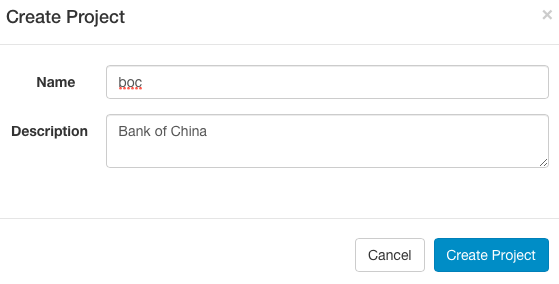

创建完毕后，在当前项目页面即可看到刚创建的项目

image::images/azkaban-8ef66.png[]

=== 上传项目

首选，点击你要上传的项目的名称，然后点击 **Upload** 按钮，你会看待以下界面：

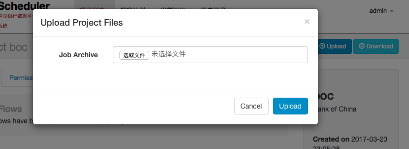

选择打包创建好的调度压缩文件。目前调度程序仅支持 zip 压缩格式文件，然后点击**Upload**按钮。

调度管理服务将会校验压缩包的内容，并对依赖关系进行检查，如果校验通过，则所有工作流将会显示在当前项目页面。

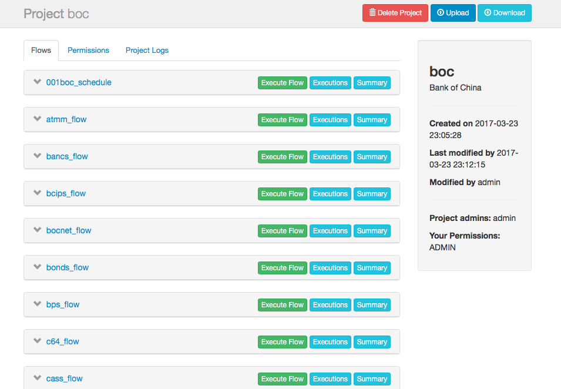

否则，调度管理服务将会给出类似下面的错误：

image::images/azkaban-2e6da.png[]

=== 工作流查看

点击工作流连接，进入到工作流查看界面，该界面你可以看到用一个关系型图来表示个工作流，工作任务之间的依赖关系，左侧面板包含了所有工作流列表。

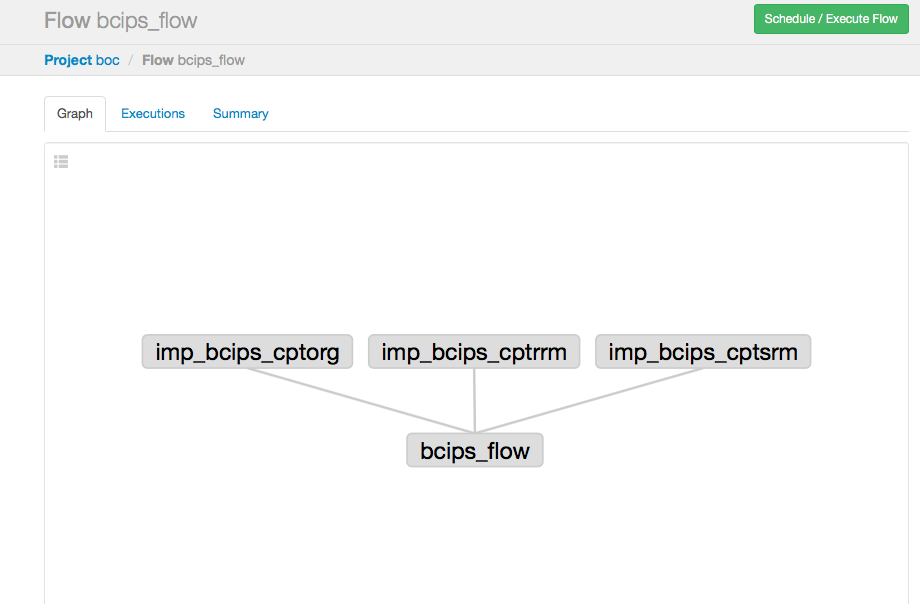

在右侧面板的工作流节点上右键或者左侧面板工作流列表中右键一个任务，然后选择 "open job" 可以看查看单个任务的情况。

在该界面，你也可以调度或者执行该工作流。

点击 Executions 标签页，则可以看到已经执行过的任务，如果是第一次，则为空白。

image::images/azkaban-977aa.png[]

=== 项目权限

当项目创建后，创建则自动成为该项目的管理者(ADMIN)。它拥有项目的上传，查看，任务修改，工作流运行，删除，以及权限分配等权力。

在项目页面，点击 Permissions 标签，既可以查看当前项目的权限分配情况

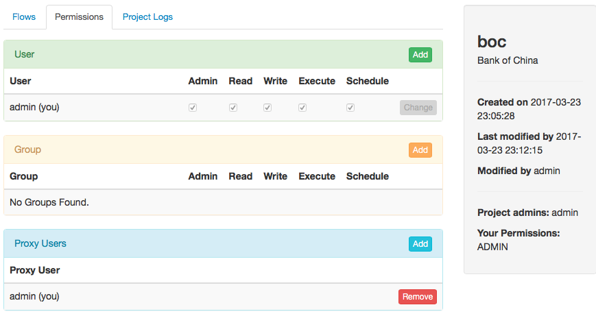

你可以分别在 User,Group,Proxy Users 中添加权限，要想获得某一个权限，就勾选该权限做的选择框。

每一个项目或者用户可以分配到5种权限，解释如下：
[[user_roles]]
[cols="2*",options="headers"]
|====
| 权限 | 描述

| ADMIN | 允许用户针对该项目做任何操作，包括删除该项目

| READ | 该用户可以查看任务、工作流以及执行的日志

| WRITE | 可以上传项目文件，任务文件可以修改

| EXECUTE | 用户可以执行、暂停和取消任务

| SCHEDULE | 用户可以增加、修改和删除一个工作流的调度任务

|====

=== 执行工作流

从工作流页面,可以点击右上方的  按钮来执行工作流，在出现的工作流执行界面
我们可以右键某一个工作流，然后选择 Disable 菜单来实现本次执行时，该工作流不执行的功能。

image::images/azkaban-58700.png[]

==== 通知选项

通知选项允许用户修改工作流执行成功或失败后的通知行为

===== 失败通知

- **首次失败** 检测到任务第一失败后发送失败邮件
- **工作结束** 如果工作流有失败的任务，他将在所有任务完成后发送失败邮件

===== 邮件重定义

我们在该界面修改一个任务的默认邮件通知情况

==== 并发选项

如果一个工作流内包含依赖和并行管理，则可以设置并发执行选项

- **跳过执行** 可选项，如果已经执行了，则不再执行
- **并发执行** 不管是否已经在执行，这次都会运行这些任务
- **管道** 任务按照一定规则进行运行，而不出现重叠，它两种运行机制：
** Level 1： 任务 A 直到之前运行的都完成后才开始运行
** Level 2： 任务 A 直到之前包含任务 A 的工作流全部完成后才开始运行

==== 工作流参数
工作流参数允许用户在运行该工作流时重新指定某些参数的值，比如指定一个特定的任务运行时间，而不是当前系统指定的时间。

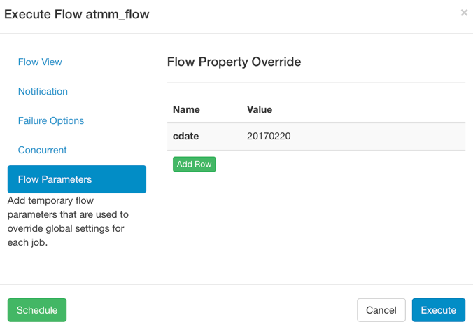

=== 执行

==== 工作流执行页面
当开始执行一个工作流后，系统将会展现当前执行的工作流页面，你也可以从工作流视图页面，历史页面或者正在执行页面访问到当前执行执行的工作流页面。

页面类似如下：

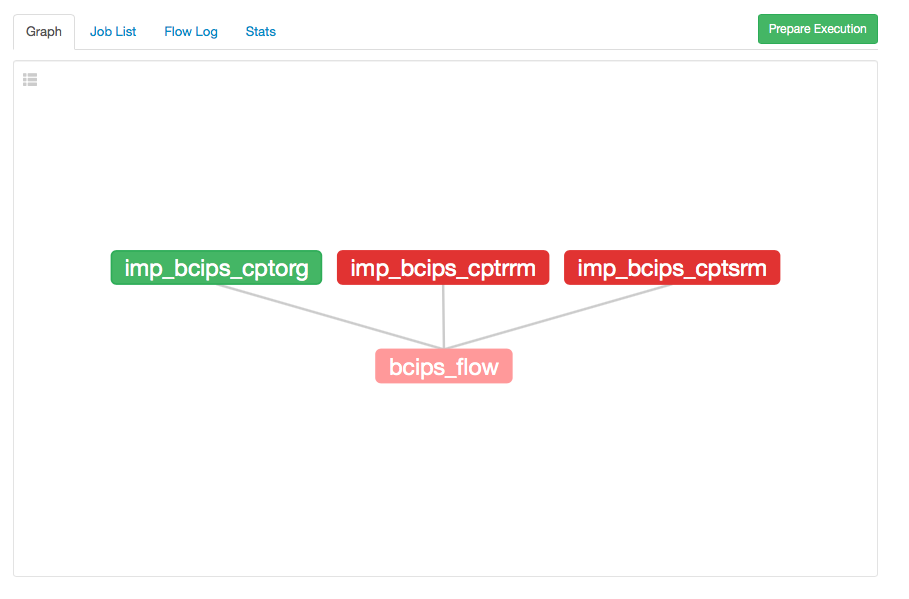

其中绿色表示执行失败，绿色表示执行成功，灰色表示该任务本次不执行。

选择 "Job List" 标签，可以看到每一个任务的执行情况，包括执行花费时间，开始时间，结束时间，状态等，类似如下：

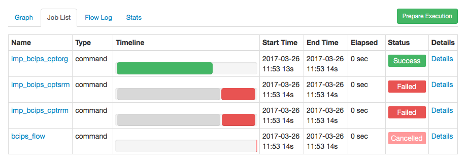

该页面会自动更新当前执行的状态，同时还可以对正在执行的任务进行以下操作：

- **Cancel** 杀掉所有正在执行的任务并返回失败，工作流状态表示为" KILLED"
- **Pause** 阻止新的任务运行，但当前已经在执行的任务还是继续执行，不受影响
- **Resume** 恢复暂停的任务
- **Retry Failed** 只有工作流状态为"FAILED FINISHING"才有效，它将尝试重新运行所有本次运行失败的任务
- **Prepare Execution** 只有当前工作流完成后才有效，不管失败还是成功。他会自动禁用哪些已经运行成功的任务再次运行

你可以点击每一个任务列表最右侧的"Detail" 连接来查看任务失败或者成功的原因，比如成功的任务详细情况类似如下：

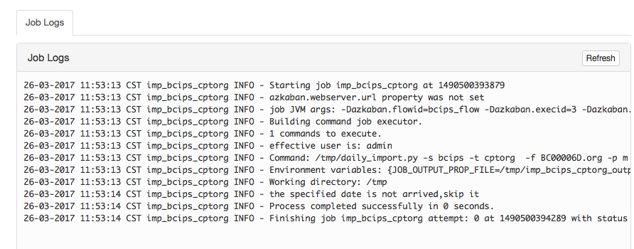

一个失败的任务的详细情况类似如下：

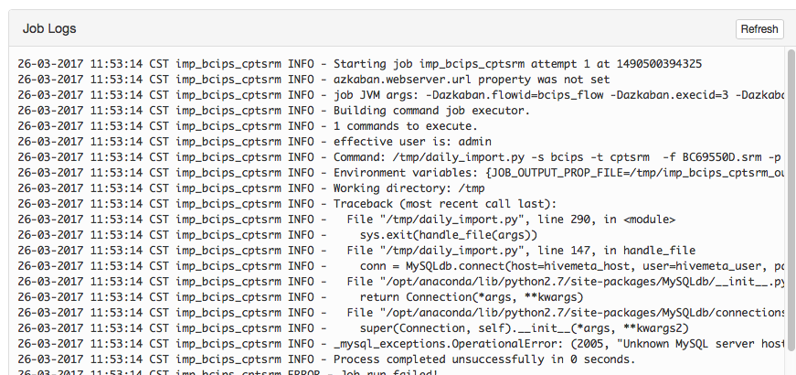

如果当前任务还在运行，则可以点击该页面上方的"Refresh"按钮来刷新输出。

=== 历史页面
当前运行的工作流一旦完成，就会出现在历史页面。历史页面保存了所有运行的历史，在该页面你可以通过搜索来查找你所需要的历史工作流。

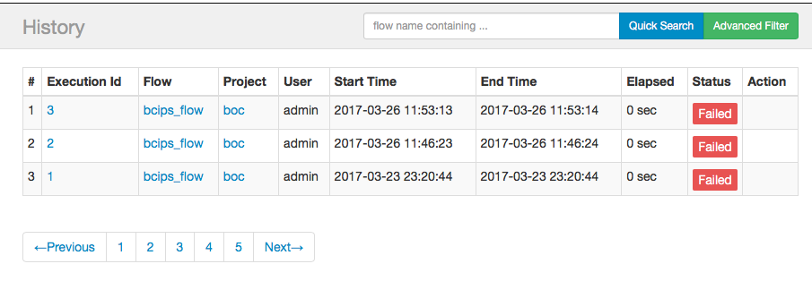

=== 调度工作流

进入你要要调度的工作，然后点击右上方的image:images/azkaban-7f8f4.png[]的按钮，在弹出的对话框中，选择左下角的image:images/azkaban-84730.png[]按钮，即可进入到该工作流的调度设置页面。

image::images/azkaban-1c8a7.png[]

调度页面的任务调度采取类似 Unix/Linux 系统的 crontab 配置语法。当你设置好调度时间后，为了更加清晰的明确调度时间是否设置正确，该页面下方的" Next 10 scheduled exections" 会依据当前语法计算出借来的10次调度时间安排，用来判断调度配置是否正确。

比如，我们想设置调度在每周一到周三的9点，10点，18点各运行一次，则可以这样设置：

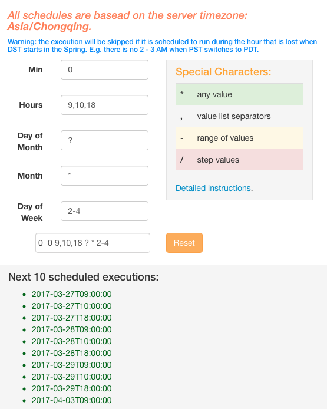

NOTE: Day of Week 输入框中，1表示周日，2表示周一，以此类推

确定配置正确后，点击该页面右下方的image:images/azkaban-84730.png[] 按钮，弹出如下提示对话框

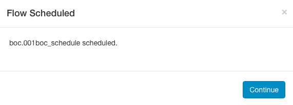

点击" Conintue" 按钮，自动带带调度计划页面，类似如下：

image::images/azkaban-8b0fb.png[]

=== SLA

服务水平协议是用来衡量一个服务的稳定读，调度系统也可以针对调度设定自己的 SLA。为了增加 SLA 通知消息，进入调度计划页面，然后点击每个调度任务最右侧的image:images/azkaban-8a01a.png[]按钮，进入 SLA 设置对话框。

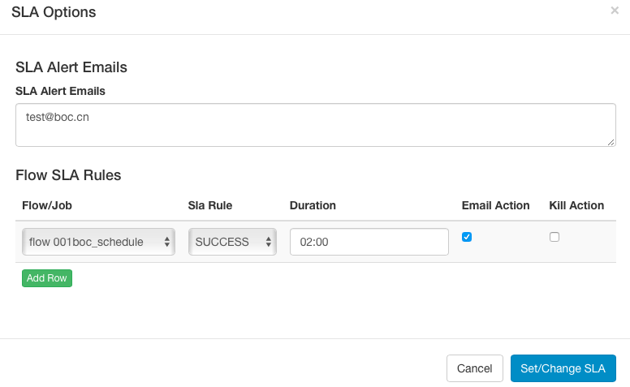

设置好 SLA 规则后，点击image:images/azkaban-6c952.png[]完成 SLA 配置。

=== 修改任务

在项目列表页面，点击你希望修改的任务，进入任务详细页面，类似如下：

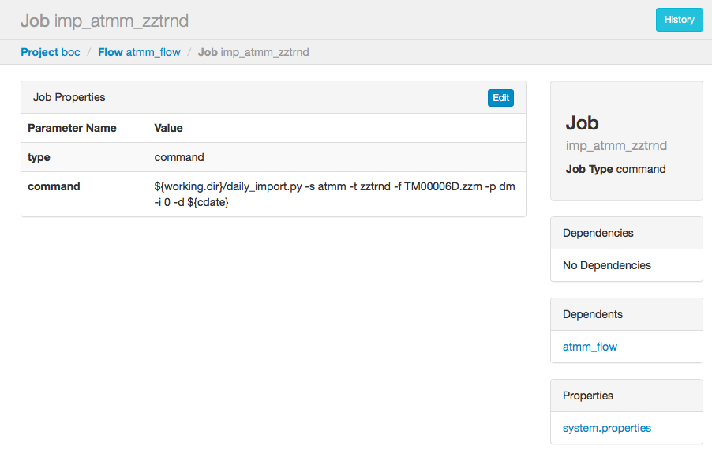

如要修改该任务，可以点击 Edit 按钮，在弹出的对话框中，General Job Settings 部分均可以修改，可以修改当前的配置值，可以增加新的配置属性。

image::images/azkaban-1fef4.png[]

修改完成，点击 Set/Change Job Description 按钮保存当前修改。

== 调度系统维护操作

=== 说明
当前调度系统运行在IP地址为 `21.148.2.66` 的/opt/azkaban 目录，所有的维护均在该目录下操作

=== 增加角色与用户

编辑 _/opt/azkaban/conf/azkaban-users.xml_ 文件，该文件类似如下：

[source,xml]
----
<azkaban-users>
        <user username="azkaban" password="azkaban" roles="admin" groups="azkaban" />
        <user username="admin" password="admin" roles="admin" groups="admin" />
        <user username="metrics" password="metrics" roles="metrics"/>

        <role name="admin" permissions="ADMIN" />
        <role name="metrics" permissions="METRICS"/>
</azkaban-users>
----
默认有三个账号，两个角色。我们可以按照 <<user_roles>>
添加需要的角色，
比如下面这样

[source, xml]
----
<role name="readall" permissions="READ" / >
----

然后再添加用户，类似如下

[source, xml]
----
<user username="job" password="job123" roles="readall"/>
----

=== 运行停止调度程序

如果需要启动调度程序，请按照下面的步骤进行操作

. 登陆到调度程序所在节点
. 切换到 hdfs 账号
. 运行命令 `/opt/azkaban/bin/azkaban-solo-start.sh`

如果需要停止调度程序，请按照下面的步骤进行操作

. 登陆到调度程序所在节点
. 切换到 hdfs 账号
. 运行命令 `/opt/azkaban/bin/azkaban-solo-shutdown.sh`

如果想重启调度程序，则分别执行停止调度程序和启动调度程序流程。

=== 修改调度程序运行端口

默认情况下，调度程序的调度管理运行在8081端口，如果想修改端口，请按照以下步骤进行操作：

. 登陆到调度程序所在的节点
. 编辑 _/opt/azkaban/conf/azkaban.properties_ 文件，修改
`jetty.port=8081` 一行，把8081修改成其他端口，保存退出
. 重启调度程序

== 常见问题解答

[qanda]

一个跑批失败后，重新跑批时，如何只运行那些失败的任务::
  进入到失败的工作流执行页面，点击右上角的 "Prepare Exection" 按钮，调度自动自动会把已经运行成功的任务设置为
  禁止运行。在弹出的对话框，点击 "Execute" 按钮即可。
如何设置一个跑批任务的跑批时间::
  默认情况下，跑批任务的跑批时间为当前日期的前一天，如果要指定特定日期跑批，请按照以下方式设定

  . 进入要跑批的项目页面，在工作流列表中，找到需要跑批的工作流，点击右边的 "Execute Flow" 按钮
  . 在弹出的页面中，点击左侧列表的 "Flow Parameters" 链接
  . 在右侧 "Flow Property Override" 面板中，点击下方列表的的 "Add Row" 按钮
  . 在出现的空白行中，点击左侧 Name 列下面的空白行，在出现的输入框中，输入 cdate
  . 在右侧 Value 列下面的空白行中，输入需要指定的8位格式日期，比如 20170207

  目前 Name 仅支持 cdate 参数，且区分大小写，因此 CDATE ,Cdate 均为无效参数
如何设置一个跑批任务的跑批时间范围::
  调度程序运行指定一个时间范围来进行跑批，其设置方法和如何设置一个跑批任务的跑批时间方法类似，只是在
  Value 栏中，输入用短横线连接的时间范围参数，比如 20170207-20170306 表示跑批任务将运行一个月的任务
如果禁止一个流程中的某些任务::
  进入要运行的流程，点击右上角的 "Schedule / Execute Flow", 在弹出的兑换中，选中不需要运行的流程，然后右键，点击 "Disable" 按钮。
  如果没有看到你要禁用的流程，则在选中该流程的父流程，然后右键，选择 "Expand Flow",然后再禁用不要运行的流程
