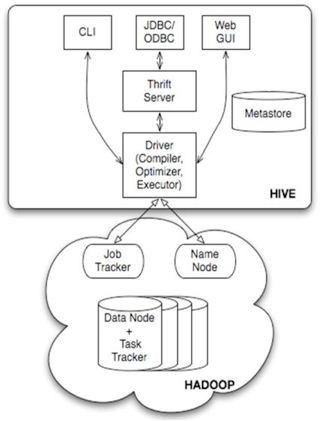
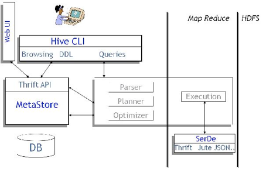

[[hive-concept]]
== Hive 基本原理 ==

Hive 是建立在 Hadoop 上的数据仓库基础构架。它提供了一系列的工具，可以用来进行数据提取转化加载（ETL），这是一种可以存储、查询和分析存储在 Hadoop 中的大规模数据的机制。Hive 定义了简单的类 SQL 查询语言，称为 QL，它允许熟悉 SQL 的用户查询数据。同时，这个语言也允许熟悉 MapReduce 开发者开发自定义的 mapper 和 reducer 来处理内建的 mapper 和 reducer 无法完成的复杂的分析工作。

=== Hive 架构 ===

Hive 的结构可以分为以下几部分：

* 用户接口：包括 CLI, Client, WUI
*	元数据存储。通常是存储在关系数据库如 mysql, derby 中
*	解释器、编译器、优化器、执行器
*	Hadoop：用 HDFS 进行存储，利用 MapReduce 进行计算

1. 用户接口主要有三个：CLI，Client 和 WUI。其中最常用的是 CLI，Cli 启动的时候，会同时启动一个 Hive 副本。Client 是 Hive 的客户端，用户连接至 Hive Server。在启动 Client 模式的时候，需要指出 Hive Server 所在节点，并且在该节点启动 Hive Server。 WUI 是通过浏览器访问 Hive。
2. Hive 将元数据存储在数据库中，如 mysql、derby。Hive 中的元数据包括表的名字，表的列和分区及其属性，表的属性（是否为外部表等），表的数据所在目录等。
3. 解释器、编译器、优化器完成 HQL 查询语句从词法分析、语法分析、编译、优化以及查询计划的生成。生成的查询计划存储在 HDFS 中，并在随后有 MapReduce 调用执行。
4. Hive 的数据存储在 HDFS 中，大部分的查询由 MapReduce 完成（包含 * 的查询，比如 select * from tbl 不会生成 MapRedcue 任务）。

[[hive-and-hadoop]]
=== Hive 和 Hadoop 的关系 ===

Hive 构建在 Hadoop 之上，

*	HQL 中对查询语句的解释、优化、生成查询计划是由 Hive 完成的
*	所有的数据都是存储在 Hadoop 中
*	查询计划被转化为 MapReduce 任务，在 Hadoop 中执行（有些查询没有 MR 任务，如：select * from table）
*	Hadoop和Hive都是用UTF-8编码的

[[hive-rdbms]]
=== Hive 和传统关系数据库的异同 ===

|=======
| | Hive | RDBMS

|查询语言 | HQL | SQL

|数据存储 | HDFS | 裸设备或本地文件系统

|索引 | 无 | 有

|执行 |MapReduce/Tez | Executor

|执行延迟 | 高  | 低

|处理数据规模 | 大 | 小

|=======

1.	查询语言。由于 SQL 被广泛的应用在数据仓库中，因此，专门针对 Hive 的特性设计了类 SQL 的查询语言 HQL。熟悉 SQL 开发的开发者可以很方便的使用 Hive 进行开发。
2.	数据存储位置。Hive 是建立在 Hadoop 之上的，所有 Hive 的数据都是存储在 HDFS 中的。而数据库则可以将数据保存在块设备或者本地文件系统中。
3.	数据格式。Hive 中没有定义专门的数据格式，数据格式可以由用户指定，用户定义数据格式需要指定三个属性：列分隔符（通常为空格、”\t”、”\x001″）、行分隔符（”\n”）以及读取文件数据的方法（Hive 中默认有三个文件格式 TextFile，SequenceFile 以及 RCFile）。由于在加载数据的过程中，不需要从用户数据格式到 Hive 定义的数据格式的转换，因此，Hive 在加载的过程中不会对数据本身进行任何修改，而只是将数据内容复制或者移动到相应的 HDFS 目录中。而在数据库中，不同的数据库有不同的存储引擎，定义了自己的数据格式。所有数据都会按照一定的组织存储，因此，数据库加载数据的过程会比较耗时。
4.	数据更新。由于 Hive 是针对数据仓库应用设计的，而数据仓库的内容是读多写少的。因此，Hive 中不支持对数据的改写和添加，所有的数据都是在加载的时候中确定好的。而数据库中的数据通常是需要经常进行修改的，因此可以使用 INSERT INTO ...  VALUES 添加数据，使用 UPDATE ... SET 修改数据。
5.	索引。之前已经说过，Hive 在加载数据的过程中不会对数据进行任何处理，甚至不会对数据进行扫描，因此也没有对数据中的某些 Key 建立索引。Hive 要访问数据中满足条件的特定值时，需要暴力扫描整个数据，因此访问延迟较高。由于 MapReduce 的引入， Hive 可以并行访问数据，因此即使没有索引，对于大数据量的访问，Hive 仍然可以体现出优势。数据库中，通常会针对一个或者几个列建立索引，因此对于少量的特定条件的数据的访问，数据库可以有很高的效率，较低的延迟。由于数据的访问延迟较高，决定了 Hive 不适合在线数据查询。
6.	执行。Hive 中大多数查询的执行是通过 Hadoop 提供的 MapReduce 来实现的（类似 select * from tbl 的查询不需要 MapReduce）。而数据库通常有自己的执行引擎。
7.	执行延迟。之前提到，Hive 在查询数据的时候，由于没有索引，需要扫描整个表，因此延迟较高。另外一个导致 Hive 执行延迟高的因素是 MapReduce 框架。由于 MapReduce 本身具有较高的延迟，因此在利用 MapReduce 执行 Hive 查询时，也会有较高的延迟。相对的，数据库的执行延迟较低。当然，这个低是有条件的，即数据规模较小，当数据规模大到超过数据库的处理能力的时候，Hive 的并行计算显然能体现出优势。
8.	可扩展性。由于 Hive 是建立在 Hadoop 之上的，因此 Hive 的可扩展性是和 Hadoop 的可扩展性是一致的（世界上最大的 Hadoop 集群在 Yahoo!，2009年的规模在 4000 台节点左右）。而数据库由于 ACID 语义的严格限制，扩展行非常有限。目前最先进的并行数据库 Oracle 在理论上的扩展能力也只有 100 台左右。
9.	数据规模。由于 Hive 建立在集群上并可以利用 MapReduce 进行并行计算，因此可以支持很大规模的数据；对应的，数据库可以支持的数据规模较小。

[[hive-metastore]]
=== Hive 元数据库 ===

Hive 将元数据存储在 RDBMS 中,一般常用的有 MySQL,PostgreSQL 和 Derby，Derby一般用于测试环境，适应于低负载的情况。在生成环境下，我们推荐使用 MySQL 或 PostgreSQL 之类的传统关系型数据库。

|======
|表名 | 说明  | 关联键

|BUCKETING_COLS | |

|COLUMNS | Hive表字段信息(字段注释，字段名，字段类型，字段序号) | SD_ID

|DBS | 元数据库信息，存放HDFS路径信息 | DB_ID

|PARTITION_KEYS | Hive分区表分区键 | PART_ID

|SDS | 所有hive表、表分区所对应的hdfs数据目录和数据格式。 | SD_ID,SERDE_ID

|SD_PARAMS | 序列化反序列化信息，如行分隔符、列分隔符、NULL的表示字符等 | SERDE_ID

|SEQUENCE_TABLE | SEQUENCE_TABLE表保存了hive对象的下一个可用ID，如 `org.apache.hadoop.hive.metastore.model.MTable`, 21，则下一个新创建的hive表其TBL_ID就是21，同时SEQUENCE_TABLE表中271786被更新为26(这里每次都是+5?)。同样，COLUMN，PARTITION等都有相应的记录 |

|SERDES | |

|SERDE_PARAMS | |

|SORT_COLS | |

|TABLE_PARAMS |表级属性，如是否外部表，表注释等 | TBL_ID

|TBLS | 所有hive表的基本信息 | TBL_ID,SD_ID

|======

从上面几张表的内容来看，hive整个创建表的过程已经比较清楚了
1.	解析用户提交hive语句，对其进行解析，分解为表、字段、分区等hive对象
2.	根据解析到的信息构建对应的表、字段、分区等对象，从SEQUENCE_TABLE中获取构建对象的最新ID，与构建对象信息(名称，类型等)一同通过DAO方法写入到元数据表中去，成功后将SEQUENCE_TABLE中对应的最新ID+5。
实际上我们常见的RDBMS都是通过这种方法进行组织的，典型的如postgresql，其系统表中和hive元数据一样裸露了这些id信息(oid,cid等),而Oracle等商业化的系统则隐藏了这些具体的ID。通过这些元数据我们可以很容易的读到数据诸如创建一个表的数据字典信息，比如导出建表语名等。

[[data-units]]
=== Hive 数据组织结构 ===

Hive 的数据组织成以下结构：

.数据库(Database)
充当命名空间的功能，以避免表、视图、分区、字段的冲突。数据库也可以用来针对用户或者用户组设定在其上的安全配置。和传统关系型数据的 database 概念相同
.表(Table)
表是有相同模式的数据集合。和传统关系型数据库的 table 概念类似。
.分区(Partitions)
每一个表可以有一个或多个分区键，分区键决定数据如何存储，同时也使得用户可以高效的查询到特定的记录。比如对于字符串类型的分区键 'date_partition' 和 字符串类型的分区键 'country_partition' ，分区键的唯一值确定了一个分区表。
比如所有日期为 '2009-12-15' ，来自 'US' 的记录都会保存在一个分区表中。因此，如果你分析 '2009-12-15' 这条所有来自 'US' 的记录，那么系统只需要读取这一个分区表即可。
.桶或族(Buckets/Clusters)
每个分区表中的数据还可以按照针对某列求散列的方式划分到不同的桶里。

注意，对一个表而言，分区和桶并不是必须的，但这些数据组织的方式使得系统在清空表数据和查询数据时都能带来效率的提升。

[[type-system]]
=== 数据类型 ===

Hive 支持的数据类型分为基本类型和复杂数据类型。更多的详细内容可以参考link:[hive-data-types]，这里简单描述。

[[primitive-types]]
==== 基本数据类型 ====

* 整型
** TINYINT -- 1字节整数
** SMALLINT -- 2字节整数
** INT -- 4字节整数
** BIGINT -- 8字节整数
* 布尔类型
** BOOLEAN -- True/False
* 浮点数
** FLOAT -- 单精度
** DOUBLE -- 双精度
* 定点数
** DECIMAL -- 固定整数位和小数位的数字
* 字符类型
** STRING -- 特定字符集的字符序列
** VARCHAR -- 特定字符集中有最大长度限定的字符序列
** CHAR -- 特定字符集中有固定长度的字符序列
* 日期和时间类型
** TIMESTAMP -- 时间戳，精确到纳秒
** DATE -- 日期
* 二进制类型
** BINARY -- 字节序列组合

[[complex-types]]
==== 复杂数据类型 ====

复杂数据类型建立在基本数据类型的基础上，他是多个基本数据类型的联合体：
.Structs
该类型里的所有元素采取点(.)记号方式访问。比如，对已一个字段 c 的类型为 `STRUCT{a INT; b INT}` ，那么元素 a 的访问方式就是 'c.a'
.Map(key-value对)
结构内的元素采取['元素名称']方式访问，比如对于字段 M 包含有 `'group'->gid` ，那么 'gid' 值可以通过 `M['group']` 方式获得。
.Array(带索引的列表)
数组(Array)的元素必须是同一类型，每个元素使用索引位置 '[n]' 方式访问。 'n' 为非0整数。比如对于一个包含 `['a','b','c']` 的字段 A，那么 'A[1]' 返回的就是 'b'

复杂数据类型可以有任意层级，可以递归创建。比如对一个类型 'User'，我们可以由以下类型组成：
* gender -- 字符创(STRING)类型
* active -- 布尔类型

[[built-in-operators]]
=== 内置的操作符 ===

Hive 内置了各种操作符用于条件查询时的过滤。

.关系操作符
以下操作符比较传递过来的操作数，然后返回 TRUE 或 FALSE21
|======
|关系操作符 | 操作数类型 | 说明

|A = B  | 所有基本数据类型 | 如果表达式 A 等于 表达式 B，则返回 TRUE；否则返回 FALSE

|A != B  | 所有基本数据类型 | 如果表达式 A 不等于 表达式 B，则返回 TRUE；否则返回 FALSE

|A < B  | 所有基本数据类型 | 如果表达式 A 小于 表达式 B，则返回 TRUE；否则返回 FALSE

|A <= B  | 所有基本数据类型 | 如果表达式 A 小于等于 表达式 B，则返回 TRUE；否则返回 FALSE

|A > B  | 所有基本数据类型 | 如果表达式 A 大于 表达式 B，则返回 TRUE；否则返回 FALSE

|A >= B  | 所有基本数据类型 | 如果表达式 A 大于等于 表达式 B，则返回 TRUE；否则返回 FALSE

| A IS NULL | 所有类型 | 如果表达式 A 等于 NULL，则返回 TRUE；否则返回 FALSE

| A IS NOT NULL | 所有数据类型 | 如果表达式 A 不等于 NULL，则返回 TRUE；否则返回 FALSE

| A LIKE B | 字符串 | 如果 字符串 A 能匹配 SQL 简单正则表达式 B，则返回 TRUE；否则返回 FALSE。B 里的 _ 字符表示匹配任意一个字符， % 表示匹配任意数量的字符。比如 `'foobar' LIKE 'foo'` 返回 FALSE，但 `'foobar' LIKE 'foo%'` 则返回 TRUE。如果要匹配 _ , % 这些字符，需要使用转义符号 '\'。

| A RLIKE B | 字符串 | 如果 A 或者 B 为 NULL ，则返回 NULL，如果 A 的任意字串（可能是空串）匹配 Java 正则表达式 B，则返回 TRUE，否则为 FALSE。

| A REGEXP B | 字符串 | 和 RLIKE 相同

|======

.算术操作符
以下操作符支持各种通用操作数上的算术操作。所有这些操作都返回数字类型
|======
| 算术操作符 | 操作数 | 说明

| A + B | 所有数字类型 | 给出 A 加 B 的结果，结果类型和操作数的类型或操作数的父类型相同；比如每个整数也属于浮点数，所以当一个浮点数 + 一个整数时，返回的数据类型是浮点数。

| A - B | 所有数字类型 | 给出 A 减 B 的结果，结果类型和操作数的类型或操作数的父类型相同；比如每个整数也属于浮点数，所以当一个浮点数 - 一个整数时，返回的数据类型是浮点数。

| A * B | 所有数字类型 | 给出 A 乘以 B 的结果，结果类型和操作数的类型或操作数的父类型相同；

| A /B | 所有数字类型 | 给出 A 除以 B 的结果，结果类型为 A 或 B 的类型。

| A % B | 所有数字类型  | 给出 A 模 B 的结果，也就是 A 除以 B 的余数。

| A & B | 所有数字类型 | 给出 A 和 B 按位与(AND)的结果

| A | B | 所有数字类型 | 给出 A 和 B 按位或(OR)的结果

| A ^ B | 所有数字类型 | 给出 A 和 B 按位异或(XOR)的结果
| ~A    | 所有数字类型 | 给出 A 位反的结果

|======

.逻辑操作符
以下操作符支持逻辑表达式的创建，所有结果返回为布尔值
|======
|逻辑操作符 | 操作数 | 说明

| A AND B | 任意类型 | 如果 A 和 B 都为 TRUE，则返回为 TRUE； 否则返回为 FALSE

| A && B  | 任意类型  | 和 A AND B 相同

| A OR B | 任意类型  | A 或 B 为 TRUE，则返回为 TRUE；否则返回 FALSE

| A || B | 任意类型 | 类似 A OR B

| NOT A | 任意类型  | 如果 A 为 False ，则返回为 TRUE；否则返回 FALSE

| !A   | 任意类型   | 同于 NOT A

|======

.复杂数据类型上的操作符
以下操作符提供访问复杂数据类型上的元素的访问方式
|======
| 操作符  | 操作数类型  | 说明

| A[n]   |  A 是一个数组(Array),n 为整数 | 返回数组里某一个元素，第一个元素的索引为0.

| M[key] | M 是一个映射(Map(k,v)) | 返回键为 key 的值

| S.x    | S 是一个结构(Struct)  | 返回结构 S 的元素 x 的值

|======

[[built-in-functions]]
=== 内置的函数 ===

.Hive 支持以下内置的函数:
|======
|返回类型 | 函数名（注册名） | 说明

| BIGINT | round(double a) | 返回 a 的四舍五入整数

| BIGINT | floor(double a) | 返回不大于 a 的最大整数

| BIGINT | ceil(double a)  | 返回不小于 a 的最小整数

| double | rand(),rand(int seed) | 返回随机数，也可以指定随机种子

| string | concat(string A, string B, ...) | 返回 字符串 B 接在 字符串 A 后字符串，这是一个字符串合并操作。比如 concat('foo', 'bar') 返回的结果就是 'foobar'。该函数接受任意数量的字符串参数

| string | substr(string A, int start)  | 返回从字符串 A 的 索引位置 start 开始到结尾的子串。比如 substr('foobar', 4) 返回 'bar'。注意，索引是从1开始计算

| string | substr(string A, int start, int length) | 返回从字符串 A 的索引位置 start 开始的，长度为 length 的字串。比如 substr('foobar', 4, 2) 的返回结果为 'ba'

| string | upper(string A) | 返回把字符串 A 的所有字符全部转为大写后的字符串。比如 upper('fOoBaR') 的结果为 'FOOBAR'

| string | ucase(string A) | 等同于 upper 函数

| string | lower(string A) | 返回把字符串 A 的所有字符全部转为小写后的字符串。比如 lower('fOoBaR') 的结果为 'foobar'

| string | lcase(string A) | 等同于 lower 函数

| string | trim(string A ) | 返回去掉字符串 A 头尾所有空格字符后的字符串。比如 trim(' foobar    ') 的结果为 'foobar'

| string | ltrim(string A) | 返回去掉字符串 A 左边开头的所有空格字符的字符串。比如 ltrim(' foobar   ') 的结果为 'foobar   '

| string | rtime(string A) | 返回去掉字符串 A 右边的所有空格字符的字符串。比如 ltrim(' foobar   ') 的结果为 ' foobar'

| string | regexp_replace(string A, string B ,string C) | 把字符串 A 中所有符合正则表达式 B 的字符串全部用 C 来替代，如果 C 不存在，则用空替代（等同于删除）。比如 regexp_replace('foobar','oo\|bar', 'B') 的返回结果为 'fBbB'

| int | size(Map<K,V>) | 返回 map 类型的元素数量

| int | size(Array<T>) | 返回 array 类型的元素数量

| <type> 值 | cast(<expr> as <type>) | 将表达式 expr 的结果转为 <type>，比如 cast('1' as BIGINT) 将会返回数字1，而不是字符串1，类型为 BIGINT。如果转换失败，则返回为 null

| string | from_unixtime(int unixtime) | 把 unix 时间戳转为日期时间的字符串表达形式。比如 from_unixtime(1441521463) 返回的结果为 '2015-09-06 14:37:43'

| string | to_date(string timestamp) | 返回字符串形式的时间的日期部分。比如 to_date('2012-12-24 11:23:45') 的返回结果为 '2012-12-24'

| int | year(string date) | 返回日期类型或字符串时间戳类型的年份部分。比如 year('2012-12-24 11:23:45') 的返回结果为 '2012'

| int | month(string date) | 返回日期类型或字符串时间戳类型的月部分。比如 month('2012-12-24 11:23:45) 的返回结果为 '12'，注意月份不会返回前缀0，比如 month('2012-01-01') 的返回结果为 1，而不是 '01'

| int | day(string date) | 返回日期类型或字符串时间戳类型的日部分。比如 year('2012-12-24 11:23:45') 的返回结果为 '24'，注意日不会返回前缀0，比如 day('2012-01-01') 的返回结果为 1，而不是 '01'

| string | get_json_object(string json_string, string path) | 从一个 json 字符串中依据指定的 path 获取 json 对象，返回该 json 对象。如果输入的 json 串无效，则返回 null

|======

.Hive 内置支持的聚合函数
|======
| 返回类型  | 聚合函数名（注册名） | 说明

| BIGINT | count(\*),count(expr),count(DISINCT expr[,expr]) | count(*) -- 返回获取的行总数，包括哪些值为 NULL 的空行；count(expr) -- 返回符合 expr 表达式且不为 NULL 的所有行数；count(DISINCT expr[,expr]) 返回符合表达式 expr 且唯一的所有行数。

| DOUBLE | sum(col)，sum(DISTINCT col)  | sum(col) -- 返回所有符合条件的行记录中字段 col 的累加结果；sum(DISTINCT col) -- 返回所有符合条件的不同行记录的字段 col 的累加结果

| DOUBLE | avg(col), avg(DISINCT col)  | 返回字段 col 的算术平均结果

| DOUBLE | min(col) | 返回字段 col 的最小值

| DOUBLE | max(col) | 返回字段 col 的最大值

|======
