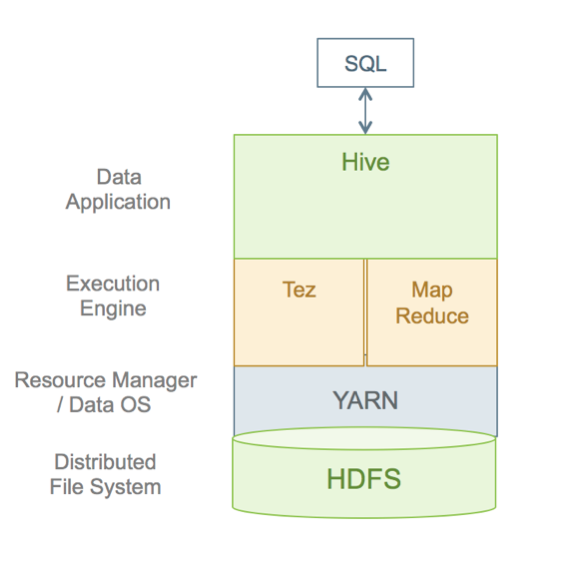
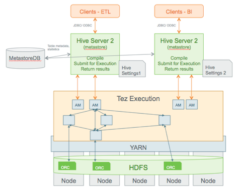
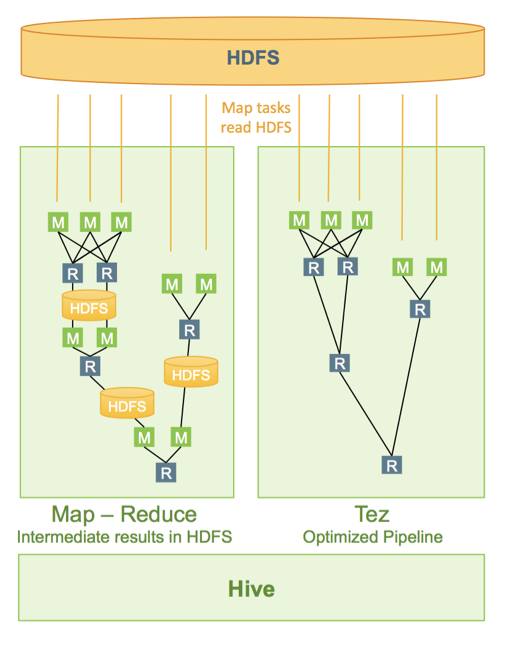
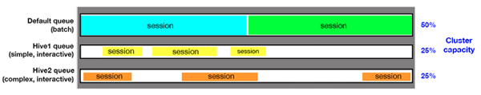

[[hive_tuning]]
== Hive 性能调优 ==

这一章我们讨论 Hive 性能优化的常用方法。

=== Hive 架构概述 ===

提交到 Hive 的 SQL 查询并开始执行大致需要经过以下步骤：

1. Hive 编译查询
2. 执行引擎 -- 比如 Tez 或 MapReduce -- 执行编译后的查询
3. 资管管理器 -- 比如 YARN -- 分配资源给应用程序
4. 与查询相关的数据从 HDFS 中获取。支持的数据格式有 ORC，AVRO，Parquet 以及纯文本
5. 查询结果集通过 JDBC/ODBC 等返回

上述执行过程的简单流程图如下：

更详细的流程图如下：

下面的内容解释上述查询执行架构的主要部分：

.Hive 客户端
我们可以使用支持 JDBC/ODBC 的工具来连接 Hive，比如 Microstrategy, Tableau, BusinessObject 或者自行开发的应用程序。
同时我们也可以使用命令行工具来连接到 Hive，比如 Hive-Cli,Beeline 等。

.SQL in Hive
Hive 支持大量的标准 SQL 语法，已经发布的 Hive 2.0 完全支持 ANSI 标准 SQL

.HiveServer2
通过 JDBC/ODBC 连接的 Hive 客户端是和 HiveServer2 进行通信，HiveServer2可以处理多用户会话，每一个会话使用不同的线程。
HiveServer2有一个内嵌的 metastore，用来执行下面的任务：

* 从 Hive Metastore 获取统计和模式
* 编译查询
* 生成查询执行计划
* 提交查询执行计划
* 返回查询结果集给客户端

.Tez Execution
查询编译后，HiveServer2生成一个 Tez 图提交给 YARN。Tez 应用管理器(AM) 监控该查询的运行情况

.Security
当提交一个查询时，Hive 执行标准 SQL 安全检查，当连接认证通过后，服务进行授权检查以确保用户提交的查询和访问的数据库、表、字段、视图以及其他资源都是有权限的。
安全也可以通过第三方组件，比如 Ranger 来增加安全机制。

.文件格式
Hive支持相当多的文件格式，还可以通过开发 SerDes(Serializers，Deserializers) 接口来支持新的文件格式。

=== Hive 高性能最佳实践 ===

以下章节描述提升 Hive 性能的最佳实践

==== 使用 Tez 查询引擎 ====

Tez 查询引擎，用来替代传统的 MapReduce，它有着更高的效率。Tez应该是首选的查询引擎，虽然 Spark SQL 也宣称执行效率高，但是所支持的 SQL 标准不如前者。

下面是 Tez 和 MapReduce 两种查询殷勤的执行流程比较

==== 使用 ORC 文件格式 ====

ORC 文件格式提供以下好处：

* **高压缩率**: 以列的方式存储，并进行压缩，这样可以使得读写磁盘的次数减少。面向列的格式也是对于向量优化的一种理想格式
* **快速读**: ORC 内建索引,min/max 值，以及其他聚合函数的结果，这使得获取这些结果时不需要真正读取数据。另外，#谓# 词下推使得过滤只需要很少的行。而且内建的布隆过滤(Bloom filters)进一步要返回的行数
* **大规模部署证明**: Facebook 在超过3000 PB 的数据集上部署了 ORC 格式。

image::images/hive-tuning-67850.png[ORC 文件格式]

.指定 ORC 作为存储格式
创建表时，可以指定存储格式以及压缩算法，类似下面这样：
[source,sql]
----
CREATE TABLE addresses (
   name string,
   street string,
   city string,
   state string,
   zip int
   ) STORED AS orc tblproperties ("orc.compress"="Zlib");
----

.切换存储格式到 ORC
我们可以从存在的表读取数据，然后以 ORC 格式拷贝存储，类似下面的命令：
[source,sql]
----
CREATE TABLE a_orc STORED AS ORC AS SELECT * FROM a;
----

.高级设置
ORC 的大部分属性不需要我们去修改，但是，对应特定的场景，你可以根据需要修改以下属性来满足业务特性。

|====
| 选项     |    默认值    | 注释

| orc.compress | ZLIB   | 压缩类型(NONE,ZLIB,SNAPPY)

| orc.compress.size | 262,144 | 每个压缩块的字节数

| orc.strip.size  | 268,435,456  | 每个条带的字节数

| orc.row.index.stride | 10,0000 | 两个索引条目中间的行数

| orc.create.index  | true   | 设置是否创建行索引

| orc.bloom.filter.columns | -- | 允许布隆过滤的字段，多个字段用逗号分隔

| orc.bloom.filter.fpp  | 0.05  | 针对布隆过滤的假阳性概率(False Positive Probability, FPP)，值在0和1之间

|====

=== 使用列统计和 CBO ===

基于成本的优化器(Cost-Based Optimizer, CBO) 可以产生更有效率的查询计划。在 Hive 中，CBO 默认启用，但它需要利用列统计来针对表产生执行计划。
列统计是高成本计算，因此不会自动执行。

启用 CBO::
如果你的 Hive 还没有启动 CBO，可以在 `hive-site.xml` 文件中配置对应的属性，也可以在Hive 中执行下面的命令启用：
[source,sql]
----
SET hive.cbo.enable=true;
----

生成统计::

CBO同时需要表级和列级的统计::
* 表级统计： 针对表级的统计收集应该总是运行，确保下面的属性已经配置在 `hive-site.xml` 文件中
[source,sql]
----
SET hive.stats.autogather=true;
----
如果已经存在的表没有做统计收集，可以直接执行下面的命令来进行收集：
[source,sql]
----
ANALYZE TABLE <table_name> COMPUTE STATISTICS;
----
* 列级统计（非常关键）
列级统计非常耗时，因此不会自动执行。对于已经存在的表，我们可以使用下面的命令来执行列统计收集：
[source,sql]
----
ANALYZE TABLE <table_name> COMPUTE STATISTICS for COLUMNS;
----
对于新增的分区，只需要对该分区做列统计收集即可。假设一个表的分区字段为'col1'，增加了一个值为'x' 的分区，那么可以执行下面的命令：
[source,sql]
----
ANALYZE TABLE <table_name> PARTITION(col1='x') COMPUTE STATISTICS for COLUMNS;
----

=== 巧妙设计数据存储 ===

下面是 Hive 的数据存储抽象层图

image::images/hive-tuning-96455.png[Hive Data Abstractions]

分区::
Hive 里的表经常使用分区，大部分情况下，表采取日期/时间进行分区，这样可以使得每天的数据载入到对应的一个分区中。
不过在大规模部署环境中，这种分区方式将会有成千上万个分区，每个分区在物理上对应一个 HDFS 上的目录。

如果一个查询刚好可以使用分区字段进行过滤，那么使用分区能显著提升查询效率。

分区字段并不在表的主体中，我们称之为“虚拟字段”，不过对于 SQL 查询而言，它和普通字段并无区别。

[source,sql]
----
create table sale(id int,amount decimal)
  partitioned by (xdate string, state string);
----

要把数据插入到上述表中，分区键可以在载入数据时最后指定
[source,sql]
----
insert into sale(xdate='2016-03-08', state='CA')
  select * from staging_table
  where xdate = '2016-03-08' and state = 'CA';
----

如果没有分区键，那么将会采取动态分区方式加载数据，不过效率会比较低。

桶(Buckets)::
表或分区可以进一步划分成桶，这等于进一步细化分区表的分区区间。

=== 使用队列来更好的管理负载 ===

队列是用来管理多个负载的主要方法。队列可以提供负载隔离，对不同的负载提供不同的容量担保。队列还可以针对不同的负载来满足不同的服务水平协议(SLA)。

在每一个队列里，你可以允许一个或多个会话同时存在。这些会话共享资源同时可以相互进行操作。

下图是一个集群配置队列示意图

==== 配置 Hive 的对队列 ====

对于多负载或多应用程序，推荐使用多个 HiveServer2 实例。每一个 HiveServer2 有自己的独立针对 Hive 和 Tez 的配置。

image::images/hive-tuning-ab495.png[Hive 配置多队列]

安装第二个 HiveServer2 实例::

下图显示了多个 HiveServer2 实例

image::images/hive-tuning-e278c.png[]

以下是手工安装第二个 HiveServer2 实例的步骤：

1. 如果安装第二个实例的节点不在当前集群范围内，需要执行下面的命令把 HDFS 相关的软件包都安装上
+
[source,sql]
----
yum install hive hcatalog hadoop hadoop-hdfs hadoop-libhdfs
        hadoop-yarn hadoop-mapreduce hadoop-client openssl
----
+
否则，只需要安装 Hive 相关的包即可
+
[source,sql]
----
yum install hive hcatalog
----
2. 从原始 HiveServer2 节点上拷贝下面的配置到新的节点上
** /etc/hive/conf 下的 hive-site.xml,hiveserver2-site.xml
** /etc/hadoop/conf 下的 core-site.xml，hdfs-site.xml，mapred-site.xml 以及 yarn-site.xml
3. 拷贝针对 Hive Metastore 的数据库 JDBC 驱动包到新节点上
4. 启动 HiveSever2 服务：
+
[source,shell]
----
su $HIVE_USER
/usr/bin/hiveserver2 -hiveconf hive.metastore.uris=" "
-hiveconf hive.log.file=hiveserver2.log
>$HIVE_LOG_DIR/hiveserver2.out 2
>$HIVE_LOG_DIR/hiveserver2.log &
----
5. 通过 Beeline 等工具连接到新的 HiveServer2 实例
+
[source,shell]
----
/usr/bin/beeline -u jdbc:hive2://<hive.server.full.hostname>:10000 $HIVE_USER password org.apache.hive.jdbc.HiveDriver
----

==== 创建和配置 YARN 容量调度队列 ====

容量调度队列可以用来在用户和组中间分配集群资源。相关配置文件为 `conf/capacity-scheduler.xml`

下面的配置例子演示了如何配置容量调度队列。该例子把队列分成短期运行和长期运行两个分离的队列：

* **hive1** -- 该队列运行那些耗时短的查询，分配整个资源的50%
* **hive2** -- 该队列运行那些耗时长的查询，分配整个资源的50%

修改配置文件，增加以下内容
[source,ini]
----
yarn.scheduler.capacity.root.queues=hive1,hive2
yarn.scheduler.capacity.root.hive1.capacity=50
yarn.scheduler.capacity.root.hive2.capacity=50
----

还可以配置使用者使用限定
[source,ini]
----
yarn.scheduler.capacity.root.hive1.maximum-capacity=50
yarn.scheduler.capacity.root.hive2.maximum-capacity=50
yarn.scheduler.capacity.root.hive1.user-limit=1
yarn.scheduler.capacity.root.hive2.user-limit=1
----
设置 **maximum-capacity** 到50表示限制可以最多可以使用到50%，注意这是一个硬限制(hard limit)。user-limit 配置为1表示单个用户最多可以使用1倍的队列配置容量。

==== 配置改变时刷新 YARN 队列 ====

通过命令行接口可以在不重启 YARN 的情况下改变 YARN 的容量配置。假定你修改了 `conf/capacity-scheduler.xml`，那么执行下面的命令即可：
[source,shell]
----
yarn rmadmin -refreshQueues
----

==== 为 TDP2.7 配置交互式队列 ====

在 TDP2.7 产品中，我们可以使用 Tuatara(GUI 工具)来配置交互式队列。

配置 Tez 容器重用::
访问 `Tuatara->Tez->配置->高级` 或者直接修改 `tez-site.xml` 可以改变 Tez 的配置。启动 Tez 重用容器针对每一个任务的内存开销和资源分配，从而提升性能。
其原理是针对特定的时间范围内配置为一定保留量的队列容量，从而使得接下来的查询可以很快运行。
要注意的是该设置时全局性的，因为为了确保该配置仅影响一个应用程序，我们必须在隔离的 HiveServer2 节点上使用独立的 `tez-site.xml`。

在一个繁忙的集群列队中，越少的交互会获得越好的性能，比如交互查询所持续的时间不超过5分钟。对于不太繁忙的队列或者我们觉得时间是一个重要的参考点时，
一个交互查询的时间也不要超过30分钟。

在 `tez-site.xml` 进行下列配置来启用容器重用：
[horizon]
* **Tez Application Master Waiting Period**(/秒) -- 指定 Tez AM 在关闭已经提交的 DAG 任务前等待的时间量。假定我们要设置为15分钟，即 15*60 = 900 秒
+
`tez.session.am.dag.submit.timeout.secs=900`
* **Tez min.held-containers** -- 指定AM 启动和查询运行完毕后保留的容器的最小数量。如果一个 AM 保留太多的容器，那么它会放弃一些容器直到降低到设定的水平。配置参数如下
+
`tez.am.session.min.hel-containers=5`

HiveServer2 配置::
HiveServer2 的配置可以通过 `Tuatara->Hive->配置->高级配置` 标签来进行修改，也可以直接编辑 `hive-site.xml` 文件。修改后，必须重启 HiveServer2 才能生效。

* **Hive Execution Engine** -- 设置为 "tez":
+
`hive.execution.engine=tez`
* **Enable Default Sessions** -- 启动该选项后，表示所有的会话默认都会使用 tez 引擎。
+
`hive.server2.tez.initialize.default.session=true`
* **Sepcify HiveServer Queues** -- 配置多个队列时，队列名之间用逗号(,)分隔。比如像下面这样
+
`hive.server2.tez.default.queues=hive1,hive2`
* **Set the Number of Sessions in Each Queue** -- 设置每个队列的会话数
+
`hive.server2.tez.sessions.per.default.queue=1`
* **Set enable.doAs**  -- 设置为 false 时，Hive提交给 YARN 的任务的运行用户不是独立的系统用户，而是运行 HiveServer2 的用户。该项设置提升了安全以及容器重用
+
`hive.server2.enable.doAs=false`

NOTE:: 当 `doAs` 设置为 false 时，这意味着所有运行 hive 任务的用户都一样，他们就能共享资源。否则，YARN 是无法在把资源在不同用户之间共享的。
这样当 hive 执行所有的查询时，tez 为一个查询打开一个会话，并保留所有的资源给下一个查询而不用重新分配。

为提升并发用户数调整配置::
当并发用户数提升后，队列的最小数保持不变，增加每个队列的会话数。比如，对5-10个并发用户而言，2-5个队列，每个队列1-2个会话比较合适。以下是配置示例：
[source,ini]
----
hive.server2.tez.default.queues=hive1,hive2,hive3
hive.server2.tez.sessions.per.default.queue=2
----
如果并发用户数提升到15，那么可以考虑使用5个队列，每个对了3个会话。

下表给出了并发用户数与队列和会话的配置推荐

|====
| 用户数   | 并发用户数    |  队列数    | 会话数/队列

| 50    | 5  | 2-5   |  1-2

| 100  |  10  | 5  | 2

| 150  | 15  | 5  | 3

| 200  | 20  | 5  | 4

|====

==== 为 TDP2.7 配置混合负载队列 ====

如果队列包含了交换式和批量的工作负载，我们可以设置队列基于使用的方式。

一般来说，针对交互式查询的调整并不会影响批量查询。所以两种类型的查询可以共存在同一个队列中。
当然，我们也可以针对交换式和批量的查询分成隔离的队列，比如50%的资源分配给批量查询，交换式查询分成2个队列，每个队列占比25%。配置如下：
[source,ini]
----
yarn.scheduler.capacity.root.queues=default,hive1,hive2
yarn.scheduler.capacity.root.default.capacity=50
yarn.scheduler.capacity.root.hive1.capacity=25
yarn.scheduler.capacity.root.hive2.capacity=25
----

=== 内存配置指南 ===

内存配置似乎很简单，但是很重要，如果配置不恰当，任务可能运行失败或者没有足够的资源运行。

YARN 内存配置::
YARN 会考虑到集群中每台服务器的所有可用计算资源。基于这些可用资源，YARN会协调运行在集群中的应用所需要的资源，比如 MapReduce。然后 YARN 通过分配容器提供给每一个应用的处理能力。
在 YARN 里，容器是处理能力的基本单位。它封装了所需要的资源元素（比如内存，CPU 等等）

在 Hadoop 集群中，平衡内存、CPU 和磁盘资源的使用很重要，以避免任务运行是不受这些资源的限制。
通常来说，每核每磁盘2个容器是集群资源利用的最佳配置。

=== 查询优化 ===
