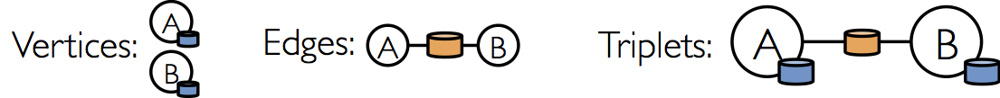

[[graphx-programming-guide]]
== GraphX编程指南 ==

GraphX是一个新的（alpha）Spark
API，它用于图和并行图(graph-parallel)的计算。GraphX通过引入link:property-graph.md[Resilient
Distributed Property Graph]：带有 顶点和边属性的有向多重图，来扩展Spark
RDD。为了支持图计算，GraphX公开一组基本的功能操作以及Pregel
API的一个优化。另外，GraphX包含了一个日益增长的图算法和图builders的
集合，用以简化图分析任务。

从社交网络到语言建模，不断增长的规模和图形数据的重要性已经推动了许多新的 `graph-parallel` 系统（如link:http://giraph.apache.org/[Giraph]和link:http://graphlab.org/[GraphLab]）的发展。
通过限制可表达的计算类型和引入新的技术来划分和分配图，这些系统可以高效地执行复杂的图形算法，比一般的`data-parallel`系统快很多。

image:./img/data_parallel_vs_graph_parallel.png[data parallel vs graph
parallel]

然而，通过这种限制可以提高性能，但是很难表示典型的图分析途径（构造图、修改它的结构或者表示跨多个图的计算）中很多重要的stages。另外，我们如何看待数据取决于我们的目标，并且同一原始数据可能有许多不同表和图的视图。

image:./img/tables_and_graphs.png[表和图]

结论是，图和表之间经常需要能够相互移动。然而，现有的图分析管道必须组成`graph-parallel`和`data- parallel`系统`，从而实现大数据的迁移和复制并生成一个复杂的编程模型。

image:./img/graph_analytics_pipeline.png[图分析路径]

GraphX项目的目的就是将`graph-parallel`和`data-parallel`统一到一个系统中，这个系统拥有一个唯一的组合API。GraphX允许用户将数据当做一个图和一个集合（RDD），而不需要
而不需要数据移动或者复杂。通过将最新的进展整合进`graph-parallel`系统，GraphX能够优化图操作的执行。

[[get-started]]
== 开始 ==

开始的第一步是引入Spark和GraphX到你的项目中，如下面所示

[source,scala]
----
mport org.apache.spark._
import org.apache.spark.graphx._
// To make some of the examples work we will also need RDD
import org.apache.spark.rdd.RDD
----

如果你没有用到Spark shell，你还将需要SparkContext。

[[the-property-graph]]
== 属性图 ==

link:https://spark.apache.org/docs/latest/api/scala/index.html#org.apache.spark.graphx.Graph[属性图]是一个有向多重图，它带有连接到每个顶点和边的用户定义的对象。
有向多重图中多个并行(parallel)的边共享相同的源和目的地顶点。支持并行边的能力简化了建模场景，这个场景中，相同的顶点存在多种关系(例如co-worker和friend)。每个顶点由一个
唯一的64位长的标识符（VertexID）作为key。GraphX并没有对顶点标识强加任何排序。同样，顶点拥有相应的源和目的顶点标识符。

属性图通过vertex(VD)和edge(ED)类型参数化，这些类型是分别与每个顶点和边相关联的对象的类型。

在某些情况下，在相同的图形中，可能希望顶点拥有不同的属性类型。这可以通过继承完成。例如，将用户和产品建模成一个二分图，我们可以用如下方式

[source,scala]
----
class VertexProperty()
case class UserProperty(val name: String) extends VertexProperty
case class ProductProperty(val name: String, val price: Double) extends VertexProperty
// The graph might then have the type:
var graph: Graph[VertexProperty, String] = null
----

和RDD一样，属性图是不可变的、分布式的、容错的。图的值或者结构的改变需要按期望的生成一个新的图来实现。注意，原始图的大部分都可以在新图中重用，用来减少这种固有的功能数据结构的成本。
执行者使用一系列顶点分区试探法来对图进行分区。如RDD一样，图中的每个分区可以在发生故障的情况下被重新创建在不同的机器上。

逻辑上的属性图对应于一对类型化的集合(RDD),这个集合编码了每一个顶点和边的属性。因此，图类包含访问图中顶点和边的成员。

[source,scala]
----
class Graph[VD, ED] {
  val vertices: VertexRDD[VD]
  val edges: EdgeRDD[ED]
}
----

`VertexRDD[VD]`和`EdgeRDD[ED]`类分别继承和优化自`RDD[(VertexID, VD)]`和`RDD[Edge[ED]]`。`VertexRDD[VD]`和`EdgeRDD[ED]`都支持额外的功能来建立在图计算和利用内部优化。

[[example-property-graph]]
=== 属性图的例子 ===

在GraphX项目中，假设我们想构造一个包括不同合作者的属性图。顶点属性可能包含用户名和职业。我们可以用描述合作者之间关系的字符串标注边缘。

image:./img/property_graph.png[属性图]

所得的图形将具有类型签名

[source,scala]
----
val userGraph: Graph[(String, String), String]
----

有很多方式从一个原始文件、RDD构造一个属性图。最一般的方法是利用link:https://spark.apache.org/docs/latest/api/scala/index.html#org.apache.spark.graphx.Graph$[Graph
object]。 下面的代码从RDD集合生成属性图。

[source,scala]
----
// Assume the SparkContext has already been constructed
val sc: SparkContext
// Create an RDD for the vertices
val users: RDD[(VertexId, (String, String))] =
  sc.parallelize(Array((3L, ("rxin", "student")), (7L, ("jgonzal", "postdoc")),
                       (5L, ("franklin", "prof")), (2L, ("istoica", "prof"))))
// Create an RDD for edges
val relationships: RDD[Edge[String]] =
  sc.parallelize(Array(Edge(3L, 7L, "collab"),    Edge(5L, 3L, "advisor"),
                       Edge(2L, 5L, "colleague"), Edge(5L, 7L, "pi")))
// Define a default user in case there are relationship with missing user
val defaultUser = ("John Doe", "Missing")
// Build the initial Graph
val graph = Graph(users, relationships, defaultUser)
----

在上面的例子中，我们用到了link:https://spark.apache.org/docs/latest/api/scala/index.html#org.apache.spark.graphx.Edge[Edge]样本类。边有一个 `srcId` 和 `dstId` 分别对应
于源和目标顶点的标示符。另外，`Edge` 类有一个 `attr` 成员用来存储边属性。

我们可以分别用 `graph.vertices` 和 `graph.edges` 成员将一个图解构为相应的顶点和边。

[source,scala]
----
val graph: Graph[(String, String), String] // Constructed from above
// Count all users which are postdocs
graph.vertices.filter { case (id, (name, pos)) => pos == "postdoc" }.count
// Count all the edges where src > dst
graph.edges.filter(e => e.srcId > e.dstId).count
----

....
注意，graph.vertices返回一个VertexRDD[(String, String)]，它继承于 RDD[(VertexID, (String, String))]。所以我们可以用scala的case表达式解构这个元组。另一方面，
graph.edges返回一个包含Edge[String]对象的EdgeRDD。我们也可以用到case类的类型构造器，如下例所示。

graph.edges.filter { case Edge(src, dst, prop) => src > dst }.count
....

除了属性图的顶点和边视图，GraphX也包含了一个三元组视图，三元视图逻辑上将顶点和边的属性保存为一个 `RDD[EdgeTriplet[VD, ED]]`，它包含link:https://spark.apache.org/docs/latest/api/scala/index.html#org.apache.spark.graphx.EdgeTriplet[EdgeTriplet]类的实例。
可以通过下面的Sql表达式表示这个连接。

[source,sql]
----
SELECT src.id, dst.id, src.attr, e.attr, dst.attr
FROM edges AS e LEFT JOIN vertices AS src, vertices AS dst
ON e.srcId = src.Id AND e.dstId = dst.Id
----

或者通过下面的图来表示。

`EdgeTriplet `类继承于 `Edge` 类，并且加入了 `srcAttr` 和 `dstAttr` 成员，这两个成员分别包含源和目的的属性。我们可以用一个三元组视图渲染字符串集合用来描述用户之间的关系。

[source,scala]
----
val graph: Graph[(String, String), String] // Constructed from above
// Use the triplets view to create an RDD of facts.
val facts: RDD[String] =
  graph.triplets.map(triplet =>
    triplet.srcAttr._1 + " is the " + triplet.attr + " of " + triplet.dstAttr._1)
facts.collect.foreach(println(_))
----
[[graph-operators]]
== 图操作符 ==

正如RDDs有基本的操作map,
filter和reduceByKey一样，属性图也有基本的集合操作，这些操作采用用户自定义的函数并产生包含转换特征和结构的新图。定义在link:http://spark.apache.org/docs/latest/api/scala/index.html#org.apache.spark.graphx.Graph[Graph]中的
核心操作是经过优化的实现。表示为核心操作的组合的便捷操作定义在link:http://spark.apache.org/docs/latest/api/scala/index.html#org.apache.spark.graphx.GraphOps[GraphOps]中。然而，
因为有Scala的隐式转换，定义在 `GraphOps` 中的操作可以作为 `Graph` 的成员自动使用。例如，我们可以通过下面的方式计算每个顶点(定义在GraphOps中)的入度。

[source,scala]
----
val graph: Graph[(String, String), String]
// Use the implicit GraphOps.inDegrees operator
val inDegrees: VertexRDD[Int] = graph.inDegrees
----

区分核心图操作和 `GraphOps` 的原因是为了在将来支持不同的图表示。每个图表示都必须提供核心操作的实现并重用很多定义在`GraphOps`中的有用操作。

[[summary-list-of-operators]]
=== 操作一览 ===

以下是定义在 `Graph` 和 `GraphOps` 中（为了简单起见，表现为图的成员）的功能的快速浏览。注意，某些函数签名已经简化（如默认参数和类型的限制已删除），一些更高级的功能已经被
删除，所以请参阅API文档了解官方的操作列表。

[source,scala]
----
/** Summary of the functionality in the property graph */
class Graph[VD, ED] {
  // Information about the Graph ===================================================================
  val numEdges: Long
  val numVertices: Long
  val inDegrees: VertexRDD[Int]
  val outDegrees: VertexRDD[Int]
  val degrees: VertexRDD[Int]
  // Views of the graph as collections =============================================================
  val vertices: VertexRDD[VD]
  val edges: EdgeRDD[ED]
  val triplets: RDD[EdgeTriplet[VD, ED]]
  // Functions for caching graphs ==================================================================
  def persist(newLevel: StorageLevel = StorageLevel.MEMORY_ONLY): Graph[VD, ED]
  def cache(): Graph[VD, ED]
  def unpersistVertices(blocking: Boolean = true): Graph[VD, ED]
  // Change the partitioning heuristic  ============================================================
  def partitionBy(partitionStrategy: PartitionStrategy): Graph[VD, ED]
  // Transform vertex and edge attributes ==========================================================
  def mapVertices[VD2](map: (VertexID, VD) => VD2): Graph[VD2, ED]
  def mapEdges[ED2](map: Edge[ED] => ED2): Graph[VD, ED2]
  def mapEdges[ED2](map: (PartitionID, Iterator[Edge[ED]]) => Iterator[ED2]): Graph[VD, ED2]
  def mapTriplets[ED2](map: EdgeTriplet[VD, ED] => ED2): Graph[VD, ED2]
  def mapTriplets[ED2](map: (PartitionID, Iterator[EdgeTriplet[VD, ED]]) => Iterator[ED2])
    : Graph[VD, ED2]
  // Modify the graph structure ====================================================================
  def reverse: Graph[VD, ED]
  def subgraph(
      epred: EdgeTriplet[VD,ED] => Boolean = (x => true),
      vpred: (VertexID, VD) => Boolean = ((v, d) => true))
    : Graph[VD, ED]
  def mask[VD2, ED2](other: Graph[VD2, ED2]): Graph[VD, ED]
  def groupEdges(merge: (ED, ED) => ED): Graph[VD, ED]
  // Join RDDs with the graph ======================================================================
  def joinVertices[U](table: RDD[(VertexID, U)])(mapFunc: (VertexID, VD, U) => VD): Graph[VD, ED]
  def outerJoinVertices[U, VD2](other: RDD[(VertexID, U)])
      (mapFunc: (VertexID, VD, Option[U]) => VD2)
    : Graph[VD2, ED]
  // Aggregate information about adjacent triplets =================================================
  def collectNeighborIds(edgeDirection: EdgeDirection): VertexRDD[Array[VertexID]]
  def collectNeighbors(edgeDirection: EdgeDirection): VertexRDD[Array[(VertexID, VD)]]
  def aggregateMessages[Msg: ClassTag](
      sendMsg: EdgeContext[VD, ED, Msg] => Unit,
      mergeMsg: (Msg, Msg) => Msg,
      tripletFields: TripletFields = TripletFields.All)
    : VertexRDD[A]
  // Iterative graph-parallel computation ==========================================================
  def pregel[A](initialMsg: A, maxIterations: Int, activeDirection: EdgeDirection)(
      vprog: (VertexID, VD, A) => VD,
      sendMsg: EdgeTriplet[VD, ED] => Iterator[(VertexID,A)],
      mergeMsg: (A, A) => A)
    : Graph[VD, ED]
  // Basic graph algorithms ========================================================================
  def pageRank(tol: Double, resetProb: Double = 0.15): Graph[Double, Double]
  def connectedComponents(): Graph[VertexID, ED]
  def triangleCount(): Graph[Int, ED]
  def stronglyConnectedComponents(numIter: Int): Graph[VertexID, ED]
}
----

[[property-opertors]]
=== 属性操作 ===

如RDD的`map`操作一样，属性图包含下面的操作：

[source,scala]
----
class Graph[VD, ED] {
  def mapVertices[VD2](map: (VertexId, VD) => VD2): Graph[VD2, ED]
  def mapEdges[ED2](map: Edge[ED] => ED2): Graph[VD, ED2]
  def mapTriplets[ED2](map: EdgeTriplet[VD, ED] => ED2): Graph[VD, ED2]
}
----

每个操作都产生一个新的图，这个新的图包含通过用户自定义的map操作修改后的顶点或边的属性。

注意，每种情况下图结构都不受影响。这些操作的一个重要特征是它允许所得图形重用原有图形的结构索引(indices)。下面的两行代码在逻辑上是等价的，但是第一个不保存结构索引，所以
不会从GraphX系统优化中受益。

[source,scala]
----
val newVertices = graph.vertices.map { case (id, attr) => (id, mapUdf(id, attr)) }
val newGraph = Graph(newVertices, graph.edges)
----

另一种方法是用http://spark.apache.org/docs/latest/api/scala/index.html#org.apache.spark.graphx.Graph@mapVertices%5BVD2%5D((VertexId,VD)⇒VD2)(ClassTag%5BVD2%5D):Graph%5BVD2,ED%5D[mapVertices]保存索引。

[source,scala]
----
val newGraph = graph.mapVertices((id, attr) => mapUdf(id, attr))
----

这些操作经常用来初始化的图形，用作特定计算或者用来处理项目不需要的属性。例如，给定一个图，这个图的顶点特征包含出度，我们为PageRank初始化它。

[source,scala]
----
// Given a graph where the vertex property is the out degree
val inputGraph: Graph[Int, String] =
  graph.outerJoinVertices(graph.outDegrees)((vid, _, degOpt) => degOpt.getOrElse(0))
// Construct a graph where each edge contains the weight
// and each vertex is the initial PageRank
val outputGraph: Graph[Double, Double] =
  inputGraph.mapTriplets(triplet => 1.0 / triplet.srcAttr).mapVertices((id, _) => 1.0)
----

[[structural-operators]]
==== 结构性操作 ====

当前的GraphX仅仅支持一组简单的常用结构性操作。下面是基本的结构性操作列表。

[source,scala]
----
class Graph[VD, ED] {
  def reverse: Graph[VD, ED]
  def subgraph(epred: EdgeTriplet[VD,ED] => Boolean,
               vpred: (VertexId, VD) => Boolean): Graph[VD, ED]
  def mask[VD2, ED2](other: Graph[VD2, ED2]): Graph[VD, ED]
  def groupEdges(merge: (ED, ED) => ED): Graph[VD,ED]
}
----

http://spark.apache.org/docs/latest/api/scala/index.html#org.apache.spark.graphx.Graph@reverse:Graph%5BVD,ED%5D[reverse]操作返回一个新的图，这个图的边的方向都是反转的。例如，这个操作可以用来计算反转的PageRank。因为反转操作没有修改顶点或者边的属性或者改变边的数量，所以我们可以
在不移动或者复制数据的情况下有效地实现它。

http://spark.apache.org/docs/latest/api/scala/index.html#org.apache.spark.graphx.Graph@subgraph((EdgeTriplet%5BVD,ED%5D)⇒Boolean,(VertexId,VD)⇒Boolean):Graph%5BVD,ED%5D[subgraph]操作
利用顶点和边的谓词（predicates），返回的图仅仅包含满足顶点谓词的顶点、满足边谓词的边以及满足顶点谓词的连接顶点（connect
vertices）。`subgraph`操作可以用于很多场景，如获取
感兴趣的顶点和边组成的图或者获取清除断开链接后的图。下面的例子删除了断开的链接。

[source,scala]
----
// Create an RDD for the vertices
val users: RDD[(VertexId, (String, String))] =
  sc.parallelize(Array((3L, ("rxin", "student")), (7L, ("jgonzal", "postdoc")),
                       (5L, ("franklin", "prof")), (2L, ("istoica", "prof")),
                       (4L, ("peter", "student"))))
// Create an RDD for edges
val relationships: RDD[Edge[String]] =
  sc.parallelize(Array(Edge(3L, 7L, "collab"),    Edge(5L, 3L, "advisor"),
                       Edge(2L, 5L, "colleague"), Edge(5L, 7L, "pi"),
                       Edge(4L, 0L, "student"),   Edge(5L, 0L, "colleague")))
// Define a default user in case there are relationship with missing user
val defaultUser = ("John Doe", "Missing")
// Build the initial Graph
val graph = Graph(users, relationships, defaultUser)
// Notice that there is a user 0 (for which we have no information) connected to users
// 4 (peter) and 5 (franklin).
graph.triplets.map(
    triplet => triplet.srcAttr._1 + " is the " + triplet.attr + " of " + triplet.dstAttr._1
  ).collect.foreach(println(_))
// Remove missing vertices as well as the edges to connected to them
val validGraph = graph.subgraph(vpred = (id, attr) => attr._2 != "Missing")
// The valid subgraph will disconnect users 4 and 5 by removing user 0
validGraph.vertices.collect.foreach(println(_))
validGraph.triplets.map(
    triplet => triplet.srcAttr._1 + " is the " + triplet.attr + " of " + triplet.dstAttr._1
  ).collect.foreach(println(_))
----

注意，上面的例子中，仅仅提供了顶点谓词。如果没有提供顶点或者边的谓词，`subgraph`操作默认为true。

link:http://spark.apache.org/docs/latest/api/scala/index.html#org.apache.spark.graphx.Graph@mask%5BVD2,ED2%5D(Graph%5BVD2,ED2%5D)(ClassTag%5BVD2%5D,ClassTag%5BED2%5D):Graph%5BVD,ED%5D[mask]操作
构造一个子图，这个子图包含输入图中包含的顶点和边。这个操作可以和`subgraph`操作相结合，基于另外一个相关图的特征去约束一个图。例如，我们可能利用缺失顶点的图运行连通体（？连通组件connected
components），然后返回有效的子图。

[source,scala]
----
/ Run Connected Components
val ccGraph = graph.connectedComponents() // No longer contains missing field
// Remove missing vertices as well as the edges to connected to them
val validGraph = graph.subgraph(vpred = (id, attr) => attr._2 != "Missing")
// Restrict the answer to the valid subgraph
val validCCGraph = ccGraph.mask(validGraph)
----

http://spark.apache.org/docs/latest/api/scala/index.html#org.apache.spark.graphx.Graph@groupEdges((ED,ED)⇒ED):Graph%5BVD,ED%5D[groupEdges]操作合并多重图
中的并行边(如顶点对之间重复的边)。在大量的应用程序中，并行的边可以合并（它们的权重合并）为一条边从而降低图的大小。

[[join-operators]]
=== 连接操作 ===

在许多情况下，有必要将外部数据加入到图中。例如，我们可能有额外的用户属性需要合并到已有的图中或者我们可能想从一个图中取出顶点特征加入到另外一个图中。这些任务可以用join操作完成。
下面列出的是主要的join操作。

[source,scala]
----
class Graph[VD, ED] {
  def joinVertices[U](table: RDD[(VertexId, U)])(map: (VertexId, VD, U) => VD)
    : Graph[VD, ED]
  def outerJoinVertices[U, VD2](table: RDD[(VertexId, U)])(map: (VertexId, VD, Option[U]) => VD2)
    : Graph[VD2, ED]
}
----

joinVertices
操作将输入RDD和顶点相结合，返回一个新的带有顶点特征的图。这些特征是通过在连接顶点的结果上使用用户定义的`map`函数获得的。在RDD中没有匹配值的顶点保留其原始值。

注意，对于给定的顶点，如果RDD中有超过1个的匹配值，则仅仅使用其中的一个。建议用下面的方法保证输入RDD的唯一性。下面的方法也会预索引返回的值用以加快后续的join操作。

[source,scala]
----
val nonUniqueCosts: RDD[(VertexID, Double)]
val uniqueCosts: VertexRDD[Double] =
  graph.vertices.aggregateUsingIndex(nonUnique, (a,b) => a + b)
val joinedGraph = graph.joinVertices(uniqueCosts)(
  (id, oldCost, extraCost) => oldCost + extraCost)
----

除了将用户自定义的map函数用到所有顶点和改变顶点属性类型以外，更一般的 `outerJoinVertices` 与 `joinVertices` 类似。
因为并不是所有顶点在RDD中拥有匹配的值，map函数需要一个option类型。

[source,scala]
----
val outDegrees: VertexRDD[Int] = graph.outDegrees
val degreeGraph = graph.outerJoinVertices(outDegrees) { (id, oldAttr, outDegOpt) =>
  outDegOpt match {
    case Some(outDeg) => outDeg
    case None => 0 // No outDegree means zero outDegree
  }
}
----

你可能已经注意到了，在上面的例子中用到了curry函数的多参数列表。虽然我们可以将f(a)(b)写成f(a,b)，但是f(a,b)意味着b的类型推断将不会依赖于a。因此，用户需要为定义
的函数提供类型标注。

[source,scala]
----
val joinedGraph = graph.joinVertices(uniqueCosts,
  (id: VertexID, oldCost: Double, extraCost: Double) => oldCost + extraCost)
----

[[neighborhood-aggregation]]
=== 相邻聚合（Neighborhood Aggregation） ===

图分析任务的一个关键步骤是汇总每个顶点附近的信息。例如我们可能想知道每个用户的追随者的数量或者每个用户的追随者的平均年龄。许多迭代图算法（如PageRank，最短路径和连通体）
多次聚合相邻顶点的属性。

为了提高性能，主要的聚合操作从`graph.mapReduceTriplets`改为了新的`graph.AggregateMessages`。虽然API的改变相对较小，但是我们仍然提供了过渡的指南。

[[aggregatemessages]]
==== 聚合消息(aggregateMessages)  ====

GraphX中的核心聚合操作是http://spark.apache.org/docs/latest/api/scala/index.html#org.apache.spark.graphx.Graph@aggregateMessages%5BA%5D((EdgeContext%5BVD,ED,A%5D)⇒Unit,(A,A)⇒A,TripletFields)(ClassTag%5BA%5D):VertexRDD%5BA%5D[aggregateMessages]。
这个操作将用户定义的`sendMsg`函数应用到图的每个边三元组(edge
triplet)，然后应用`mergeMsg`函数在其目的顶点聚合这些消息。

[source,scala]
----
class Graph[VD, ED] {
  def aggregateMessages[Msg: ClassTag](
      sendMsg: EdgeContext[VD, ED, Msg] => Unit,
      mergeMsg: (Msg, Msg) => Msg,
      tripletFields: TripletFields = TripletFields.All)
    : VertexRDD[Msg]
}
----

用户自定义的`sendMsg`函数是一个http://spark.apache.org/docs/latest/api/scala/index.html#org.apache.spark.graphx.EdgeContext[EdgeContext]类型。它暴露源和目的属性以及边缘属性
以及发送消息给源和目的属性的函数(http://spark.apache.org/docs/latest/api/scala/index.html#org.apache.spark.graphx.EdgeContext@sendToSrc(msg:A):Unit[sendToSrc]和http://spark.apache.org/docs/latest/api/scala/index.html#org.apache.spark.graphx.EdgeContext@sendToDst(msg:A):Unit[sendToDst])。
可将`sendMsg`函数看做map-reduce过程中的map函数。用户自定义的`mergeMsg`函数指定两个消息到相同的顶点并保存为一个消息。可以将`mergeMsg`函数看做map-reduce过程中的reduce函数。
http://spark.apache.org/docs/latest/api/scala/index.html#org.apache.spark.graphx.Graph@aggregateMessages%5BA%5D((EdgeContext%5BVD,ED,A%5D)⇒Unit,(A,A)⇒A,TripletFields)(ClassTag%5BA%5D):VertexRDD%5BA%5D[aggregateMessages]
操作返回一个包含聚合消息(目的地为每个顶点)的`VertexRDD[Msg]`。没有接收到消息的顶点不包含在返回的`VertexRDD`中。

另外，http://spark.apache.org/docs/latest/api/scala/index.html#org.apache.spark.graphx.Graph@aggregateMessages%5BA%5D((EdgeContext%5BVD,ED,A%5D)⇒Unit,(A,A)⇒A,TripletFields)(ClassTag%5BA%5D):VertexRDD%5BA%5D[aggregateMessages]
有一个可选的`tripletFields`参数，它指出在`EdgeContext`中，哪些数据被访问（如源顶点特征而不是目的顶点特征）。`tripletsFields`可能的选项定义在http://spark.apache.org/docs/latest/api/java/org/apache/spark/graphx/TripletFields.html[TripletFields]中。
`tripletFields`参数用来通知GraphX仅仅只需要`EdgeContext`的一部分允许GraphX选择一个优化的连接策略。例如，如果我们想计算每个用户的追随者的平均年龄，我们仅仅只需要源字段。
所以我们用`TripletFields.Src`表示我们仅仅只需要源字段。

在下面的例子中，我们用`aggregateMessages`操作计算每个用户更年长的追随者的年龄。

[source,scala]
----
// Import random graph generation library
import org.apache.spark.graphx.util.GraphGenerators
// Create a graph with "age" as the vertex property.  Here we use a random graph for simplicity.
val graph: Graph[Double, Int] =
  GraphGenerators.logNormalGraph(sc, numVertices = 100).mapVertices( (id, _) => id.toDouble )
// Compute the number of older followers and their total age
val olderFollowers: VertexRDD[(Int, Double)] = graph.aggregateMessages[(Int, Double)](
  triplet => { // Map Function
    if (triplet.srcAttr > triplet.dstAttr) {
      // Send message to destination vertex containing counter and age
      triplet.sendToDst(1, triplet.srcAttr)
    }
  },
  // Add counter and age
  (a, b) => (a._1 + b._1, a._2 + b._2) // Reduce Function
)
// Divide total age by number of older followers to get average age of older followers
val avgAgeOfOlderFollowers: VertexRDD[Double] =
  olderFollowers.mapValues( (id, value) => value match { case (count, totalAge) => totalAge / count } )
// Display the results
avgAgeOfOlderFollowers.collect.foreach(println(_))
----

当消息（以及消息的总数）是常量大小(列表和连接替换为浮点数和添加)时，`aggregateMessages`操作的效果最好。

[[map-reduce-triplets-transition]]
==== Map Reduce三元组过渡指南 ====

在之前版本的GraphX中，利用[mapReduceTriplets]操作完成相邻聚合。

[source,scala]
----
class Graph[VD, ED] {
  def mapReduceTriplets[Msg](
      map: EdgeTriplet[VD, ED] => Iterator[(VertexId, Msg)],
      reduce: (Msg, Msg) => Msg)
    : VertexRDD[Msg]
}
----

`mapReduceTriplets`操作在每个三元组上应用用户定义的map函数，然后保存用用户定义的reduce函数聚合的消息。然而，我们发现用户返回的迭代器是昂贵的，它抑制了我们添加额外优化(例如本地顶点的重新编号)的能力。
`aggregateMessages`
暴露三元组字段和函数显示的发送消息到源和目的顶点。并且，我们删除了字节码检测转而需要用户指明三元组的哪些字段实际需要。

下面的代码用到了 `mapReduceTriplets`

[source,scala]
----
val graph: Graph[Int, Float] = ...
def msgFun(triplet: Triplet[Int, Float]): Iterator[(Int, String)] = {
  Iterator((triplet.dstId, "Hi"))
}
def reduceFun(a: Int, b: Int): Int = a + b
val result = graph.mapReduceTriplets[String](msgFun, reduceFun)
----

下面的代码用到了 `aggregateMessages`

[source,scala]
----
val graph: Graph[Int, Float] = ...
def msgFun(triplet: EdgeContext[Int, Float, String]) {
  triplet.sendToDst("Hi")
}
def reduceFun(a: Int, b: Int): Int = a + b
val result = graph.aggregateMessages[String](msgFun, reduceFun)
----

[[computing-degree-information]]
==== 计算度信息 ====

最一般的聚合任务就是计算顶点的度，即每个顶点相邻边的数量。在有向图中，经常需要知道顶点的入度、出度以及总共的度。http://spark.apache.org/docs/latest/api/scala/index.html#org.apache.spark.graphx.GraphOps[GraphOps]
类包含一个操作集合用来计算每个顶点的度。例如，下面的例子计算最大的入度、出度和总度。

[source,scala]
----
// Define a reduce operation to compute the highest degree vertex
def max(a: (VertexId, Int), b: (VertexId, Int)): (VertexId, Int) = {
  if (a._2 > b._2) a else b
}
// Compute the max degrees
val maxInDegree: (VertexId, Int)  = graph.inDegrees.reduce(max)
val maxOutDegree: (VertexId, Int) = graph.outDegrees.reduce(max)
val maxDegrees: (VertexId, Int)   = graph.degrees.reduce(max)
----

[[collecting-neighbors]]
==== Collecting Neighbors ====

在某些情况下，通过收集每个顶点相邻的顶点及它们的属性来表达计算可能更容易。这可以通过 `collectNeighborIds`
和 `collectNeighbors` 操作来简单的完成

[source,scala]
----
class GraphOps[VD, ED] {
  def collectNeighborIds(edgeDirection: EdgeDirection): VertexRDD[Array[VertexId]]
  def collectNeighbors(edgeDirection: EdgeDirection): VertexRDD[ Array[(VertexId, VD)] ]
}
----

这些操作是非常昂贵的，因为它们需要重复的信息和大量的通信。如果可能，尽量用`aggregateMessages`操作直接表达相同的计算。

[[caching-and-uncaching]]
=== 缓存和不缓存 ===

在Spark中，RDDs默认是不缓存的。为了避免重复计算，当需要多次利用它们时，我们必须显示地缓存它们。GraphX中的图也有相同的方式。当利用到图多次时，确保首先访问`Graph.cache()`方法。

在迭代计算中，为了获得最佳的性能，不缓存可能是必须的。默认情况下，缓存的RDDs和图会一直保留在内存中直到因为内存压力迫使它们以LRU的顺序删除。对于迭代计算，先前的迭代的中间结果将填充到缓存
中。虽然它们最终会被删除，但是保存在内存中的不需要的数据将会减慢垃圾回收。只有中间结果不需要，不缓存它们是更高效的。这涉及到在每次迭代中物化一个图或者RDD而不缓存所有其它的数据集。
在将来的迭代中仅用物化的数据集。然而，因为图是由多个RDD组成的，正确的不持久化它们是困难的。对于迭代计算，我们建议使用Pregel
API，它可以正确的不持久化中间结果。

[[pregel-api]]
== Pregel API ==

图本身是递归数据结构，顶点的属性依赖于它们邻居的属性，这些邻居的属性又依赖于自己邻居的属性。所以许多重要的图算法都是迭代的重新计算每个顶点的属性，直到满足某个确定的条件。
一系列的graph-parallel抽象已经被提出来用来表达这些迭代算法。GraphX公开了一个类似Pregel的操作，它是广泛使用的Pregel和GraphLab抽象的一个融合。

在GraphX中，更高级的Pregel操作是一个约束到图拓扑的批量同步（bulk-synchronous）并行消息抽象。Pregel操作者执行一系列的超级步骤（super
steps），在这些步骤中，顶点从
之前的超级步骤中接收进入(inbound)消息的总和，为顶点属性计算一个新的值，然后在以后的超级步骤中发送消息到邻居顶点。不像Pregel而更像GraphLab，消息作为一个边三元组的函数被并行
计算，消息计算既访问了源顶点特征也访问了目的顶点特征。在超级步中，没有收到消息的顶点被跳过。当没有消息遗留时，Pregel操作停止迭代并返回最终的图。

注意，与更标准的Pregel实现不同的是，GraphX中的顶点仅仅能发送信息给邻居顶点，并利用用户自定义的消息函数构造消息。这些限制允许在GraphX进行额外的优化。

以下是Pregel操作的类型签名以及实现草图（注意，访问graph.cache已经被删除）

[source,scala]
----
class GraphOps[VD, ED] {
  def pregel[A]
      (initialMsg: A,
       maxIter: Int = Int.MaxValue,
       activeDir: EdgeDirection = EdgeDirection.Out)
      (vprog: (VertexId, VD, A) => VD,
       sendMsg: EdgeTriplet[VD, ED] => Iterator[(VertexId, A)],
       mergeMsg: (A, A) => A)
    : Graph[VD, ED] = {
    // Receive the initial message at each vertex
    var g = mapVertices( (vid, vdata) => vprog(vid, vdata, initialMsg) ).cache()
    // compute the messages
    var messages = g.mapReduceTriplets(sendMsg, mergeMsg)
    var activeMessages = messages.count()
    // Loop until no messages remain or maxIterations is achieved
    var i = 0
    while (activeMessages > 0 && i < maxIterations) {
      // Receive the messages: -----------------------------------------------------------------------
      // Run the vertex program on all vertices that receive messages
      val newVerts = g.vertices.innerJoin(messages)(vprog).cache()
      // Merge the new vertex values back into the graph
      g = g.outerJoinVertices(newVerts) { (vid, old, newOpt) => newOpt.getOrElse(old) }.cache()
      // Send Messages: ------------------------------------------------------------------------------
      // Vertices that didn't receive a message above don't appear in newVerts and therefore don't
      // get to send messages.  More precisely the map phase of mapReduceTriplets is only invoked
      // on edges in the activeDir of vertices in newVerts
      messages = g.mapReduceTriplets(sendMsg, mergeMsg, Some((newVerts, activeDir))).cache()
      activeMessages = messages.count()
      i += 1
    }
    g
  }
}
----

注意，pregel有两个参数列表（graph.pregel(list1)(list2)）。第一个参数列表包含配置参数初始消息、最大迭代数、发送消息的边的方向（默认是沿边方向出）。第二个参数列表包含用户
自定义的函数用来接收消息（vprog）、计算消息（sendMsg）、合并消息（mergeMsg）。

我们可以用Pregel操作表达计算单源最短路径( single source shortest path)。

[source,scala]
----
import org.apache.spark.graphx._
// Import random graph generation library
import org.apache.spark.graphx.util.GraphGenerators
// A graph with edge attributes containing distances
val graph: Graph[Int, Double] =
  GraphGenerators.logNormalGraph(sc, numVertices = 100).mapEdges(e => e.attr.toDouble)
val sourceId: VertexId = 42 // The ultimate source
// Initialize the graph such that all vertices except the root have distance infinity.
val initialGraph = graph.mapVertices((id, _) => if (id == sourceId) 0.0 else Double.PositiveInfinity)
val sssp = initialGraph.pregel(Double.PositiveInfinity)(
  (id, dist, newDist) => math.min(dist, newDist), // Vertex Program
  triplet => {  // Send Message
    if (triplet.srcAttr + triplet.attr < triplet.dstAttr) {
      Iterator((triplet.dstId, triplet.srcAttr + triplet.attr))
    } else {
      Iterator.empty
    }
  },
  (a,b) => math.min(a,b) // Merge Message
  )
println(sssp.vertices.collect.mkString("\n"))
----

[[graph-builders]]
== 图构造者 ==

GraphX提供了几种方式从RDD或者磁盘上的顶点和边集合构造图。默认情况下，没有哪个图构造者为图的边重新分区，而是把边保留在默认的分区中（例如HDFS中它们的原始块）。`Graph.groupEdges`
需要重新分区图，因为它假定相同的边将会被分配到同一个分区，所以你必须在调用groupEdges之前调用 `Graph.partitionBy`

[source,scala]
----
object GraphLoader {
  def edgeListFile(
      sc: SparkContext,
      path: String,
      canonicalOrientation: Boolean = false,
      minEdgePartitions: Int = 1)
    : Graph[Int, Int]
}
----

`GraphLoader.edgeListFile`
提供了一个方式从磁盘上的边列表中加载一个图。它解析如下形式（源顶点ID，目标顶点ID）的连接表，跳过以 `#` 开头的注释行。

[source,scala]
----
# This is a comment
2 1
4 1
1 2
----

它从指定的边创建一个图，自动地创建边提及的所有顶点。所有的顶点和边的属性默认都是1。`canonicalOrientation` 参数允许重定向正方向(srcId
<
dstId)的边。这在link::[connected components]
算法中需要用到。`minEdgePartitions` 参数指定生成的边分区的最少数量。边分区可能比指定的分区更多，例如，一个HDFS文件包含更多的块。

[source,scala]
----
object Graph {
  def apply[VD, ED](
      vertices: RDD[(VertexId, VD)],
      edges: RDD[Edge[ED]],
      defaultVertexAttr: VD = null)
    : Graph[VD, ED]
  def fromEdges[VD, ED](
      edges: RDD[Edge[ED]],
      defaultValue: VD): Graph[VD, ED]
  def fromEdgeTuples[VD](
      rawEdges: RDD[(VertexId, VertexId)],
      defaultValue: VD,
      uniqueEdges: Option[PartitionStrategy] = None): Graph[VD, Int]
}
----

`Graph.apply`
允许从顶点和边的RDD上创建一个图。重复的顶点可以任意的选择其中一个，在边RDD中而不是在顶点RDD中发现的顶点分配默认的属性。

`Graph.fromEdges`
允许仅仅从一个边RDD上创建一个图，它自动地创建边提及的顶点，并分配这些顶点默认的值。

`Graph.fromEdgeTuples`
允许仅仅从一个边元组组成的RDD上创建一个图。分配给边的值为1。它自动地创建边提及的顶点，并分配这些顶点默认的值。它还支持删除边。为了删除边，需要传递一个 `PartitionStrategy`
为值的 `Some` 作为 `uniqueEdges` 参数（如uniqueEdges =
Some(PartitionStrategy.RandomVertexCut)）。分配相同的边到同一个分区从而使它们可以被删除，一个分区策略是必须的。

[[vertex-and-edge-rdds]]
== 顶点和边RDDs ==

GraphX暴露保存在图中的顶点和边的RDD。然而，因为GraphX包含的顶点和边拥有优化的数据结构，这些数据结构提供了额外的功能。顶点和边分别返回`VertexRDD`和`EdgeRDD`。这一章
我们将学习它们的一些有用的功能。

[[vertexrdds]]
=== VertexRDDs ===

`VertexRDD[A]`继承自`RDD[(VertexID, A)]`并且添加了额外的限制，那就是每个`VertexID`只能出现一次。此外，`VertexRDD[A]`代表了一组属性类型为A的顶点。在内部，这通过
保存顶点属性到一个可重复使用的hash-map数据结构来获得。所以，如果两个`VertexRDDs`从相同的基本`VertexRDD`获得（如通过filter或者mapValues），它们能够在固定的时间内连接
而不需要hash评价。为了利用这个索引数据结构，`VertexRDD`暴露了一下附加的功能：

[source,scala]
----
class VertexRDD[VD] extends RDD[(VertexID, VD)] {
  // Filter the vertex set but preserves the internal index
  def filter(pred: Tuple2[VertexId, VD] => Boolean): VertexRDD[VD]
  // Transform the values without changing the ids (preserves the internal index)
  def mapValues[VD2](map: VD => VD2): VertexRDD[VD2]
  def mapValues[VD2](map: (VertexId, VD) => VD2): VertexRDD[VD2]
  // Remove vertices from this set that appear in the other set
  def diff(other: VertexRDD[VD]): VertexRDD[VD]
  // Join operators that take advantage of the internal indexing to accelerate joins (substantially)
  def leftJoin[VD2, VD3](other: RDD[(VertexId, VD2)])(f: (VertexId, VD, Option[VD2]) => VD3): VertexRDD[VD3]
  def innerJoin[U, VD2](other: RDD[(VertexId, U)])(f: (VertexId, VD, U) => VD2): VertexRDD[VD2]
  // Use the index on this RDD to accelerate a `reduceByKey` operation on the input RDD.
  def aggregateUsingIndex[VD2](other: RDD[(VertexId, VD2)], reduceFunc: (VD2, VD2) => VD2): VertexRDD[VD2]
}
----

举个例子，`filter` 操作如何返回一个VertexRDD。过滤器实际使用一个 `BitSet` 实现，因此它能够重用索引以及保留和其它 `VertexRDDs` 做连接时速度快的能力。同样的，`mapValues` 操作
不允许`map`函数改变`VertexID`，因此可以保证相同的`HashMap`数据结构能够重用。当连接两个从相同的`hashmap`获取的VertexRDDs和使用线性扫描而不是昂贵的点查找实现连接操作时，`leftJoin`
和`innerJoin`都能够使用。

从一个 `RDD[(VertexID, A)]` 高效地构建一个新的 `VertexRDD`，`aggregateUsingIndex` 操作是有用的。概念上，如果我通过一组顶点构造了一个 `VertexRDD[B]`，而 `VertexRDD[B]` 是
一些 `RDD[(VertexID, A)]` 中顶点的超集，那么我们就可以在聚合以及随后索引 `RDD[(VertexID, A)]` 中重用索引。例如：

[source,scala]
----
val setA: VertexRDD[Int] = VertexRDD(sc.parallelize(0L until 100L).map(id => (id, 1)))
val rddB: RDD[(VertexId, Double)] = sc.parallelize(0L until 100L).flatMap(id => List((id, 1.0), (id, 2.0)))
// There should be 200 entries in rddB
rddB.count
val setB: VertexRDD[Double] = setA.aggregateUsingIndex(rddB, _ + _)
// There should be 100 entries in setB
setB.count
// Joining A and B should now be fast!
val setC: VertexRDD[Double] = setA.innerJoin(setB)((id, a, b) => a + b)
----

[[edgerdds]]
=== EdgeRDDs ===

`EdgeRDD[ED]`继承自`RDD[Edge[ED]]`，使用定义在 `PartitionStrategy` 的
各种分区策略中的一个在块分区中组织边。在每个分区中，边属性和相邻结构被分别保存，当属性值改变时，它们可以最大化的重用。

`EdgeRDD` 暴露了三个额外的函数

[source,scala]
----
// Transform the edge attributes while preserving the structure
def mapValues[ED2](f: Edge[ED] => ED2): EdgeRDD[ED2]
// Revere the edges reusing both attributes and structure
def reverse: EdgeRDD[ED]
// Join two `EdgeRDD`s partitioned using the same partitioning strategy.
def innerJoin[ED2, ED3](other: EdgeRDD[ED2])(f: (VertexId, VertexId, ED, ED2) => ED3): EdgeRDD[ED3]
----

在大多数的应用中，我们发现，EdgeRDD操作可以通过图操作者(graph
operators)或者定义在基本RDD中的操作来完成。

[[graph-algorithms]]
== 图算法 ==

GraphX包括一组图算法来简化分析任务。这些算法包含在 `org.apache.spark.graphx.lib` 包中，可以被直接访问。

[[pagerank]]
=== PageRank算法 ===

PageRank度量一个图中每个顶点的重要程度，假定从u到v的一条边代表v的重要性标签。例如，一个Twitter用户被许多其它人粉，该用户排名很高。GraphX带有静态和动态PageRank的实现方法
，这些方法在 PageRank
object 中。静态的PageRank运行固定次数
的迭代，而动态的PageRank一直运行，直到收敛。link:[GraphOps]允许直接调用这些算法作为图上的方法。

GraphX包含一个我们可以运行PageRank的社交网络数据集的例子。用户集在 `graphx/data/users.txt` 中，用户之间的关系在 `graphx/data/followers.txt` 中。我们通过下面的方法计算
每个用户的PageRank。

[source,scala]
----
// Load the edges as a graph
val graph = GraphLoader.edgeListFile(sc, "graphx/data/followers.txt")
// Run PageRank
val ranks = graph.pageRank(0.0001).vertices
// Join the ranks with the usernames
val users = sc.textFile("graphx/data/users.txt").map { line =>
  val fields = line.split(",")
  (fields(0).toLong, fields(1))
}
val ranksByUsername = users.join(ranks).map {
  case (id, (username, rank)) => (username, rank)
}
// Print the result
println(ranksByUsername.collect().mkString("\n"))
----

[[connected-components]]
=== 连通体算法 ===

连通体算法用id标注图中每个连通体，将连通体中序号最小的顶点的id作为连通体的id。例如，在社交网络中，连通体可以近似为集群。GraphX在link:[ConnectedComponents
-object]
中包含了一个算法的实现，我们通过下面的方法计算社交网络数据集中的连通体。

[source,scala]
----
/ Load the graph as in the PageRank example
val graph = GraphLoader.edgeListFile(sc, "graphx/data/followers.txt")
// Find the connected components
val cc = graph.connectedComponents().vertices
// Join the connected components with the usernames
val users = sc.textFile("graphx/data/users.txt").map { line =>
  val fields = line.split(",")
  (fields(0).toLong, fields(1))
}
val ccByUsername = users.join(cc).map {
  case (id, (username, cc)) => (username, cc)
}
// Print the result
println(ccByUsername.collect().mkString("\n"))
----

[[triangle-counting]]
=== 三角形计数算法 ===

一个顶点有两个相邻的顶点以及相邻顶点之间的边时，这个顶点是一个三角形的一部分。GraphX在TriangleCount
object
中实现了一个三角形计数算法，它计算通过每个顶点的三角形的数量。需要注意的是，在计算社交网络数据集的三角形计数时，`TriangleCount` 需要边的方向是规范的方向(srcId
< dstId), 并且图通过 `Graph.partitionBy` 分片过。

[source,scala]
----
// Load the edges in canonical order and partition the graph for triangle count
val graph = GraphLoader.edgeListFile(sc, "graphx/data/followers.txt", true).partitionBy(PartitionStrategy.RandomVertexCut)
// Find the triangle count for each vertex
val triCounts = graph.triangleCount().vertices
// Join the triangle counts with the usernames
val users = sc.textFile("graphx/data/users.txt").map { line =>
  val fields = line.split(",")
  (fields(0).toLong, fields(1))
}
val triCountByUsername = users.join(triCounts).map { case (id, (username, tc)) =>
  (username, tc)
}
// Print the result
println(triCountByUsername.collect().mkString("\n"))
----
[[examples]]
== 例子 ==

假定我们想从一些文本文件中构建一个图，限制这个图包含重要的关系和用户，并且在子图上运行 page-rank，最后返回与 top 用户相关的属性。可以通过如下方式实现。

[source,scala]
----
// Connect to the Spark cluster
val sc = new SparkContext("spark://master.amplab.org", "research")

// Load my user data and parse into tuples of user id and attribute list
val users = (sc.textFile("graphx/data/users.txt")
  .map(line => line.split(",")).map( parts => (parts.head.toLong, parts.tail) ))

// Parse the edge data which is already in userId -> userId format
val followerGraph = GraphLoader.edgeListFile(sc, "graphx/data/followers.txt")

// Attach the user attributes
val graph = followerGraph.outerJoinVertices(users) {
  case (uid, deg, Some(attrList)) => attrList
  // Some users may not have attributes so we set them as empty
  case (uid, deg, None) => Array.empty[String]
}

// Restrict the graph to users with usernames and names
val subgraph = graph.subgraph(vpred = (vid, attr) => attr.size == 2)

// Compute the PageRank
val pagerankGraph = subgraph.pageRank(0.001)

// Get the attributes of the top pagerank users
val userInfoWithPageRank = subgraph.outerJoinVertices(pagerankGraph.vertices) {
  case (uid, attrList, Some(pr)) => (pr, attrList.toList)
  case (uid, attrList, None) => (0.0, attrList.toList)
}

println(userInfoWithPageRank.vertices.top(5)(Ordering.by(_._2._1)).mkString("\n"))
----
