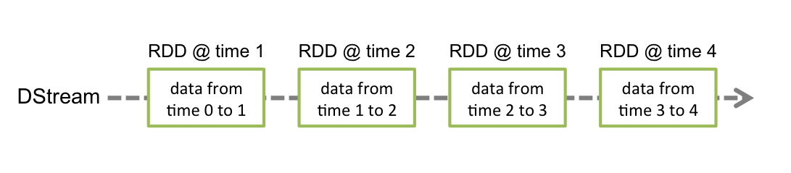

[[spark-streaming]]
== Spark Streaming ==

Spark
streaming是Spark核心API的一个扩展，它对实时流式数据的处理具有可扩展性、高吞吐量、可容错性等特点。我们可以从kafka、flume、Twitter、
ZeroMQ、Kinesis等源获取数据，也可以通过由
高阶函数map、reduce、join、window等组成的复杂算法计算出数据。最后，处理后的数据可以推送到文件系统、数据库、实时仪表盘中。事实上，你可以将处理后的数据应用到Spark的link:https://spark.apache.org/docs/latest/mllib-guide.html[机器学习算法]、
link:
image:./img/streaming-arch.png[Spark Streaming处理流程]

在内部，它的工作原理如下图所示。Spark
Streaming接收实时的输入数据流，然后将这些数据切分为批数据供Spark引擎处理，Spark引擎将数据生成最终的结果数据。

image:./img/streaming-flow.png[Spark Streaming处理原理]

Spark
Streaming支持一个高层的抽象，叫做离散流(`discretized stream`)或者`DStream`，它代表连续的数据流。DStream既可以利用从Kafka,
Flume和Kinesis等源获取的输入数据流创建，也可以
在其他DStream的基础上通过高阶函数获得。在内部，DStream是由一系列RDDs组成。

本指南指导用户开始利用DStream编写Spark
Streaming程序。用户能够利用scala、java或者Python来编写Spark
Streaming程序。

注意：Spark 1.2已经为Spark Streaming引入了Python API。它的所有DStream
transformations和几乎所有的输出操作可以在scala和java接口中使用。然而，它只支持基本的源如文本文件或者套接字上
的文本数据。诸如flume、kafka等外部的源的API会在将来引入。

[[a-quick-example]]
== 一个快速的例子 ==

在我们进入如何编写Spark
Streaming程序的细节之前，让我们快速地浏览一个简单的例子。在这个例子中，程序从监听TCP套接字的数据服务器获取文本数据，然后计算文本中包含的单词数。做法如下：

首先，我们导入Spark
Streaming的相关类以及一些从StreamingContext获得的隐式转换到我们的环境中，为我们所需的其他类（如DStream）提供有用的方法。https://spark.apache.org/docs/latest/api/scala/index.html#org.apache.spark.streaming.StreamingContext[StreamingContext]
是Spark所有流操作的主要入口。然后，我们创建了一个具有两个执行线程以及1秒批间隔时间(即以秒为单位分割数据流)的本地StreamingContext。

[source,scala]
----
import org.apache.spark._
import org.apache.spark.streaming._
import org.apache.spark.streaming.StreamingContext._
// Create a local StreamingContext with two working thread and batch interval of 1 second
val conf = new SparkConf().setMaster("local[2]").setAppName("NetworkWordCount")
val ssc = new StreamingContext(conf, Seconds(1))
----

利用这个上下文，我们能够创建一个DStream，它表示从TCP源（主机位localhost，端口为9999）获取的流式数据。

[source,scala]
----
// Create a DStream that will connect to hostname:port, like localhost:9999
val lines = ssc.socketTextStream("localhost", 9999)
----

这个`lines`变量是一个DStream，表示即将从数据服务器获得的流数据。这个DStream的每条记录都代表一行文本。下一步，我们需要将DStream中的每行文本都切分为单词。

[source,scala]
----
// Split each line into words
val words = lines.flatMap(_.split(" "))
----

`flatMap`是一个一对多的DStream操作，它通过把源DStream的每条记录都生成多条新记录来创建一个新的DStream。在这个例子中，每行文本都被切分成了多个单词，我们把切分
的单词流用`words`这个DStream表示。下一步，我们需要计算单词的个数。

[source,scala]
----
import org.apache.spark.streaming.StreamingContext._
// Count each word in each batch
val pairs = words.map(word => (word, 1))
val wordCounts = pairs.reduceByKey(_ + _)
// Print the first ten elements of each RDD generated in this DStream to the console
wordCounts.print()
----

`words`这个DStream被mapper(一对一转换操作)成了一个新的DStream，它由（word，1）对组成。然后，我们就可以用这个新的DStream计算每批数据的词频。最后，我们用`wordCounts.print()`
打印每秒计算的词频。

需要注意的是，当以上这些代码被执行时，Spark
Streaming仅仅准备好了它要执行的计算，实际上并没有真正开始执行。在这些转换操作准备好之后，要真正执行计算，需要调用如下的方法

[source,scala]
----
ssc.start()             // Start the computation
ssc.awaitTermination()  // Wait for the computation to terminate
----

完整的例子可以在https://github.com/apache/spark/blob/master/examples/src/main/scala/org/apache/spark/examples/streaming/NetworkWordCount.scala[NetworkWordCount]中找到。

如果你已经下载和构建了Spark环境，你就能够用如下的方法运行这个例子。首先，你需要运行Netcat作为数据服务器

[source,shell]
----
$ nc -lk 9999
----

然后，在不同的终端，你能够用如下方式运行例子

[source,shell]
----
$ ./bin/run-example streaming.NetworkWordCount localhost 9999
----

[[basic-concepts]]
== 基本概念 ==

在了解简单的例子的基础上，下面将介绍编写Spark
Streaming应用程序必需的一些基本概念。

[[linking]]
=== 关联 ===

与Spark类似，Spark Streaming也可以利用maven仓库。编写你自己的Spark Streaming程序，你需要引入下面的依赖到你的SBT或者Maven项目中

[source,maven]
----
<dependency>
    <groupId>org.apache.spark</groupId>
    <artifactId>spark-streaming_2.10</artifactId>
    <version>1.2</version>
</dependency>
----

为了从Kafka, Flume和Kinesis这些不在Spark核心API中提供的源获取数据，我们需要添加相关的模块`spark-streaming-xyz_2.10`到依赖中。例如，一些通用的组件如下表所示：

Source | Artifact
--- | ---
Kafka | spark-streaming-kafka_2.10
Flume | spark-streaming-flume_2.10
Kinesis | spark-streaming-kinesis-asl_2.10
Twitter | spark-streaming-twitter_2.10
ZeroMQ | spark-streaming-zeromq_2.10
MQTT | spark-streaming-mqtt_2.10

为了获取最新的列表，请访问[Apache repository](http://search.maven.org/#search%7Cga%7C1%7Cg%3A%22org.apache.spark%22%20AND%20v%3A%221.2.0%22)

[[init-streamingcontext]]
=== 初始化StreamingContext ===

为了初始化Spark
Streaming程序，一个StreamingContext对象必需被创建，它是Spark
Streaming所有流操作的主要入口。一个https://spark.apache.org/docs/latest/api/scala/index.html#org.apache.spark.streaming.StreamingContext[StreamingContext]
对象可以用https://spark.apache.org/docs/latest/api/scala/index.html#org.apache.spark.SparkConf[SparkConf]对象创建。

[source,scala]
----
import org.apache.spark._
import org.apache.spark.streaming._
val conf = new SparkConf().setAppName(appName).setMaster(master)
val ssc = new StreamingContext(conf, Seconds(1))
----

`appName`表示你的应用程序显示在集群UI上的名字，`master`是一个https://spark.apache.org/docs/latest/submitting-applications.html#master-urls[Spark、Mesos、YARN]集群URL
或者一个特殊字符串“local[*]”，它表示程序用本地模式运行。当程序运行在集群中时，你并不希望在程序中硬编码`master`，而是希望用`spark-submit`启动应用程序，并从`spark-submit`中得到
`master`的值。对于本地测试或者单元测试，你可以传递“local”字符串在同一个进程内运行Spark
Streaming。需要注意的是，它在内部创建了一个SparkContext对象，你可以通过`ssc.sparkContext`
访问这个SparkContext对象。

批时间片需要根据你的程序的潜在需求以及集群的可用资源来设定，你可以在link:performance-tuning.adoc[性能调优]那一节获取详细的信息。

可以利用已经存在的`SparkContext`对象创建`StreamingContext`对象。

[source,scala]
----
import org.apache.spark.streaming._
val sc = ...                // existing SparkContext
val ssc = new StreamingContext(sc, Seconds(1))
----

当一个上下文（context）定义之后，你必须按照以下几步进行操作

* 定义输入源；
* 准备好流计算指令；
* 利用 `streamingContext.start()` 方法接收和处理数据；
* 处理过程将一直持续，直到 `streamingContext.stop()` 方法被调用。

几点需要注意的地方：

* 一旦一个context已经启动，就不能有新的流算子建立或者是添加到context中。
* 一旦一个context已经停止，它就不能再重新启动
* 在JVM中，同一时间只能有一个StreamingContext处于活跃状态
* 在StreamingContext上调用`stop()`方法，也会关闭SparkContext对象。如果只想仅关闭StreamingContext对象，设置`stop()`的可选参数为false
* 一个SparkContext对象可以重复利用去创建多个StreamingContext对象，前提条件是前面的StreamingContext在后面StreamingContext创建之前关闭（不关闭SparkContext）。

[[discretized-streams]]
=== 离散流（DStreams） ===

离散流或者DStreams是Spark
Streaming提供的基本的抽象，它代表一个连续的数据流。它要么是从源中获取的输入流，要么是输入流通过转换算子生成的处理后的数据流。在内部，DStreams由一系列连续的
RDD组成。DStreams中的每个RDD都包含确定时间间隔内的数据，如下图所示：

任何对DStreams的操作都转换成了对DStreams隐含的RDD的操作。在前面的link:../a-quick-example.md[例子]中，`flatMap`操作应用于`lines`这个DStreams的每个RDD，生成`words`这个DStreams的
RDD。过程如下图所示：

image:./img/streaming-dstream-ops.png[DStreams]

通过Spark引擎计算这些隐含RDD的转换算子。DStreams操作隐藏了大部分的细节，并且为了更便捷，为开发者提供了更高层的API。下面几节将具体讨论这些操作的细节。

[[input-dstreams-receivers]]
=== 输入DStreams和receivers ===

输入DStreams表示从数据源获取输入数据流的DStreams。在link:../a-quick-example.md[快速例子]中，`lines`表示输入DStream，它代表从netcat服务器获取的数据流。每一个输入流DStream
和一个`Receiver`对象相关联，这个`Receiver`从源中获取数据，并将数据存入内存中用于处理。

输入DStreams表示从数据源获取的原始数据流。Spark Streaming拥有两类数据源
- 基本源（Basic sources）：这些源在StreamingContext
API中直接可用。例如文件系统、套接字连接、Akka的actor等。 -
高级源（Advanced
sources）：这些源包括Kafka,Flume,Kinesis,Twitter等等。它们需要通过额外的类来使用。我们在link:linking.md[关联]那一节讨论了类依赖。

需要注意的是，如果你想在一个流应用中并行地创建多个输入DStream来接收多个数据流，你能够创建多个输入流（这将在link:../performance-tuning/README.md[性能调优]那一节介绍）
。它将创建多个Receiver同时接收多个数据流。但是，`receiver`作为一个长期运行的任务运行在Spark
worker或executor中。因此，它占有一个核，这个核是分配给Spark
Streaming应用程序的所有 核中的一个（it occupies one of the cores
allocated to the Spark Streaming application）。所以，为Spark
Streaming应用程序分配足够的核（如果是本地运行，那么是线程）
用以处理接收的数据并且运行`receiver`是非常重要的。

几点需要注意的地方： -
如果分配给应用程序的核的数量少于或者等于输入DStreams或者receivers的数量，系统只能够接收数据而不能处理它们。
- 当运行在本地，如果你的master
URL被设置成了“local”，这样就只有一个核运行任务。这对程序来说是不足的，因为作为`receiver`的输入DStream将会占用这个核，这样就没有剩余的核来处理数据了。

[[basic-sources]]
==== 基本源 ====

我们已经在link:../a-quick-example.md[快速例子]中看到，`ssc.socketTextStream(...)`方法用来把从TCP套接字获取的文本数据创建成DStream。除了套接字，StreamingContext
API也支持把文件 以及Akka actors作为输入源创建DStream。

* 文件流（File Streams）：从任何与HDFS
API兼容的文件系统中读取数据，一个DStream可以通过如下方式创建

[source,scala]
----
streamingContext.fileStream[keyClass, valueClass, inputFormatClass](dataDirectory)
----

Spark
Streaming将会监控`dataDirectory`目录，并且处理目录下生成的任何文件（嵌套目录不被支持）。需要注意一下三点：

....
1 所有文件必须具有相同的数据格式
2 所有文件必须在`dataDirectory`目录下创建，文件是自动的移动和重命名到数据目录下
3 一旦移动，文件必须被修改。所以如果文件被持续的附加数据，新的数据不会被读取。
....

对于简单的文本文件，有一个更简单的方法`streamingContext.textFileStream(dataDirectory)`可以被调用。文件流不需要运行一个receiver，所以不需要分配核。

在Spark1.2中，`fileStream`在Python
API中不可用，只有`textFileStream`可用。

* 基于自定义actor的流：DStream可以调用`streamingContext.actorStream(actorProps, actor-name)`方法从Akka
actors获取的数据流来创建。具体的信息见https://spark.apache.org/docs/latest/streaming-custom-receivers.html#implementing-and-using-a-custom-actor-based-receiver[自定义receiver指南]
`actorStream`在Python API中不可用。
* RDD队列作为数据流：为了用测试数据测试Spark
Streaming应用程序，人们也可以调用`streamingContext.queueStream(queueOfRDDs)`方法基于RDD队列创建DStreams。每个push到队列的RDD都被
当做DStream的批数据，像流一样处理。

关于从套接字、文件和actor中获取流的更多细节，请看https://spark.apache.org/docs/latest/api/scala/index.html#org.apache.spark.streaming.StreamingContext[StreamingContext]和
https://spark.apache.org/docs/latest/api/java/index.html?org/apache/spark/streaming/api/java/JavaStreamingContext.html[JavaStreamingContext]

[[advanced-sources]]
==== 高级源 ====

这类源需要非Spark库接口，并且它们中的部分还需要复杂的依赖（例如kafka和flume）。为了减少依赖的版本冲突问题，从这些源创建DStream的功能已经被移到了独立的库中，你能在link:linking.md[关联]查看
细节。例如，如果你想用来自推特的流数据创建DStream，你需要按照如下步骤操作：

* 关联：添加`spark-streaming-twitter_2.10`到SBT或maven项目的依赖中
* 编写：导入`TwitterUtils`类，用`TwitterUtils.createStream`方法创建DStream,如下所示
+
[source,scala]
----
import org.apache.spark.streaming.twitter._
TwitterUtils.createStream(ssc)
----
* 部署：将编写的程序以及其所有的依赖（包括spark-streaming-twitter_2.10的依赖以及它的传递依赖）打为jar包，然后部署。这在link:deploying-applications.md[部署章节]将会作更进一步的介绍。

需要注意的是，这些高级的源在`spark-shell`中不能被使用，因此基于这些源的应用程序无法在shell中测试。

下面将介绍部分的高级源：

* Twitter：Spark
Streaming利用`Twitter4j 3.0.3`获取公共的推文流，这些推文通过https://dev.twitter.com/docs/streaming-apis[推特流API]获得。认证信息可以通过Twitter4J库支持的
任何http://twitter4j.org/en/configuration.html[方法]提供。你既能够得到公共流，也能够得到基于关键字过滤后的流。你可以查看API文档（https://spark.apache.org/docs/latest/api/scala/index.html#org.apache.spark.streaming.twitter.TwitterUtils$[scala]和https://spark.apache.org/docs/latest/api/java/index.html?org/apache/spark/streaming/twitter/TwitterUtils.html[java]）
和例子（https://github.com/apache/spark/blob/master/examples/src/main/scala/org/apache/spark/examples/streaming/TwitterPopularTags.scala[TwitterPopularTags]和https://github.com/apache/spark/blob/master/examples/src/main/scala/org/apache/spark/examples/streaming/TwitterAlgebirdCMS.scala[TwitterAlgebirdCMS]）
* Flume：Spark Streaming 1.2能够从flume
1.4.0中获取数据，可以查看link:flume-integration-guide.md[flume集成指南]了解详细信息
* Kafka：Spark Streaming 1.2能够从kafka
0.8.0中获取数据，可以查看link:kafka-integration-guide.md[kafka集成指南]了解详细信息
* Kinesis：查看link:kinesis-integration.md[Kinesis集成指南]了解详细信息

[[custom-sources]]
==== 自定义源 ====

在Spark 1.2中，这些源不被Python API支持。
输入DStream也可以通过自定义源创建，你需要做的是实现用户自定义的`receiver`，这个`receiver`可以从自定义源接收数据以及将数据推到Spark中。通过link:custom-receiver.md[自定义receiver指南]了解详细信息

[[receiver-reliablity]]
==== Receiver可靠性 ====

基于可靠性有两类数据源。源(如kafka、flume)允许。如果从这些可靠的源获取数据的系统能够正确的应答所接收的数据，它就能够确保在任何情况下不丢失数据。这样，就有两种类型的receiver：

* Reliable
Receiver：一个可靠的receiver正确的应答一个可靠的源，数据已经收到并且被正确地复制到了Spark中。
* Unreliable Receiver
：这些receivers不支持应答。即使对于一个可靠的源，开发者可能实现一个非可靠的receiver，这个receiver不会正确应答。

怎样编写可靠的Receiver的细节在link:custom-receiver.md[自定义receiver]中有详细介绍。

* link:output-operations-on-DStreams.md[DStream的输出操作]
* link:caching-persistence.md[缓存或持久化]
* link:checkpointing.md[Checkpointing]
* link:deploying-applications.md[部署应用程序]
* link:monitoring-applications.md[监控应用程序]

[[transformation-on-dstreams]]
=== DStream中的转换（transformation）===

和RDD类似，transformation允许从输入DStream来的数据被修改。DStreams支持很多在RDD中可用的transformation算子。一些常用的算子如下所示：

[width="11%",cols="50%,50%",options="header",]
|=======================================================================
|Transformation |Meaning
|map(func) |利用函数`func`处理原DStream的每个元素，返回一个新的DStream

|flatMap(func) |与map相似，但是每个输入项可用被映射为0个或者多个输出项

|filter(func)
|返回一个新的DStream，它仅仅包含源DStream中满足函数func的项

|repartition(numPartitions)
|通过创建更多或者更少的partition改变这个DStream的并行级别(level of
parallelism)

|union(otherStream)
|返回一个新的DStream,它包含源DStream和otherStream的联合元素

|count()
|通过计算源DStream中每个RDD的元素数量，返回一个包含单元素(single-element)RDDs的新DStream

|reduce(func)
|利用函数func聚集源DStream中每个RDD的元素，返回一个包含单元素(single-element)RDDs的新DStream。函数应该是相关联的，以使计算可以并行化

|countByValue()
|这个算子应用于元素类型为K的DStream上，返回一个（K,long）对的新DStream，每个键的值是在原DStream的每个RDD中的频率。

|reduceByKey(func, [numTasks])
|当在一个由(K,V)对组成的DStream上调用这个算子，返回一个新的由(K,V)对组成的DStream，每一个key的值均由给定的reduce函数聚集起来。注意：在默认情况下，这个算子利用了Spark默认的并发任务数去分组。你可以用`numTasks`参数设置不同的任务数

|join(otherStream, [numTasks])
|当应用于两个DStream（一个包含（K,V）对,一个包含(K,W)对），返回一个包含(K,
(V, W))对的新DStream

|cogroup(otherStream, [numTasks])
|当应用于两个DStream（一个包含（K,V）对,一个包含(K,W)对），返回一个包含(K,
Seq[V], Seq[W])的元组

|transform(func)
|通过对源DStream的每个RDD应用RDD-to-RDD函数，创建一个新的DStream。这个可以在DStream中的任何RDD操作中使用

|updateStateByKey(func)
|利用给定的函数更新DStream的状态，返回一个新"state"的DStream。
|=======================================================================

最后两个transformation算子需要重点介绍一下：

[[updatestatebykey-operation]]
==== UpdateStateByKey操作 ====

updateStateByKey操作允许不断用新信息更新它的同时保持任意状态。你需要通过两步来使用它

* 定义状态-状态可以是任何的数据类型
* 定义状态更新函数-怎样利用更新前的状态和从输入流里面获取的新值更新状态

让我们举个例子说明。在例子中，你想保持一个文本数据流中每个单词的运行次数，运行次数用一个state表示，它的类型是整数

[source,scala]
----
def updateFunction(newValues: Seq[Int], runningCount: Option[Int]): Option[Int] = {
    val newCount = ...  // add the new values with the previous running count to get the new count
    Some(newCount)
}
----

这个函数被用到了DStream包含的单词上

[source,scala]
----
import org.apache.spark._
import org.apache.spark.streaming._
import org.apache.spark.streaming.StreamingContext._
// Create a local StreamingContext with two working thread and batch interval of 1 second
val conf = new SparkConf().setMaster("local[2]").setAppName("NetworkWordCount")
val ssc = new StreamingContext(conf, Seconds(1))
// Create a DStream that will connect to hostname:port, like localhost:9999
val lines = ssc.socketTextStream("localhost", 9999)
// Split each line into words
val words = lines.flatMap(_.split(" "))
// Count each word in each batch
val pairs = words.map(word => (word, 1))
val runningCounts = pairs.updateStateByKey[Int](updateFunction _)
----

更新函数将会被每个单词调用，`newValues`拥有一系列的1（从 (词,
1)对而来），runningCount拥有之前的次数。要看完整的代码，见https://github.com/apache/spark/blob/master/examples/src/main/scala/org/apache/spark/examples/streaming/StatefulNetworkWordCount.scala[例子]

[[transform-operation]]
==== Transform操作 ====

`transform`操作（以及它的变化形式如`transformWith`）允许在DStream运行任何RDD-to-RDD函数。它能够被用来应用任何没在DStream
API中提供的RDD操作（It can be used to apply any RDD operation that is
not exposed in the DStream API）。
例如，连接数据流中的每个批（batch）和另外一个数据集的功能并没有在DStream
API中提供，然而你可以简单的利用`transform`方法做到。如果你想通过连接带有预先计算的垃圾邮件信息的输入数据流
来清理实时数据，然后过了它们，你可以按如下方法来做：

[source,scala]
----
val spamInfoRDD = ssc.sparkContext.newAPIHadoopRDD(...) // RDD containing spam information

val cleanedDStream = wordCounts.transform(rdd => {
  rdd.join(spamInfoRDD).filter(...) // join data stream with spam information to do data cleaning
  ...
})
----

事实上，你也可以在`transform`方法中用https://spark.apache.org/docs/latest/mllib-guide.html[机器学习]和https://spark.apache.org/docs/latest/graphx-programming-guide.html[图计算]算法

[[window-operation]]
==== 窗口(window)操作 ====

Spark
Streaming也支持窗口计算，它允许你在一个滑动窗口数据上应用transformation算子。下图阐明了这个滑动窗口。

image:../img/streaming-dstream-window.png[滑动窗口]

如上图显示，窗口在源DStream上滑动，合并和操作落入窗内的源RDDs，产生窗口化的DStream的RDDs。在这个具体的例子中，程序在三个时间单元的数据上进行窗口操作，并且每两个时间单元滑动一次。
这说明，任何一个窗口操作都需要指定两个参数：

* 窗口长度：窗口的持续时间
* 滑动的时间间隔：窗口操作执行的时间间隔

这两个参数必须是源DStream的批时间间隔的倍数。

下面举例说明窗口操作。例如，你想扩展前面的link:../a-quick-example.md[例子]用来计算过去30秒的词频，间隔时间是10秒。为了达到这个目的，我们必须在过去30秒的 `pairs`
DStream上应用 `reduceByKey` 操作。用方法 `reduceByKeyAndWindow` 实现。

[source,scala]
----
// Reduce last 30 seconds of data, every 10 seconds
val windowedWordCounts = pairs.reduceByKeyAndWindow((a:Int,b:Int) => (a + b), Seconds(30), Seconds(10))
----

一些常用的窗口操作如下所示，这些操作都需要用到上文提到的两个参数：窗口长度和滑动的时间间隔

[width="11%",cols="50%,50%",options="header",]
|=======================================================================
|Transformation |Meaning
|window(windowLength, slideInterval)
|基于源DStream产生的窗口化的批数据计算一个新的DStream

|countByWindow(windowLength, slideInterval)
|返回流中元素的一个滑动窗口数

|reduceByWindow(func, windowLength, slideInterval)
|返回一个单元素流。利用函数func聚集滑动时间间隔的流的元素创建这个单元素流。函数必须是相关联的以使计算能够正确的并行计算。

|reduceByKeyAndWindow(func, windowLength, slideInterval, [numTasks])
|应用到一个(K,V)对组成的DStream上，返回一个由(K,V)对组成的新的DStream。每一个key的值均由给定的reduce函数聚集起来。注意：在默认情况下，这个算子利用了Spark默认的并发任务数去分组。你可以用`numTasks`参数设置不同的任务数

|reduceByKeyAndWindow(func, invFunc, windowLength, slideInterval,
[numTasks]) |A more efficient version of the above
reduceByKeyAndWindow() where the reduce value of each window is
calculated incrementally using the reduce values of the previous window.
This is done by reducing the new data that enter the sliding window, and
"inverse reducing" the old data that leave the window. An example would
be that of "adding" and "subtracting" counts of keys as the window
slides. However, it is applicable to only "invertible reduce functions",
that is, those reduce functions which have a corresponding "inverse
reduce" function (taken as parameter invFunc. Like in
reduceByKeyAndWindow, the number of reduce tasks is configurable through
an optional argument.

|countByValueAndWindow(windowLength, slideInterval, [numTasks])
|应用到一个(K,V)对组成的DStream上，返回一个由(K,V)对组成的新的DStream。每个key的值都是它们在滑动窗口中出现的频率。
|=======================================================================

[[output-operation-dstreams]]
===  DStreams上的输出操作 ===

输出操作允许DStream的操作推到如数据库、文件系统等外部系统中。因为输出操作实际上是允许外部系统消费转换后的数据，它们触发的实际操作是DStream转换。目前，定义了下面几种输出操作：

[width="11%",cols="50%,50%",options="header",]
|=======================================================================
|Output Operation |Meaning
|print()
|在DStream的每个批数据中打印前10条元素，这个操作在开发和调试中都非常有用。在Python
API中调用`pprint()`。

|saveAsObjectFiles(prefix, [suffix])
|保存DStream的内容为一个序列化的文件`SequenceFile`。每一个批间隔的文件的文件名基于`prefix`和`suffix`生成。"prefix-TIME_IN_MS[.suffix]"，在Python
API中不可用。

|saveAsTextFiles(prefix, [suffix])
|保存DStream的内容为一个文本文件。每一个批间隔的文件的文件名基于`prefix`和`suffix`生成。"prefix-TIME_IN_MS[.suffix]"

|saveAsHadoopFiles(prefix, [suffix])
|保存DStream的内容为一个hadoop文件。每一个批间隔的文件的文件名基于`prefix`和`suffix`生成。"prefix-TIME_IN_MS[.suffix]"，在Python
API中不可用。

|foreachRDD(func)
|在从流中生成的每个RDD上应用函数`func`的最通用的输出操作。这个函数应该推送每个RDD的数据到外部系统，例如保存RDD到文件或者通过网络写到数据库中。需要注意的是，`func`函数在驱动程序中执行，并且通常都有RDD
action在里面推动RDD流的计算。
|=======================================================================

[[desgin-patterns-for-using-foreachrdd]]
==== 利用foreachRDD的设计模式 ====

dstream.foreachRDD是一个强大的原语，发送数据到外部系统中。然而，明白怎样正确地、有效地用这个原语是非常重要的。下面几点介绍了如何避免一般错误。
-
经常写数据到外部系统需要建一个连接对象（例如到远程服务器的TCP连接），用它发送数据到远程系统。为了达到这个目的，开发人员可能不经意的在Spark驱动中创建一个连接对象，但是在Spark
worker中 尝试调用这个连接对象保存记录到RDD中，如下：

[source,scala]
----
  dstream.foreachRDD(rdd => {
      val connection = createNewConnection()  // executed at the driver
      rdd.foreach(record => {
          connection.send(record) // executed at the worker
      })
  })
----

这是不正确的，因为这需要先序列化连接对象，然后将它从driver发送到worker中。这样的连接对象在机器之间不能传送。它可能表现为序列化错误（连接对象不可序列化）或者初始化错误（连接对象应该
在worker中初始化）等等。正确的解决办法是在worker中创建连接对象。

* 然而，这会造成另外一个常见的错误-为每一个记录创建了一个连接对象。例如：

....
  dstream.foreachRDD(rdd => {
      rdd.foreach(record => {
          val connection = createNewConnection()
          connection.send(record)
          connection.close()
      })
  })
....

通常，创建一个连接对象有资源和时间的开支。因此，为每个记录创建和销毁连接对象会导致非常高的开支，明显的减少系统的整体吞吐量。一个更好的解决办法是利用`rdd.foreachPartition`方法。
为RDD的partition创建一个连接对象，用这个两件对象发送partition中的所有记录。

....
 dstream.foreachRDD(rdd => {
      rdd.foreachPartition(partitionOfRecords => {
          val connection = createNewConnection()
          partitionOfRecords.foreach(record => connection.send(record))
          connection.close()
      })
  })
....

这就将连接对象的创建开销分摊到了partition的所有记录上了。

* 最后，可以通过在多个RDD或者批数据间重用连接对象做更进一步的优化。开发者可以保有一个静态的连接对象池，重复使用池中的对象将多批次的RDD推送到外部系统，以进一步节省开支。

....
  dstream.foreachRDD(rdd => {
      rdd.foreachPartition(partitionOfRecords => {
          // ConnectionPool is a static, lazily initialized pool of connections
          val connection = ConnectionPool.getConnection()
          partitionOfRecords.foreach(record => connection.send(record))
          ConnectionPool.returnConnection(connection)  // return to the pool for future reuse
      })
  })
....

需要注意的是，池中的连接对象应该根据需要延迟创建，并且在空闲一段时间后自动超时。这样就获取了最有效的方式发生数据到外部系统。

其它需要注意的地方：

* 输出操作通过懒执行的方式操作DStreams，正如RDD
action通过懒执行的方式操作RDD。具体地看，RDD
actions和DStreams输出操作接收数据的处理。因此，如果你的应用程序没有任何输出操作或者
用于输出操作`dstream.foreachRDD()`，但是没有任何RDD
action操作在`dstream.foreachRDD()`里面，那么什么也不会执行。系统仅仅会接收输入，然后丢弃它们。
* 默认情况下，DStreams输出操作是分时执行的，它们按照应用程序的定义顺序按序执行。

[[buffer-or-persistence]]
=== 缓存或持久化 ===

和RDD相似，DStreams也允许开发者持久化流数据到内存中。在DStream上使用`persist()`方法可以自动地持久化DStream中的RDD到内存中。如果DStream中的数据需要计算多次，这是非常有用的。像`reduceByWindow`和`reduceByKeyAndWindow`这种窗口操作、`updateStateByKey`这种基于状态的操作，持久化是默认的，不需要开发者调用`persist()`方法。

例如通过网络（如kafka，flume等）获取的输入数据流，默认的持久化策略是复制数据到两个不同的节点以容错。

注意，与RDD不同的是，DStreams默认持久化级别是存储序列化数据到内存中，这将在link:../performance-tuning/README.md[性能调优]章节介绍。更多的信息请看link:../../programming-guide/rdds/rdd-persistences.md[rdd持久化]

[[checkpointing]]
=== Checkpointing ===

一个流应用程序必须全天候运行，所有必须能够解决应用程序逻辑无关的故障（如系统错误，JVM崩溃等）。为了使这成为可能，Spark
Streaming需要checkpoint足够的信息到容错存储系统中，
以使系统从故障中恢复。

* Metadata
checkpointing：保存流计算的定义信息到容错存储系统如HDFS中。这用来恢复应用程序中运行worker的节点的故障。元数据包括
** Configuration ：创建Spark Streaming应用程序的配置信息
** DStream operations ：定义Streaming应用程序的操作集合
** Incomplete batches：操作存在队列中的未完成的批
* Data checkpointing
：保存生成的RDD到可靠的存储系统中，这在有状态transformation（如结合跨多个批次的数据）中是必须的。在这样一个transformation中，生成的RDD依赖于之前
批的RDD，随着时间的推移，这个依赖链的长度会持续增长。在恢复的过程中，为了避免这种无限增长。有状态的transformation的中间RDD将会定时地存储到可靠存储系统中，以截断这个依赖链。

元数据checkpoint主要是为了从driver故障中恢复数据。如果transformation操作被用到了，数据checkpoint即使在简单的操作中都是必须的。

[[when-enable-checkpoint]]
==== 何时checkpoint ====

应用程序在下面两种情况下必须开启checkpoint

* 使用有状态的transformation。如果在应用程序中用到了`updateStateByKey`或者`reduceByKeyAndWindow`，checkpoint目录必需提供用以定期checkpoint
RDD。
* 从运行应用程序的driver的故障中恢复过来。使用元数据checkpoint恢复处理信息。

注意，没有前述的有状态的transformation的简单流应用程序在运行时可以不开启checkpoint。在这种情况下，从driver故障的恢复将是部分恢复（接收到了但是还没有处理的数据将会丢失）。
这通常是可以接受的，许多运行的Spark Streaming应用程序都是这种方式。

[[howto-configure-checkpointing]]
==== 怎样配置Checkpointing ====

在容错、可靠的文件系统（HDFS、s3等）中设置一个目录用于保存checkpoint信息。着可以通过`streamingContext.checkpoint(checkpointDirectory)`方法来做。这运行你用之前介绍的
有状态transformation。另外，如果你想从driver故障中恢复，你应该以下面的方式重写你的Streaming应用程序。

* 当应用程序是第一次启动，新建一个StreamingContext，启动所有Stream，然后调用`start()`方法
* 当应用程序因为故障重新启动，它将会从checkpoint目录checkpoint数据重新创建StreamingContext

[source,scala]
----
// Function to create and setup a new StreamingContext
def functionToCreateContext(): StreamingContext = {
    val ssc = new StreamingContext(...)   // new context
    val lines = ssc.socketTextStream(...) // create DStreams
    ...
    ssc.checkpoint(checkpointDirectory)   // set checkpoint directory
    ssc
}

// Get StreamingContext from checkpoint data or create a new one
val context = StreamingContext.getOrCreate(checkpointDirectory, functionToCreateContext _)

// Do additional setup on context that needs to be done,
// irrespective of whether it is being started or restarted
context. ...

// Start the context
context.start()
context.awaitTermination()
----

如果`checkpointDirectory`存在，上下文将会利用checkpoint数据重新创建。如果这个目录不存在，将会调用`functionToCreateContext`函数创建一个新的上下文，建立DStreams。
请看https://github.com/apache/spark/tree/master/examples/src/main/scala/org/apache/spark/examples/streaming/RecoverableNetworkWordCount.scala[RecoverableNetworkWordCount]例子。

除了使用`getOrCreate`，开发者必须保证在故障发生时，driver处理自动重启。只能通过部署运行应用程序的基础设施来达到该目的。在部署章节将有更进一步的讨论。

注意，RDD的checkpointing有存储成本。这会导致批数据（包含的RDD被checkpoint）的处理时间增加。因此，需要小心的设置批处理的时间间隔。在最小的批容量(包含1秒的数据)情况下，checkpoint每批数据会显著的减少
操作的吞吐量。相反，checkpointing太少会导致谱系以及任务大小增大，这会产生有害的影响。因为有状态的transformation需要RDD
checkpoint。默认的间隔时间是批间隔时间的倍数，最少10秒。它可以通过`dstream.checkpoint`
来设置。典型的情况下，设置checkpoint间隔是DStream的滑动间隔的5-10大小是一个好的尝试。

[[deploying-application]]
=== 部署应用程序 ===

[[requirements]]
==== Requirements ====

运行一个Spark Streaming应用程序，有下面一些步骤

* 有管理器的集群-这是任何Spark应用程序都需要的需求，详见link:../../deploying/README.md[部署指南]
* 将应用程序打为jar包-你必须编译你的应用程序为jar包。如果你用link:../../deploying/submitting-applications.md[spark-submit]启动应用程序，你不需要将Spark和Spark
Streaming打包进这个jar包。
如果你的应用程序用到了高级源（如kafka，flume），你需要将它们关联的外部artifact以及它们的依赖打包进需要部署的应用程序jar包中。例如，一个应用程序用到了`TwitterUtils`，那么就需要将`spark-streaming-twitter_2.10`
以及它的所有依赖打包到应用程序jar中。
* 为executors配置足够的内存-因为接收的数据必须存储在内存中，executors必须配置足够的内存用来保存接收的数据。注意，如果你正在做10分钟的窗口操作，系统的内存要至少能保存10分钟的数据。所以，应用程序的内存需求依赖于使用
它的操作。
* 配置checkpointing-如果stream应用程序需要checkpointing，然后一个与Hadoop
API兼容的容错存储目录必须配置为检查点的目录，流应用程序将checkpoint信息写入该目录用于错误恢复。
* 配置应用程序driver的自动重启-为了自动从driver故障中恢复，运行流应用程序的部署设施必须能监控driver进程，如果失败了能够重启它。不同的集群管理器，有不同的工具得到该功能
** Spark
Standalone：一个Spark应用程序driver可以提交到Spark独立集群运行，也就是说driver运行在一个worker节点上。进一步来看，独立的集群管理器能够被指示用来监控driver，并且在driver失败（或者是由于非零的退出代码如exit(1)，
或者由于运行driver的节点的故障）的情况下重启driver。
** YARN：YARN为自动重启应用程序提供了类似的机制。
** Mesos：
Mesos可以用https://github.com/mesosphere/marathon[Marathon]提供该功能
* 配置write ahead logs-在Spark
1.2中，为了获得极强的容错保证，我们引入了一个新的实验性的特性-预写日志（write
ahead
logs）。如果该特性开启，从receiver获取的所有数据会将预写日志写入配置的checkpoint目录。
这可以防止driver故障丢失数据，从而保证零数据丢失。这个功能可以通过设置配置参数`spark.streaming.receiver.writeAheadLogs.enable`为true来开启。然而，这些较强的语义可能以receiver的接收吞吐量为代价。这可以通过
并行运行多个receiver增加吞吐量来解决。另外，当预写日志开启时，Spark中的复制数据的功能推荐不用，因为该日志已经存储在了一个副本在存储系统中。可以通过设置输入DStream的存储级别为`StorageLevel.MEMORY_AND_DISK_SER`获得该功能。

[[upgrading-application-code]]
==== 升级应用程序代码 ====

如果运行的Spark Streaming应用程序需要升级，有两种可能的方法

* 启动升级的应用程序，使其与未升级的应用程序并行运行。一旦新的程序（与就程序接收相同的数据）已经准备就绪，旧的应用程序就可以关闭。这种方法支持将数据发送到两个不同的目的地（新程序一个，旧程序一个）
* 首先，平滑的关闭（`StreamingContext.stop(...)`或`JavaStreamingContext.stop(...)`）现有的应用程序。在关闭之前，要保证已经接收的数据完全处理完。然后，就可以启动升级的应用程序，升级
的应用程序会接着旧应用程序的点开始处理。这种方法仅支持具有源端缓存功能的输入源（如flume，kafka），这是因为当旧的应用程序已经关闭，升级的应用程序还没有启动的时候，数据需要被缓存。

[[monitoring-application]]
=== 监控应用程序 ====

除了Spark的监控功能，Spark
Streaming增加了一些专有的功能。应用StreamingContext的时候，https://spark.apache.org/docs/latest/monitoring.html#web-interfaces[Spark
web UI]
显示添加的`Streaming`菜单，用以显示运行的receivers（receivers是否是存活状态、接收的记录数、receiver错误等）和完成的批的统计信息（批处理时间、队列等待等待）。这可以用来监控
流应用程序的处理过程。

在WEB
UI中的`Processing Time`和`Scheduling Delay`两个度量指标是非常重要的。第一个指标表示批数据处理的时间，第二个指标表示前面的批处理完毕之后，当前批在队列中的等待时间。如果
批处理时间比批间隔时间持续更长或者队列等待时间持续增加，这就预示系统无法以批数据产生的速度处理这些数据，整个处理过程滞后了。在这种情况下，考虑减少批处理时间。

Spark
Streaming程序的处理过程也可以通过https://spark.apache.org/docs/latest/api/scala/index.html#org.apache.spark.scheduler.StreamingListener[StreamingListener]接口来监控，这
个接口允许你获得receiver状态和处理时间。注意，这个接口是开发者API，它有可能在未来提供更多的信息。

[[performance-tuning]]
== 性能调优 ==

集群中的Spark
Streaming应用程序获得最好的性能需要一些调整。这章将介绍几个参数和配置，提高Spark
Streaming应用程序的性能。你需要考虑两件事情：

* 高效地利用集群资源减少批数据的处理时间
* 设置正确的批容量（size），使数据的处理速度能够赶上数据的接收速度

[[reducing-processing-time]]
=== 减少批数据的执行时间 ====

在Spark中有几个优化可以减少批处理的时间。这些可以在link:../../other/tuning-spark.md[优化指南]中作了讨论。这节重点讨论几个重要的。

[[level-of-parallelism-in-data-receiving]]
==== 数据接收的并行水平 ====

通过网络(如kafka，flume，socket等)接收数据需要这些数据反序列化并被保存到Spark中。如果数据接收成为系统的瓶颈，就要考虑并行地接收数据。注意，每个输入DStream创建一个`receiver`（运行在worker机器上）
接收单个数据流。创建多个输入DStream并配置它们可以从源中接收不同分区的数据流，从而实现多数据流接收。例如，接收两个topic数据的单个输入DStream可以被切分为两个kafka输入流，每个接收一个topic。这将
在两个worker上运行两个`receiver`，因此允许数据并行接收，提高整体的吞吐量。多个DStream可以被合并生成单个DStream，这样运用在单个输入DStream的transformation操作可以运用在合并的DStream上。

[source,scala]
----
val numStreams = 5
val kafkaStreams = (1 to numStreams).map { i => KafkaUtils.createStream(...) }
val unifiedStream = streamingContext.union(kafkaStreams)
unifiedStream.print()
----

另外一个需要考虑的参数是`receiver`的阻塞时间。对于大部分的`receiver`，在存入Spark内存之前，接收的数据都被合并成了一个大数据块。每批数据中块的个数决定了任务的个数。这些任务是用类
似map的transformation操作接收的数据。阻塞间隔由配置参数`spark.streaming.blockInterval`决定，默认的值是200毫秒。

多输入流或者多`receiver`的可选的方法是明确地重新分配输入数据流（利用`inputStream.repartition(<number of partitions>)`），在进一步操作之前，通过集群的机器数分配接收的批数据。

[[level-of-parallelism-in-data-processing]]
==== 数据处理的并行水平 ====

如果运行在计算stage上的并发任务数不足够大，就不会充分利用集群的资源。例如，对于分布式reduce操作如`reduceByKey`和`reduceByKeyAndWindow`，默认的并发任务数通过配置属性来确定（configuration.html#spark-properties）
`spark.default.parallelism`。你可以通过参数（`PairDStreamFunctions`
(api/scala/index.html#org.apache.spark.streaming.dstream.PairDStreamFunctions)）传递并行度，或者设置参数
`spark.default.parallelism`修改默认值。

[[data-serialization]]
==== 数据序列化 ====

数据序列化的总开销是平常大的，特别是当sub-second级的批数据被接收时。下面有两个相关点：

* Spark中RDD数据的序列化。关于数据序列化请参照link:../../other/tuning-spark.md[Spark优化指南]。注意，与Spark不同的是，默认的RDD会被持久化为序列化的字节数组，以减少与垃圾回收相关的暂停。
* 输入数据的序列化。从外部获取数据存到Spark中，获取的byte数据需要从byte反序列化，然后再按照Spark的序列化格式重新序列化到Spark中。因此，输入数据的反序列化花费可能是一个瓶颈。

[[task-launching-overheads]]
==== 任务的启动开支 ====

每秒钟启动的任务数是非常大的（50或者更多）。发送任务到slave的花费明显，这使请求很难获得亚秒（sub-second）级别的反应。通过下面的改变可以减小开支

* 任务序列化。运行kyro序列化任何可以减小任务的大小，从而减小任务发送到slave的时间。
* 执行模式。在Standalone模式下或者粗粒度的Mesos模式下运行Spark可以在比细粒度Mesos模式下运行Spark获得更短的任务启动时间。可以在link:../../deploying/running-spark-on-mesos.md[在Mesos下运行Spark]中获取更多信息。

These changes may reduce batch processing time by 100s of milliseconds,
thus allowing sub-second batch size to be viable.

[[setting-the-right-batch-interval]]
=== 设置正确的批容量 ===

为了Spark
Streaming应用程序能够在集群中稳定运行，系统应该能够以足够的速度处理接收的数据（即处理速度应该大于或等于接收数据的速度）。这可以通过流的网络UI观察得到。批处理时间应该小于批间隔时间。

根据流计算的性质，批间隔时间可能显著的影响数据处理速率，这个速率可以通过应用程序维持。可以考虑`WordCountNetwork`这个例子，对于一个特定的数据处理速率，系统可能可以每2秒打印一次单词计数
（批间隔时间为2秒），但无法每500毫秒打印一次单词计数。所以，为了在生产环境中维持期望的数据处理速率，就应该设置合适的批间隔时间(即批数据的容量)。

找出正确的批容量的一个好的办法是用一个保守的批间隔时间（5-10,秒）和低数据速率来测试你的应用程序。为了验证你的系统是否能满足数据处理速率，你可以通过检查端到端的延迟值来判断（可以在
Spark驱动程序的log4j日志中查看"Total
delay"或者利用StreamingListener接口）。如果延迟维持稳定，那么系统是稳定的。如果延迟持续增长，那么系统无法跟上数据处理速率，是不稳定的。
你能够尝试着增加数据处理速率或者减少批容量来作进一步的测试。注意，因为瞬间的数据处理速度增加导致延迟瞬间的增长可能是正常的，只要延迟能重新回到了低值（小于批容量）。

[[memory-tuning]]
==== 内存调优 ====

调整内存的使用以及Spark应用程序的垃圾回收行为已经在link:../../other/tuning-spark.md[Spark优化指南]中详细介绍。在这一节，我们重点介绍几个强烈推荐的自定义选项，它们可以
减少Spark Streaming应用程序垃圾回收的相关暂停，获得更稳定的批处理时间。

* Default persistence level of
DStreams：和RDDs不同的是，默认的持久化级别是序列化数据到内存中（DStream是`StorageLevel.MEMORY_ONLY_SER`，RDD是`StorageLevel.MEMORY_ONLY`）。
即使保存数据为序列化形态会增加序列化/反序列化的开销，但是可以明显的减少垃圾回收的暂停。
* Clearing persistent RDDs：默认情况下，通过Spark内置策略（LUR），Spark
Streaming生成的持久化RDD将会从内存中清理掉。如果spark.cleaner.ttl已经设置了，比这个时间存在更老的持久化
RDD将会被定时的清理掉。正如前面提到的那样，这个值需要根据Spark
Streaming应用程序的操作小心设置。然而，可以设置配置选项`spark.streaming.unpersist`为true来更智能的去持久化（unpersist）RDD。这个
配置使系统找出那些不需要经常保有的RDD，然后去持久化它们。这可以减少Spark
RDD的内存使用，也可能改善垃圾回收的行为。
* Concurrent garbage
collector：使用并发的标记-清除垃圾回收可以进一步减少垃圾回收的暂停时间。尽管并发的垃圾回收会减少系统的整体吞吐量，但是仍然推荐使用它以获得更稳定的批处理时间。

[[fault-tolerance-semantics]]
== 容错语义 ==

这一节，我们将讨论在节点错误事件时Spark
Streaming的行为。

[[background]]
==== 背景 ====

为了理解这些，让我们先记住一些Spark RDD的基本容错语义。

* 一个RDD是不可变的、确定可重复计算的、分布式数据集。每个RDD记住一个确定性操作的谱系(lineage)，这个谱系用在容错的输入数据集上来创建该RDD。
* 如果任何一个RDD的分区因为节点故障而丢失，这个分区可以通过操作谱系从源容错的数据集中重新计算得到。
* 假定所有的RDD
transformations是确定的，那么最终转换的数据是一样的，不论Spark机器中发生何种错误。

Spark运行在像HDFS或S3等容错系统的数据上。因此，任何从容错数据而来的RDD都是容错的。然而，这不是在Spark
Streaming的情况下，因为Spark Streaming的数据大部分情况下是从
网络中得到的。为了获得生成的RDD相同的容错属性，接收的数据需要重复保存在worker
node的多个Spark
executor上（默认的复制因子是2），这导致了当出现错误事件时，有两类数据需要被恢复

* Data received and replicated
：在单个worker节点的故障中，这个数据会幸存下来，因为有另外一个节点保存有这个数据的副本。
* Data received but buffered for
replication：因为没有重复保存，所以为了恢复数据，唯一的办法是从源中重新读取数据。

有两种错误我们需要关心

* worker节点故障：任何运行executor的worker节点都有可能出故障，那样在这个节点中的所有内存数据都会丢失。如果有任何receiver运行在错误节点，它们的缓存数据将会丢失
* Driver节点故障：如果运行Spark
Streaming应用程序的Driver节点出现故障，很明显SparkContext将会丢失，所有执行在其上的executors也会丢失。

[[semantics-with-files-as-input-source]]
==== 作为输入源的文件语义（Semantics with files as input source） ====

如果所有的输入数据都存在于一个容错的文件系统如HDFS，Spark
Streaming总可以从任何错误中恢复并且执行所有数据。这给出了一个恰好一次(exactly-once)语义，即无论发生什么故障，
所有的数据都将会恰好处理一次。

[[with-receiver-based-sources]]
==== 基于receiver的输入源语义 ====

对于基于receiver的输入源，容错的语义既依赖于故障的情形也依赖于receiver的类型。正如之前讨论的，有两种类型的receiver

* Reliable
Receiver：这些receivers只有在确保数据复制之后才会告知可靠源。如果这样一个receiver失败了，缓冲（非复制）数据不会被源所承认。如果receiver重启，源会重发数
据，因此不会丢失数据。
* Unreliable
Receiver：当worker或者driver节点故障，这种receiver会丢失数据

选择哪种类型的receiver依赖于这些语义。如果一个worker节点出现故障，Reliable
Receiver不会丢失数据，Unreliable
Receiver会丢失接收了但是没有复制的数据。如果driver节点
出现故障，除了以上情况下的数据丢失，所有过去接收并复制到内存中的数据都会丢失，这会影响有状态transformation的结果。

为了避免丢失过去接收的数据，Spark
1.2引入了一个实验性的特征`write ahead logs`，它保存接收的数据到容错存储系统中。有了`write ahead logs`和Reliable
Receiver，我们可以 做到零数据丢失以及exactly-once语义。

下面的表格总结了错误语义：

[width="16%",cols="34%,33%,33%",options="header",]
|=======================================================================
|Deployment Scenario |Worker Failure |Driver Failure
|Spark 1.1 或者更早, 没有write ahead log的Spark 1.2 |在Unreliable
Receiver情况下缓冲数据丢失；在Reliable
Receiver和文件的情况下，零数据丢失 |在Unreliable
Receiver情况下缓冲数据丢失；在所有receiver情况下，过去的数据丢失；在文件的情况下，零数据丢失

|带有write ahead log的Spark 1.2 |在Reliable
Receiver和文件的情况下，零数据丢失 |在Reliable
Receiver和文件的情况下，零数据丢失
|=======================================================================

[[semantics-of-output-operations]]
==== 输出操作的语义 ====

根据其确定操作的谱系，所有数据都被建模成了RDD，所有的重新计算都会产生同样的结果。所有的DStream
transformation都有exactly-once语义。那就是说，即使某个worker节点出现
故障，最终的转换结果都是一样。然而，输出操作（如`foreachRDD`）具有`at-least once`语义，那就是说，在有worker事件故障的情况下，变换后的数据可能被写入到一个外部实体不止一次。
利用`saveAs***Files`将数据保存到HDFS中的情况下，以上写多次是能够被接受的（因为文件会被相同的数据覆盖）。
