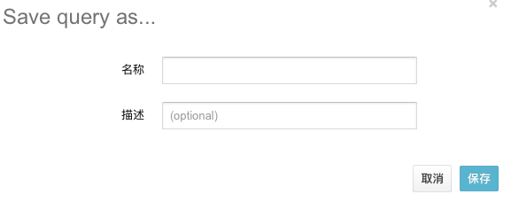

= TCube 使用手册 =
湖南天云魔方数据科技有限公司
2016
:corpname: 湖南天云魔方数据科技有限公司
:corpshortname: 天云魔方
:prodverbname: TCube
:prodver: 3.10
:imagedir: ./images
:stylesdir: ./styles
:doctype: book
:numbered:
:icons: font
:toc: left
:toclevels: 2
//active header and footer
:pagenums:
:docinfo:
:docinfo1:
:source-highlighter: pygments
:keywords: TDP, Hadoop, bigdata, Spark
//i18n
:appendix-caption: 附录
:chapter-label:
:figure-caption: 图
:table-caption: 表
:lang: zh_cn
:preface-title: 前言
:toc-title: 目录
:appendix-caption: 附录
:orgname: 湖南天云魔方数据科技有限公司
:last-update-label: 最后更新时间
//:front-cover-image: image:images/cover.pdf[width=1050,height=1600]

== 概述 ==

TCube 是基于 Web 的大数据操作和管理工具。TCube 应用程序提供了 HDFS 文件在线浏览，任务查看
Hive 查询，元数据管理，用户管理等功能。使用 TCube 能够使得工程师可以非常方便的对保存在 Hadoop
平台的数据进行查看和管理。

=== 登陆 ===

使用浏览器访问TCube 所在的服务地址，比如<http://dn6.bigdata.boc.cn:8000> ，在出现的登陆框中
输入账号密码

登陆成功后，可以看如下类似的导航栏

NOTE: 依据权限的不同，看到的导航栏可能不一样

== Hive 查询 ==

点击导航栏中的 menu:查询编辑器[Hive 查询]。进入到 Hive 查询界面。

Hive 查询模块可以通过 web 界面方式查询 Hive 数据仓库。在该界面，可以创建 Hive 数据库，表和分区，加载数据，
创建、运行和管理查询。查询结果可以导出为 Excel 格式或者 csv 格式。对于可以图形化表示的数据结果，还可以直接
展示为二维图表。

作为基于 Web 的 Hive 查询编辑器，该模块具有以下特性：

- 语法高亮且自动完成
- 一次可提交多条查询语句
- 集成 Hive 的 UDF
- 可以选择部分查询语句进行查询
- 查询结果可下载
- 与元数据浏览的无缝集成

界面截图如下：

如上图所示，界面分为左右两栏，左侧为数据库列表的树形菜单，数据库下的列表为当前数据库下的表。点击任何一张表，将会显示出该表的所有字段，类似如下：

将鼠标移动到表名上，右侧会显示一个柱状图标图标 ，点击该图标，弹出的对话框将会显示该表的样例数据，类似如下：

鼠标点击表名并拖动到右侧编辑框时，会弹出常用的查询语句，如下：

选择弹出的任何一条语句，该语句则会显示在编辑框中。然后点击编辑框左侧出现的蓝色三角形图标，则以运行该语句。类似如下：

编辑框下方的几个标签分别是最近的查询历史、保存的查询、以及查询解释器，如果查询有结果，则还会出现结果标签。 类似如下：

查询结果的左侧一栏图标解释如下：

第一个图标表示查询结果以表格形式展现；第二个图标表示数据已图表方式展现；第三个表示对结果列进行编辑；第四个图标表示可以下载当前的结果数据。

当前的查询语句可以保存，点击右上角的 icon:save[]  图标，在弹出的对话框中填写保存的名字以及描述后，点击保存即可。下次可以从已经保存的查询中直接使用。

== 元数据管理 ==

元数据管理模块可以浏览 Hive 数据库以及 Hive 表的表结构信息以及表文件所在 HDFS 的位置。

=== 开始表浏览

要开始表浏览模块，点击导航栏的表浏览图标()

=== 创建表

虽然在 Hive 查询模块，我们可以通过编写 HQL 语句来创建表，但是这里提供了基于向导的建表方式

这里提供了两种建表方式：从一个文件或者手工

如果你是用一个文件建表，则文件的格式将决定了表的一些属性，比如记录和文件格式。你选择的文件的数据将自动导入到建立的表中。

当你手工创建表示，你需要指定表的所有的属性，然后变成查询语句方式来创建表，然后在接下里的步骤导入数据。

.从文件建表
. 在表浏览窗口，点击左侧你想在创建在哪个数据库里的数据库名
. 在右侧窗口，点击从文件创建表图标()，启动建表向导
. 在接下里的建表向导中，其建表的基本步骤是:
** 选择你的输入文件，该文件必须存在
** 指定字段分隔符
** 定义字段，提供字段名称以及选择对应的类型
. 点击创建表按钮开始创建表

.手工创建表
. 在表浏览窗口，点击左侧你想在创建在哪个数据库里的数据库名
. 在右侧窗口，点击手工创建表图标(image:images/tcube-396cc.png[])，启动手工建表向导
. 接下的向导步骤，大致包括以下内容：
** 输入表名
** 选择记录格式
** 通过指定字段分隔符，集合以及映射键等内容来配置序列号器
** 选择文件格式
** 指定表数据的所在位置
** 定义字段，包括字段名称以及字段类型
** (可选)增加分区类型
. 点击创建表

=== 导入数据到表

当导入数据时，可以选择追加或者覆盖表数据两种方式，步骤如下：

1. 在列表窗口，点击你要导入数据的表，进入表元数据浏览窗口
2. 在表元数据窗口，点击上方的导入数据图标()
3. 在导入数据对话框中，输入或者选择数据文件所在的路径，根据需要，确定是否勾选**覆盖现有数据**选择框
4. 点击提价按钮

=== 删除表
删除一张表的基本步骤是

1. 在列表窗口，勾选你要删除的表，可以多选
2. 点击列表窗口上方的**丢弃**按钮

== 文件浏览器 ==

文件浏览器模块是通过 Web 界面来查看 HDFS 上的文件，并可以进行管理。

在该模块，你可以看到对 HDFS 的文件进行浏览，查看，编辑，或者上传本地文件到 HDFS 上。

.其他特性
- 文件下载
- 文件或文件夹重命名
- 文件移动
- 文件拷贝
- 递归修改文件权限
- 递归修改文件属组
- 按文件属性排序（比如文件名，大小，日期等）
- 直接查看 zip 或 gzip 压缩的文本文件内容
- 非常流畅的查看上 GB 文件的内容
- 拖拽方式文件上传

=== 开始文件浏览 ===
点击导航栏的文件浏览图标(icon:file[] ）即可进入到文件浏览器模块

=== 文件和目录 ===

你可以使用文件浏览器查看通过 MapReduce 等分布式任务所关联的输入和输出文件。比如普通用户可以查看家目录以及_/tmp_目录的文件。
系统管理员则可以查看全部文件。

=== 创建目录
1. 在文件浏览器窗口，选择 新建->目录 下来菜单
2. 在创建目录对话框里，输入目录名称，然后点击提交即可。

=== 改变目录
- 点击目录的名字或者点击上级目录(.)既可以改变当前目录
- 点击  图标，输入目录名称，然后回车也可以改变目录

要进入到家目录，在文件浏览窗口，点击路径栏左侧的 icon:home[]主页 目录即可。

NOTE: 如果没有创建家目录，则上述连接不可使用，可以联系管理员为你创建家目录。

=== 创建文件
1. 在文件浏览窗口，选择 新建->文件 下来菜单
2. 在新建文件的对话框中，输入文件名，点击提交即可在当前目录创建文件。

=== 上传文件
你可以上传文本文件和二进制文件到 HDFS 上。

1. 在文件浏览器窗口，先进入到你希望上传的目录
2. 选择 上传->文件 菜单
3. 在出现的对话框，点击**选择文件**按钮，用来选择你要上传的文件，然后点击**打开**

=== 拷贝文件

1. 在文件浏览器窗口，点击你想拷贝的文件左侧选择框
2. 点击操作->复制菜单

=== 下载文件
你可以从 HDFS 上下载文本和二进制文件

1. 在文件浏览器窗口，点击你要下载的文件左侧的选择框
2. 点击操作->下载菜单

=== 文件属性操作

[cols="2c,8a"]
|=====
^|动作 ^| 过程

^.^|重命名 | 1. 在文件浏览器窗口，点击文件或者文件夹左侧的选择框 +
         2. 选择操作->重命名菜单 +
         3. 输入新的名字，然后点击提交

^.^| 移动 | 1. 在文件浏览器窗口，点击文件或者文件夹左侧的选择框 +
        2. 选择操作->移动菜单 +
        3. 在移动对话框里，选择或者输入你要移动到的目录，然后点击提交

^.^|删除 | 1. 在文件浏览器窗口，点击文件或者文件夹左侧的选择框 +
                 2. 点击移动到回收站按钮，或则选择下来菜单的永久删除

|====
